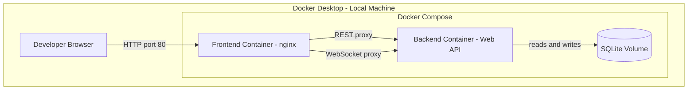
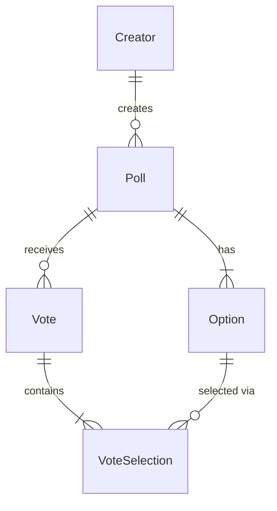
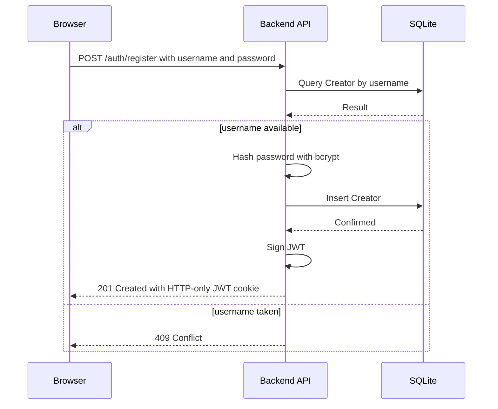
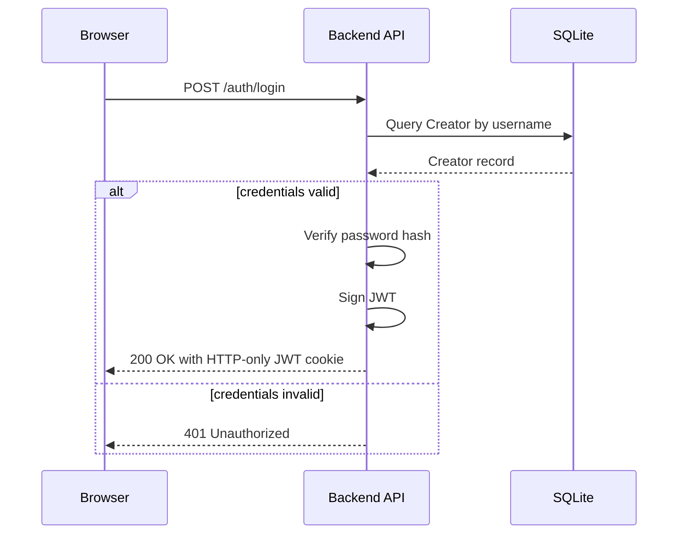
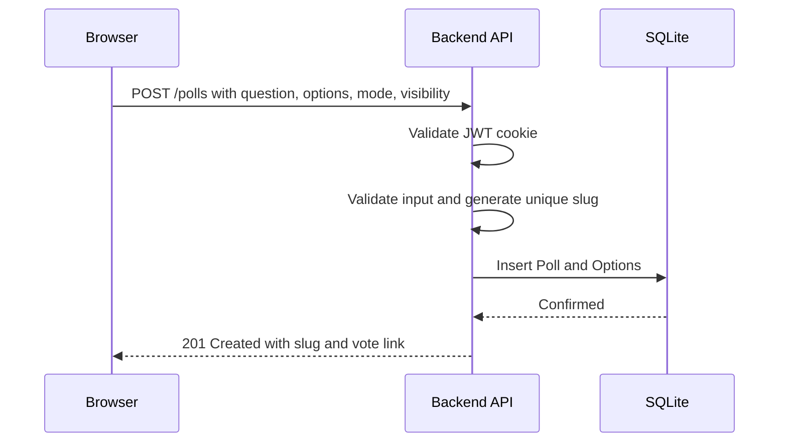
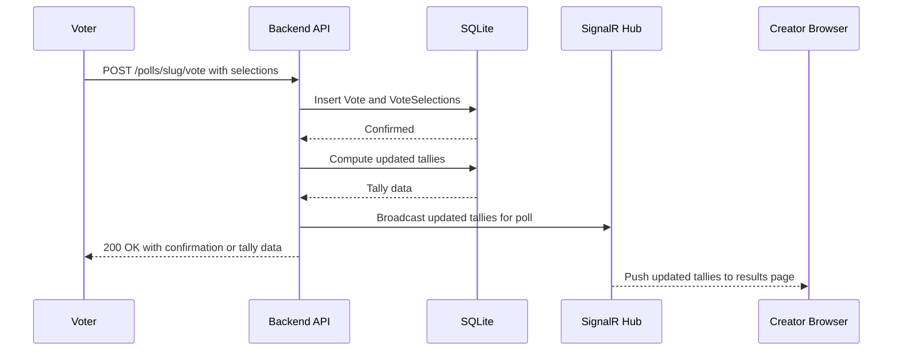
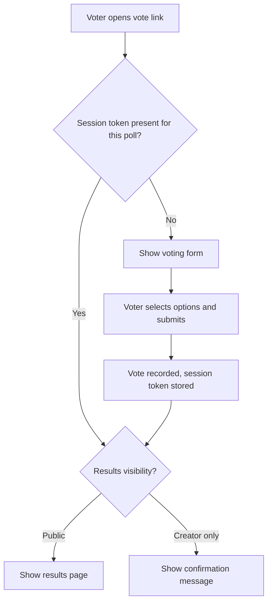
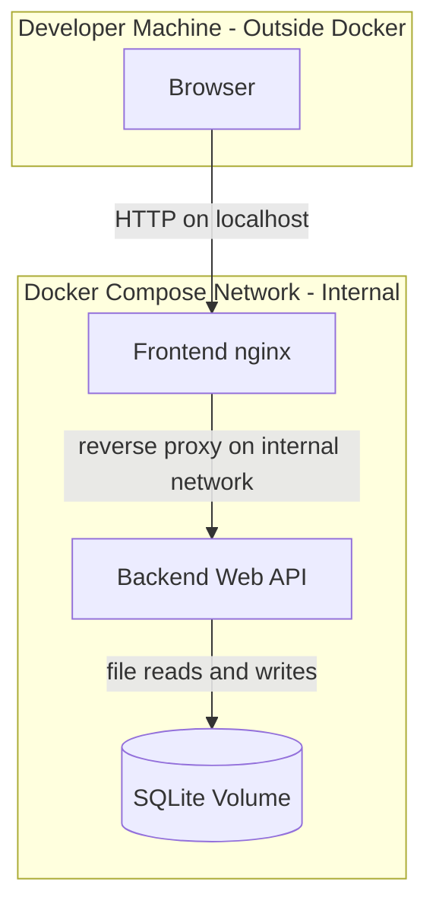
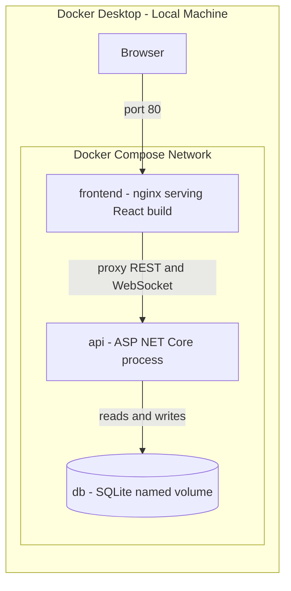

# PollMe 3.0 — High-Level Design

## 1. Overview

PollMe 3.0 is a full-stack polling web application built as a portfolio artifact. Poll creators register, authenticate, and manage polls through a React SPA that communicates with an ASP.NET Core REST API; anonymous voters follow shared links to vote and see live results pushed in real time via SignalR. The stack prioritizes readability and explainability at every layer: SQLite for zero-config data storage, Dapper for explicit SQL, JWT in an HTTP-only cookie for creator auth, and Docker Compose for a reproducible local deployment.

## 2. Architecture Summary

## 3. Core Components

### 3.1 React SPA (Frontend Container)

The browser-side application is a React + TypeScript single-page application bundled by Vite and served by nginx inside a Docker container. nginx also proxies all API calls and WebSocket connections to the backend container, so the browser has a single origin to communicate with.

| Component | Responsibility | Communicates With |
|-----------|----------------|-------------------|
| **Auth Views** | Registration, login, and logout forms | Backend REST API |
| **Creator Dashboard** | Lists creator polls with at-a-glance stats | Backend REST API |
| **Poll Creation Form** | Collects question, options, mode, and visibility | Backend REST API |
| **Voting Page** | Renders poll question and answer options; submits selection | Backend REST API |
| **Results View** | Displays live vote tallies as horizontal bars | Backend REST API, SignalR Hub |
| **SignalR Client** | Subscribes to real-time tally pushes for a specific poll | SignalR Hub |

### 3.2 ASP.NET Core Backend (Backend Container)

A single ASP.NET Core process that hosts the REST endpoints, the SignalR hub, and the observability pipeline. It is the only component that reads from or writes to the database, and is the authoritative source for all business rules.

| Component | Responsibility | Communicates With |
|-----------|----------------|-------------------|
| **Auth Endpoints** | Register, login, and logout; issue and revoke JWT cookie | SQLite |
| **Poll Endpoints** | Create a poll; list creator polls; fetch poll for voting | SQLite |
| **Vote Endpoint** | Accept and persist votes; trigger real-time tally push | SQLite, SignalR Hub |
| **Results Endpoint** | Return current tallies, enforcing visibility rules | SQLite |
| **SignalR Hub** | Manage WebSocket connections; push tally updates to subscribers | In-process hub manager |
| **OTel Pipeline** | Instrument key operations; export traces and metrics to stdout | All components above |

### 3.3 SQLite Database (Named Docker Volume)

SQLite is the sole persistence layer. The database file lives in a named Docker volume so data survives container restarts. Schema evolution is managed through FluentMigrator, which runs explicit, human-readable migration steps automatically when the API process starts.

## 4. Data Models

### 4.1 Entity Relationships

### 4.2 Key Entities

| Entity | Purpose | Key Attributes | Relationships |
|--------|---------|----------------|---------------|
| **Creator** | An authenticated user who owns polls | username, password_hash | Owns many Polls |
| **Poll** | A question with behavioral settings | question, slug, mode, visibility | Belongs to Creator; has Options and Votes |
| **Option** | A single answer choice within a poll | text, position | Belongs to Poll; referenced by VoteSelections |
| **Vote** | A single anonymous voting event | session_token, created_at | Belongs to Poll; contains VoteSelections |
| **VoteSelection** | Join between a Vote and the chosen Option(s) | vote_id, option_id | Links Vote to Option |

### 4.3 Data Lifecycle

Polls are created immediately in a live, vote-accepting state — there is no draft state. Options are created as part of poll creation and are immutable thereafter. Both the poll's voting mode and results visibility are set at creation and cannot be changed. Votes and VoteSelections accumulate over time and are never modified or deleted in v1. Creator accounts persist indefinitely; no account deletion or recovery flow is supported in v1.

## 5. Data Flows

### 5.1 Creator Registration

### 5.2 Creator Login

### 5.3 Poll Creation

### 5.4 Vote Submission and Real-Time Update

### 5.5 Voter Access with Duplicate Detection

### 5.6 Failure Paths

Error handling is straightforward at this scale. Validation failures return 400 with a descriptive message. Authentication failures return 401. Missing or unknown resources return 404. Unhandled exceptions return 500. No retry logic or circuit breakers are implemented in v1. Real-time delivery is best-effort: if a WebSocket client is disconnected when a tally push fires, it misses the update and can reload the page to retrieve current results.

## 6. Key Design Decisions

### 6.1 SQLite as the Primary Database

**Decision:** Use SQLite as the sole data store.

**Rationale:**
- Zero-config setup — no separate database server container is needed in Docker Compose
- File-based storage is immediately understandable in a demo or interview context
- Fully sufficient for single-server, demo-scale traffic
- Pairs cleanly with Dapper's explicit SQL model

**Alternatives considered:**

| Alternative | Why Not |
|-------------|---------|
| PostgreSQL | Adds a third container and connection configuration without any benefit at this scale |
| MySQL | Same operational overhead as PostgreSQL; no feature advantage for this use case |

### 6.2 Dapper for Data Access

**Decision:** Use Dapper (micro-ORM) instead of Entity Framework Core.

**Rationale:**
- SQL queries are explicit and visible in the codebase — a deliberate portfolio differentiator
- Every query is a clear talking point in a technical interview
- Satisfies the non-functional requirement that "no hidden or auto-generated query logic is permitted"

**Alternatives considered:**

| Alternative | Why Not |
|-------------|---------|
| Entity Framework Core | Generates queries implicitly; conflicts with the readability and explainability non-functional requirement |
| Raw ADO.NET | Adds boilerplate over Dapper with no benefit at this scale |

### 6.3 JWT in HTTP-Only Cookie for Creator Auth

**Decision:** Issue a signed JWT and deliver it via an HTTP-only, SameSite=Strict cookie.

**Rationale:**
- HTTP-only cookie is inaccessible to JavaScript, mitigating XSS-based token theft
- JWT is stateless on the server — no session store is needed
- SameSite=Strict cookie policy provides CSRF protection without a separate token mechanism
- The pattern is familiar to interviewers and clearly explainable

**Alternatives considered:**

| Alternative | Why Not |
|-------------|---------|
| Server-side session cookie | Requires server-side session storage; adds statefulness with no benefit on a single server |
| JWT in Authorization header stored in localStorage | Exposed to JavaScript; weaker XSS posture |

### 6.4 SignalR for Real-Time Push

**Decision:** Use ASP.NET Core SignalR for server-to-client tally delivery.

**Rationale:**
- First-party ASP.NET Core integration — no external message broker required
- Abstracts the WebSocket transport; degrades gracefully to long polling if needed
- An in-process hub manager is sufficient for single-server deployment
- Demonstrates real-time architecture as a clear portfolio talking point

**Alternatives considered:**

| Alternative | Why Not |
|-------------|---------|
| Server-Sent Events | Unidirectional only; less instructive as a portfolio demonstration |
| Client polling | Defeats the live-results UX goal; generates unnecessary requests |
| Redis Pub/Sub with SignalR backplane | Adds an external dependency; multi-server scale is explicitly out of scope for v1 |

### 6.5 Two-Container Docker Compose

**Decision:** Run the system as two Docker Compose services — a frontend nginx container and a backend API container — with a shared named volume for the SQLite file.

**Rationale:**
- Demonstrates container composition as a portfolio artifact
- nginx proxy consolidates all browser traffic to a single origin, avoiding CORS configuration
- Separation of frontend and backend containers reflects real-world deployment patterns
- A named volume provides data persistence without a dedicated database container

**Alternatives considered:**

| Alternative | Why Not |
|-------------|---------|
| Single container serving static files from ASP.NET Core | Conflates frontend serving with backend logic; less illustrative |
| Direct `dotnet run` and `npm run dev` without Docker | Works but is not containerized; weaker portfolio signal |

## 7. Security Architecture

### 7.1 Authentication and Authorization

Creator authentication is handled exclusively by the backend. On successful login, the API issues a signed JWT placed into an HTTP-only, SameSite=Strict cookie. The cookie is transmitted automatically by the browser but is inaccessible to JavaScript. All poll management and creator-only results endpoints validate the JWT on every request. Anonymous voters carry no credentials; vote submission requires none.

Authorization is identity-scoped with no role hierarchy: a creator may only list and view results for their own polls. The results visibility setting is enforced at the results endpoint — creator-only polls reject results requests from unauthenticated callers.

### 7.2 Trust Boundaries

Since this is a local-only deployment, all traffic is on localhost with no TLS requirement. The backend container is not exposed directly to the host — only the nginx frontend container publishes a host port. In a future public deployment, HTTPS termination at the nginx layer would enforce TLS at the browser boundary.

### 7.3 Data Protection

| Data Category | At Rest | In Transit | Access Control |
|---------------|---------|------------|----------------|
| Creator passwords | Bcrypt hash only — plaintext never persisted | Never logged or returned via API | API process only |
| JWT signing secret | Environment variable in Compose file | N/A | API process only |
| Poll and option content | Plaintext in SQLite | N/A — local only | All users for public polls; creator only for creator-only polls |
| Vote data | Plaintext in SQLite — no PII stored | N/A — local only | No access restrictions; no identifying data |
| Voter session tokens | localStorage | N/A — local only | Browser only |

Voter session tokens are stored in `localStorage`. These tokens carry no privilege and cannot authenticate to any protected endpoint; they are used solely for best-effort deduplication. Their XSS exposure is an accepted trade-off for a local-only deployment and is consistent with the explicitly best-effort nature of the duplicate-vote prevention mechanism.

### 7.4 Injection Prevention

All Dapper queries SHALL use parameterized inputs. Raw SQL string concatenation or interpolation is prohibited regardless of the data source. This constraint directly mitigates SQL injection and is non-negotiable given that explicit, visible SQL is a deliberate feature of this codebase (see section 6.2).

## 8. Deployment Model

### 8.1 Docker Compose (Local)

The system runs as two services under Docker Compose:

- **frontend** — nginx serves the Vite-built React bundle and reverse-proxies requests to `/api` and `/hubs` to the backend service.
- **api** — ASP.NET Core process hosts all REST endpoints, the SignalR hub, and the OTel console exporter. FluentMigrator applies any pending schema migrations at startup.

The SQLite file lives in a named Docker volume and persists across `docker compose down` and `up` cycles.

### 8.2 Local Development (Without Docker)

Developers may run services directly for a faster inner-loop:

- **Backend:** `dotnet run` from the API project directory. FluentMigrator applies migrations on startup against a local SQLite file.
- **Frontend:** `npm run dev` from the frontend directory via Vite. The Vite dev server proxies `/api` and `/hubs` requests to the locally running backend.

### 8.3 Infrastructure Requirements

| Resource | Purpose | Sizing |
|----------|---------|--------|
| Docker Desktop | Container runtime for Compose | Local developer machine |
| Named Docker volume | SQLite database file persistence | Under 100 MB for demo data |
| Frontend container (nginx) | Serves React build; proxies API and WebSocket traffic | Single instance |
| API container (ASP.NET Core) | REST API, SignalR hub, OTel console output | Single instance |

## 9. Technology Choices

| Category | Choice | Rationale |
|----------|--------|-----------|
| Backend language | C# / .NET | Industry-standard .NET backend; strong portfolio signal |
| Backend framework | ASP.NET Core Web API | First-party .NET web framework; integrates SignalR and OTel natively |
| Data access | Dapper | Explicit SQL; every query is visible and explainable |
| Schema migrations | FluentMigrator | Fluent C# migration API; traceable in source control; pairs with Dapper |
| Primary database | SQLite | Zero-config, file-based; sufficient for single-server demo scale |
| Real-time push | SignalR | First-party ASP.NET Core WebSocket support; no external broker needed |
| Creator auth | JWT in HTTP-only cookie | Stateless; XSS-resistant; CSRF-mitigated via SameSite policy |
| Observability | OpenTelemetry SDK with console exporter | Industry-standard instrumentation; console output avoids external backend dependency |
| Frontend framework | React and TypeScript | Modern SPA standard; strong type safety |
| Client-side routing | React Router | Industry-standard React routing library; declarative URL-to-component mapping for the SPA's multiple views |
| Frontend bundler | Vite | Fast dev server and optimized production build |
| Frontend tests | Jest and React Testing Library | Standard React component test stack |
| Backend tests | xUnit, NSubstitute, and FluentAssertions | Modern .NET test stack |
| CSS framework | Pico CSS | Classless — semantic HTML looks polished automatically |
| Container runtime | Docker Compose | Reproducible local environment via Docker Desktop |
| CI | GitHub Actions | Native GitHub integration; readable pipeline config as portfolio artifact |

## 10. What This Design Defers

The following are explicitly out of scope for v1:

- Rich media in poll content — all content is text-only
- Poll scheduling, expiry, or manual closure — polls are open-ended once created
- Poll editing or deletion after creation
- Analytics beyond per-option vote tallies — no time series, demographics, or trend data
- Strict duplicate-vote enforcement — session token detection is best-effort only
- Password reset or account recovery
- Email verification at registration
- Social or federated authentication (OAuth, SSO, passkeys)
- Horizontal or multi-server real-time scaling — the in-process SignalR hub is single-server only
- Poll result export (CSV, JSON)
- Cloud or public deployment — local Docker Compose only in v1
- External observability backend — OTel console exporter only; no Jaeger, Prometheus, or Grafana

## 11. Open Questions

1. **Nginx WebSocket proxy configuration:** SignalR WebSocket connections require specific nginx proxy headers (`Upgrade`, `Connection`). This is a known configuration requirement that should be captured explicitly in the low-level design.

2. **JWT secret management in Compose:** For local Docker Compose, the JWT signing secret lives in the Compose environment configuration. This is acceptable for a portfolio demo but should be documented as a deliberate trade-off and flagged as a concern for any future public deployment.

3. **FluentMigrator invocation timing:** Migrations are planned to run automatically at API startup via the `MigrationRunner`. This means the API process holds migration-runner dependencies at runtime. An alternative — a separate init container in Compose — would isolate migration concerns but adds Compose complexity. This trade-off should be resolved in the low-level design.

---

*This is a high-level architecture document. Code structure, class design, API contracts, and implementation details belong in the low-level design document.*
