# PollMe 3.0 — Low-Level Design

## 1. Overview

This document specifies the class-level design, interaction flows, data access patterns, and testing strategy for PollMe 3.0. It bridges the high-level architecture decisions into implementation-ready detail for both the backend and frontend.

**Implementation decisions confirmed in this document:**

- Backend is a **single ASP.NET Core project** (`PollMe.Api`) with all code organized into logical subfolders.
- Data access uses a **repository-per-entity** pattern (`ICreatorRepository`, `IPollRepository`, `IVoteRepository`) backed by Dapper with explicit SQL.
- FluentMigrator runs via an **`IHostedService`** at API startup before Kestrel accepts connections.
- Poll **slugs** are randomly generated 6-character alphanumeric strings with collision retry (up to 5 attempts).
- Frontend is a **flat-structured React SPA** with `src/pages/` and `src/components/` at the top level.
- SignalR groups are keyed on **numeric poll ID** (`poll-{id}`).
- Voter session tokens are stored in **`localStorage`** under the key `voted_{slug}`.
- Test coverage targets **all business-logic paths and happy/error paths for each endpoint** (no specific % threshold).

**Prerequisites:**
- [Requirements Document](pollme-requirements.md)
- [High-Level Design](pollme-high-level-design.md)

---

## 2. Package / Module Structure

### 2.1 Backend — PollMe.Api (Single Project)

All backend code lives in one `.csproj`. The project is organized into logical subfolders reflecting a clean separation of concerns without the overhead of a multi-project solution.

#### 2.1.1 Backend Folder Dependency Graph

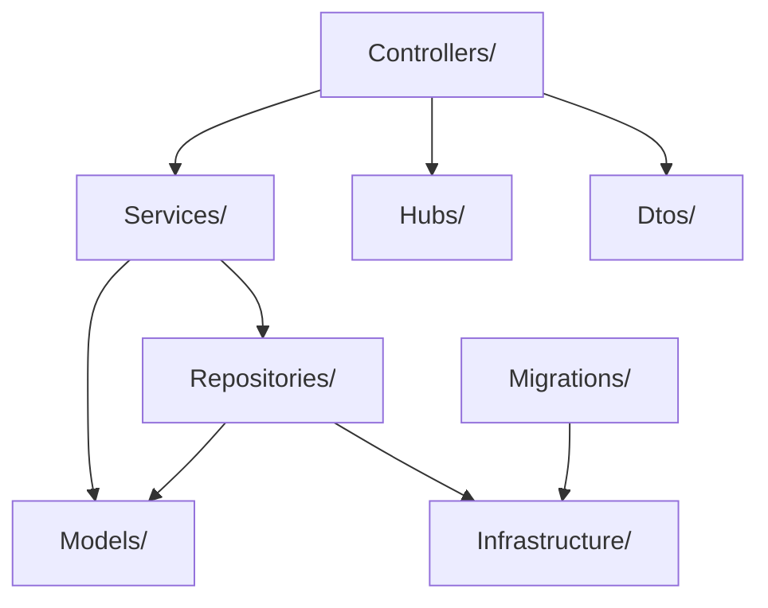

#### 2.1.2 Backend Folder Details

| Folder | Purpose | Key Types | Internal Dependencies |
|--------|---------|-----------|----------------------|
| `Controllers/` | HTTP endpoint handlers — input validation, service orchestration, HTTP responses | `AuthController`, `PollsController`, `VoteController`, `ResultsController` | `Services/`, `Dtos/`, `Hubs/` |
| `Services/` | Business logic — password hashing, slug generation, tally computation, visibility enforcement | `AuthService`, `PollService`, `VoteService`, `SlugService`, `JwtService` | `Repositories/`, `Models/` |
| `Repositories/` | All Dapper SQL queries — one repository class per entity | `ICreatorRepository`, `CreatorRepository`, `IPollRepository`, `PollRepository`, `IVoteRepository`, `VoteRepository` | `Models/`, `Infrastructure/` |
| `Hubs/` | SignalR hub managing WebSocket connections and group-based tally broadcasts | `TallyHub` | — |
| `Models/` | Entity classes mapped from SQL result rows; enumerations | `Creator`, `Poll`, `Option`, `Vote`, `VoteSelection`, `OptionTally`, `PollMode`, `ResultsVisibility` | — |
| `Dtos/` | Request and response data-transfer objects | See §3.6 | — |
| `Migrations/` | FluentMigrator migration classes — one class per schema change | `M001_CreateCreators` … `M005_CreateVoteSelections` | `Infrastructure/` |
| `Infrastructure/` | DB connection factory, configuration binding, migration hosted service | `IDbConnectionFactory`, `DbConnectionFactory`, `AppConfig`, `MigrationHostedService` | — |

### 2.2 REST API Contract

| Method | Route | Auth Required | Purpose |
|--------|-------|:---:|---------|
| POST | `/api/auth/register` | No | Register a new creator |
| POST | `/api/auth/login` | No | Login; issues HTTP-only JWT cookie |
| POST | `/api/auth/logout` | No | Clears JWT cookie |
| GET | `/api/auth/me` | Yes | Returns current creator identity (SPA auth state init on page load) |
| POST | `/api/polls` | Yes | Create a poll |
| GET | `/api/polls` | Yes | List authenticated creator's polls (dashboard) |
| GET | `/api/polls/{slug}` | No | Get poll question and options for the voting page |
| POST | `/api/polls/{slug}/votes` | No | Submit a vote |
| GET | `/api/polls/{slug}/results` | Conditional | Get current tallies (public polls: no auth; creator-only: owner only) |
| WebSocket | `/hubs/tally` | No | SignalR hub endpoint for real-time tally pushes |

### 2.3 Frontend — pollme-frontend (React SPA)

The SPA uses a flat `src/` directory with dedicated subfolders for each concern.

#### 2.3.1 Frontend Module Dependency Graph

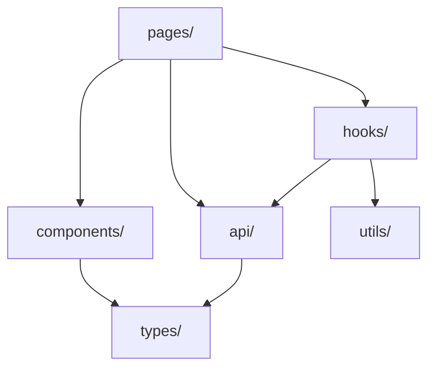

#### 2.3.2 Frontend Folder Details

| Folder | Purpose | Key Exports | Internal Dependencies |
|--------|---------|-------------|----------------------|
| `pages/` | Full-page route components, one per route | `LoginPage`, `RegisterPage`, `DashboardPage`, `CreatePollPage`, `VotePage`, `ResultsPage` | `components/`, `hooks/`, `api/` |
| `components/` | Reusable UI components shared across pages | `NavBar`, `VoteForm`, `ResultsChart`, `PollCard`, `ProtectedRoute` | `types/` |
| `hooks/` | Custom React hooks for shared logic and side effects | `useAuth`, `useSignalR`, `useVoteStatus` | `api/`, `utils/` |
| `api/` | Typed `fetch` wrappers for each backend resource group | `authApi`, `pollsApi`, `voteApi`, `resultsApi` | `types/` |
| `types/` | TypeScript interfaces and type aliases mirroring backend DTOs | `Creator`, `Poll`, `Option`, `Tally`, `OptionTally`, request/response interfaces | — |
| `utils/` | Pure helper functions | `voteStorage` (localStorage helpers), `formatPercentage` | — |

**`voteStorage` contract:** `markVoted(slug)` stores `{ ts: number }` (Unix timestamp of vote cast time) under the key `voted_{slug}` in `localStorage`. `hasVoted(slug)` retrieves the entry, checks whether `Date.now() - entry.ts < VOTE_TOKEN_EXPIRY_DAYS * 86_400_000`, and returns `false` if the entry is absent or expired. `VOTE_TOKEN_EXPIRY_DAYS` is a constant in `utils/` (default `365`) matching the backend's `VoteToken__ExpiryDays` default.

**React Router route map:**

| Path | Component | Auth Guard |
|------|-----------|:---:|
| `/login` | `LoginPage` | No |
| `/register` | `RegisterPage` | No |
| `/dashboard` | `DashboardPage` | Yes (`ProtectedRoute`) |
| `/polls/new` | `CreatePollPage` | Yes (`ProtectedRoute`) |
| `/vote/:slug` | `VotePage` | No |
| `/results/:slug` | `ResultsPage` | No |

---

## 3. Class Diagrams

### 3.1 Controllers

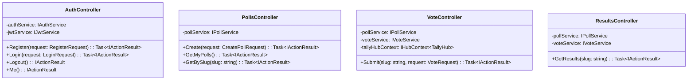

### 3.2 Services

```mermaid
classDiagram
    class IAuthService {
        <<interface>>
        +RegisterAsync(username: string, password: string): Task~Creator~
        +LoginAsync(username: string, password: string): Task~Creator?~
    }
    class AuthService {
        -creatorRepo: ICreatorRepository
        +RegisterAsync(username: string, password: string): Task~Creator~
        +LoginAsync(username: string, password: string): Task~Creator?~
    }

    class IPollService {
        <<interface>>
        +CreatePollAsync(creatorId: int, request: CreatePollRequest): Task~Poll~
        +GetBySlugAsync(slug: string): Task~Poll~
        +GetPollWithOptionsAsync(slug: string): Task~PollVoteDto~
        +GetCreatorPollsAsync(creatorId: int): Task~IEnumerable~PollSummaryDto~~
    }
    class PollService {
        -pollRepo: IPollRepository
        -voteRepo: IVoteRepository
        -slugService: ISlugService
        -config: AppConfig
        +CreatePollAsync(creatorId: int, request: CreatePollRequest): Task~Poll~
        +GetBySlugAsync(slug: string): Task~Poll~
        +GetPollWithOptionsAsync(slug: string): Task~PollVoteDto~
        +GetCreatorPollsAsync(creatorId: int): Task~IEnumerable~PollSummaryDto~~
    }

    class IVoteService {
        <<interface>>
        +SubmitVoteAsync(poll: Poll, selectedOptionIds: IEnumerable~int~): Task~TallyDto~
        +GetTalliesAsync(pollId: int): Task~TallyDto~
    }
    class VoteService {
        -voteRepo: IVoteRepository
        +SubmitVoteAsync(poll: Poll, selectedOptionIds: IEnumerable~int~): Task~TallyDto~
        +GetTalliesAsync(pollId: int): Task~TallyDto~
    }

    class ISlugService {
        <<interface>>
        +GenerateUniqueSlugAsync(): Task~string~
    }
    class SlugService {
        -pollRepo: IPollRepository
        +GenerateUniqueSlugAsync(): Task~string~
    }

    class IJwtService {
        <<interface>>
        +IssueToken(creator: Creator): string
    }
    class JwtService {
        -config: AppConfig
        +IssueToken(creator: Creator): string
    }

    AuthService ..|> IAuthService
    PollService ..|> IPollService
    VoteService ..|> IVoteService
    SlugService ..|> ISlugService
    JwtService ..|> IJwtService
    PollService --> ISlugService : uses
    PollService --> IVoteService : uses for dashboard tallies
```

### 3.3 Repositories

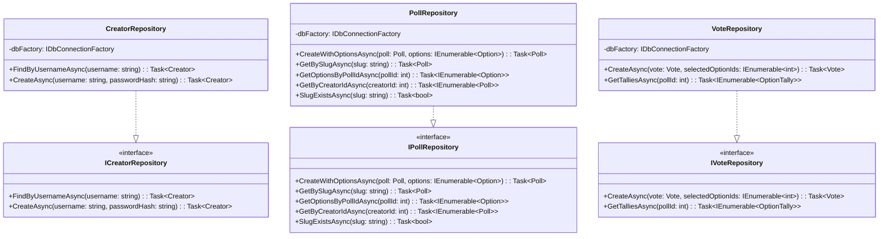

### 3.4 Domain Models

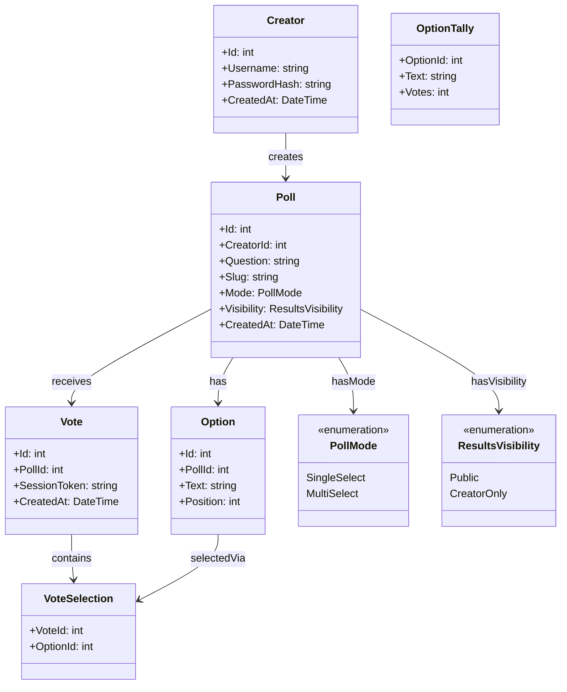

### 3.5 Hub and Infrastructure

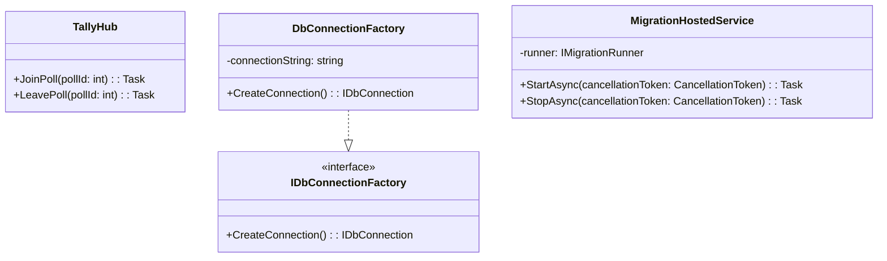

### 3.6 Key Type Definitions

**Domain Enumerations:**

| Type | Values | Stored As (SQLite) | Used By |
|------|--------|--------------------|---------|
| `PollMode` | `SingleSelect`, `MultiSelect` | String (`"SingleSelect"` / `"MultiSelect"`) | `Poll` model; vote selection-count validation in `VoteService` |
| `ResultsVisibility` | `Public`, `CreatorOnly` | String (`"Public"` / `"CreatorOnly"`) | `Poll` model; access control in `ResultsController` |

**Request DTOs:**

| DTO | Fields | Constraints |
|-----|--------|-------------|
| `RegisterRequest` | `Username: string`, `Password: string` | Both required, non-empty |
| `LoginRequest` | `Username: string`, `Password: string` | Both required, non-empty |
| `CreatePollRequest` | `Question: string`, `Options: string[]`, `Mode: PollMode`, `Visibility: ResultsVisibility` | Question required, non-empty; option count enforced in service (2–10) |
| `VoteRequest` | `SelectedOptionIds: int[]` | Array required; element count enforced against poll mode in service |

**Response DTOs:**

| DTO | Fields | Returned By |
|-----|--------|-------------|
| `CreatePollResponseDto` | `Slug: string`, `VoteLink: string` | `POST /api/polls` |
| `OptionDto` | `Id: int`, `Text: string`, `Position: int` | Nested in `PollVoteDto` |
| `PollVoteDto` | `Id: int`, `Slug: string`, `Question: string`, `Options: OptionDto[]`, `Mode: PollMode` | `GET /api/polls/{slug}` |
| `PollSummaryDto` | `Id: int`, `Slug: string`, `Question: string`, `TotalVotes: int`, `LeadingOptionText: string?`, `LeadingPercentage: int`, `CreatedAt: DateTime` | `GET /api/polls` (dashboard) |
| `OptionTallyDto` | `OptionId: int`, `Text: string`, `Votes: int`, `Percentage: int` | Nested in `TallyDto` |
| `TallyDto` | `PollId: int`, `Options: OptionTallyDto[]` | `GET /api/polls/{slug}/results`; pushed via SignalR `ReceiveTallyUpdate` |

`LeadingOptionText` is nullable — it is `null` when the poll has received no votes yet. `LeadingPercentage` is `0` in that case.

---

## 4. Class Interactions

### 4.1 Creator Registration

**Covers requirements:** FR-3.1.1

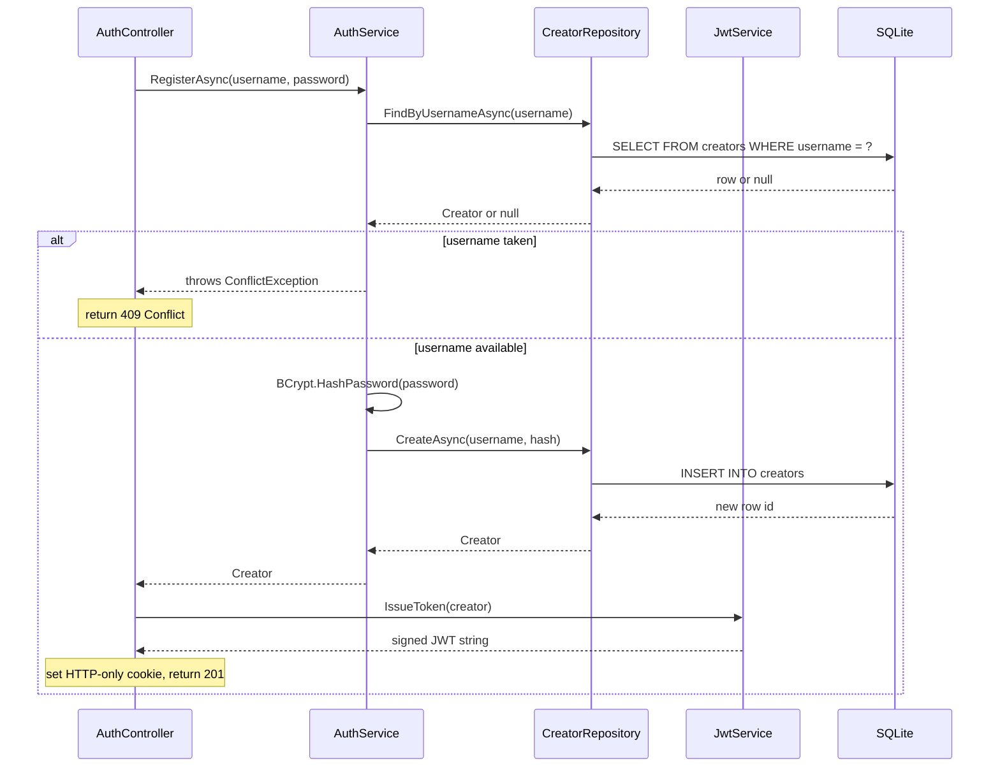

### 4.2 Creator Login

**Covers requirements:** FR-3.1.2

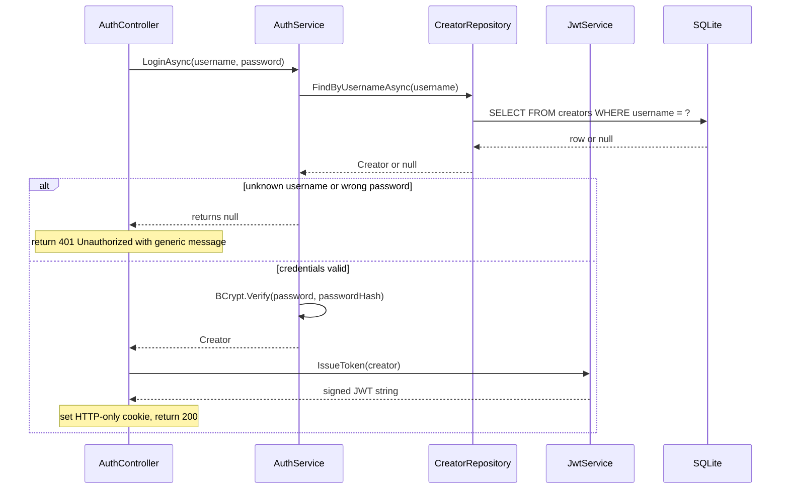

### 4.3 Creator Logout

**Covers requirements:** FR-3.1.3

Logout is stateless — no service call is required. `AuthController.Logout()` sets the `jwt` cookie with `Max-Age=0`, which instructs the browser to delete it immediately.

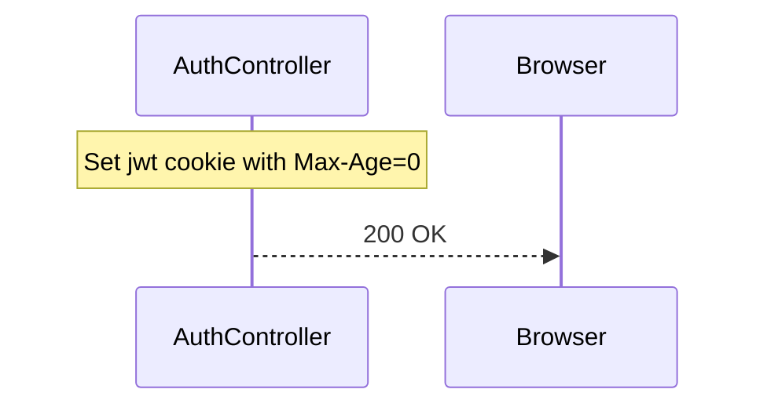

### 4.4 Poll Creation

**Covers requirements:** FR-3.2.1

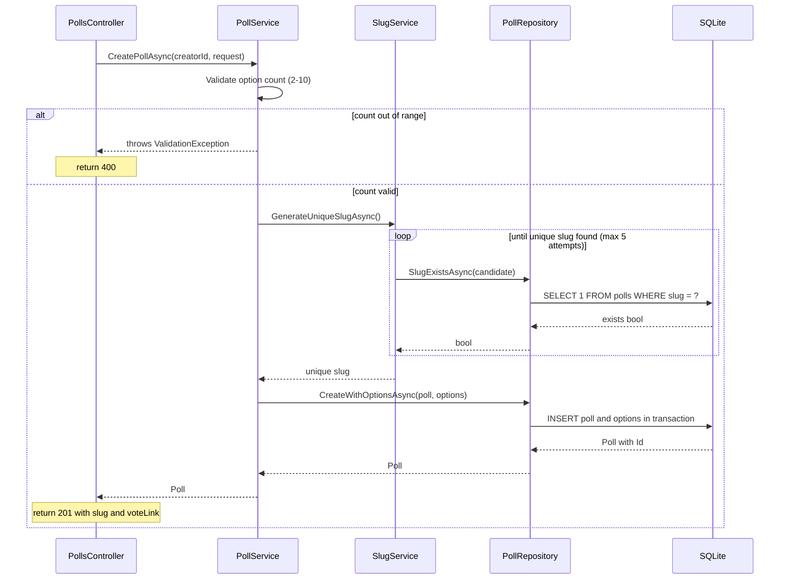

> **Dashboard data load (no diagram):** `DashboardPage` calls `GET /api/polls` to fetch the creator's poll list, then issues one `GET /api/results/:slug` call per poll to retrieve its current tally. This N+1 pattern is acceptable for the expected scale (typically < 20 polls per creator). Each subsequent visit re-fetches live data; no client-side caching is applied.

> **Poll retrieval for voting flow (no diagram):** `VoteController.SubmitVote` makes two sequential service calls: (1) `PollService.GetPollWithOptionsAsync(slug)` to validate that the poll exists and to surface its option list; (2) `PollService.GetBySlugAsync(slug)` to obtain the typed `Poll` domain object (including `Visibility`) to pass to `VoteService.SubmitVoteAsync`. See §4.5 for the full sequence.

### 4.5 Vote Submission and Real-Time Update

**Covers requirements:** FR-3.3.1, FR-3.3.2, FR-3.4.1

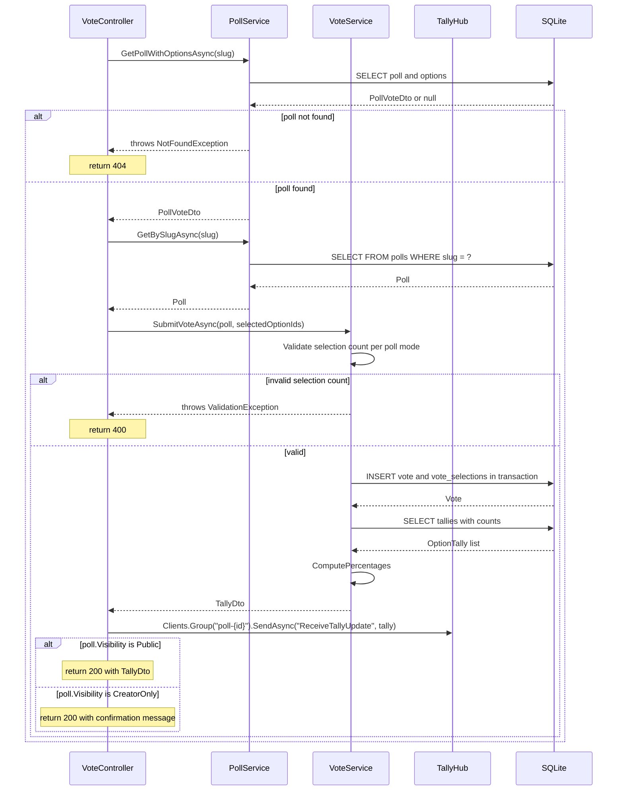

### 4.6 Results Page Load

**Covers requirements:** FR-3.4.2

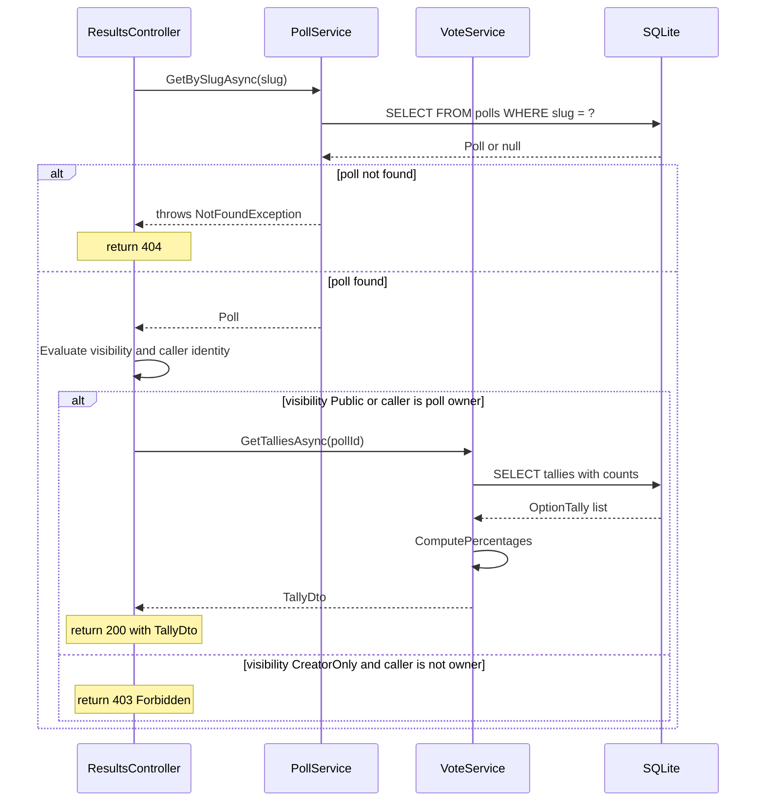

### 4.7 Error Propagation

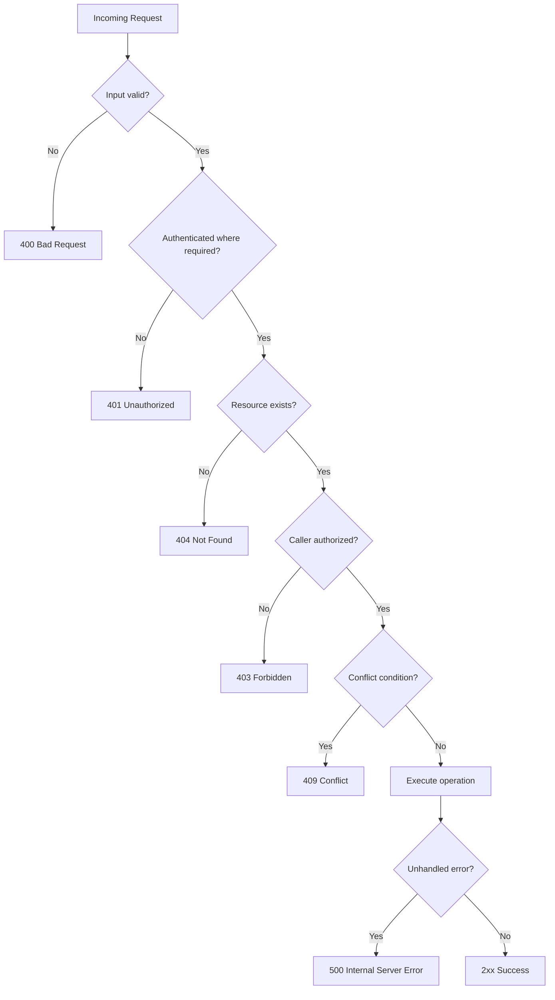

---

## 5. Data Access Layer

### 5.1 Repository Interfaces

#### ICreatorRepository

| Method | Parameters | Return Type | Guarantees |
|--------|-----------|-------------|-----------|
| `FindByUsernameAsync` | `username: string` | `Task<Creator?>` | Returns `null` if not found; never throws on a miss |
| `CreateAsync` | `username: string`, `passwordHash: string` | `Task<Creator>` | Returns the newly inserted `Creator` with its assigned `Id` |

#### IPollRepository

| Method | Parameters | Return Type | Guarantees |
|--------|-----------|-------------|-----------|
| `CreateWithOptionsAsync` | `poll: Poll`, `options: IEnumerable<Option>` | `Task<Poll>` | Inserts poll and all options atomically in a single transaction; returns `Poll` with `Id` populated |
| `GetBySlugAsync` | `slug: string` | `Task<Poll?>` | Returns `null` if no poll with this slug exists |
| `GetOptionsByPollIdAsync` | `pollId: int` | `Task<IEnumerable<Option>>` | Returns empty list if no options found; never `null` |
| `GetByCreatorIdAsync` | `creatorId: int` | `Task<IEnumerable<Poll>>` | Returns empty list if creator has no polls; never `null` |
| `SlugExistsAsync` | `slug: string` | `Task<bool>` | Returns `true` if any poll with this slug exists |

#### IVoteRepository

| Method | Parameters | Return Type | Guarantees |
|--------|-----------|-------------|-----------|
| `CreateAsync` | `vote: Vote`, `selectedOptionIds: IEnumerable<int>` | `Task<Vote>` | Inserts vote and all `VoteSelection` rows atomically in a single transaction |
| `GetTalliesAsync` | `pollId: int` | `Task<IEnumerable<OptionTally>>` | Returns a row for every option in the poll with its vote count (0 if none); never `null` |

### 5.2 Query Patterns

| Operation | Query Pattern | Transaction? | Notes |
|-----------|--------------|:---:|-------|
| Find creator by username | Single-row `SELECT` filtered by `username` parameter | No | Parameterized; returns null on miss |
| Create creator | `INSERT INTO creators`; return last insert rowid | No | |
| Create poll + options | `INSERT INTO polls`, then looped `INSERT INTO options` | **Yes** | Slug uniqueness confirmed before the transaction begins |
| Get poll by slug | Single-row `SELECT` filtered by `slug` parameter | No | |
| Get options by poll | `SELECT FROM options WHERE poll_id = ? ORDER BY position` | No | |
| Get creator polls | `SELECT FROM polls WHERE creator_id = ?` | No | |
| Slug exists check | `SELECT 1 FROM polls WHERE slug = ?` | No | Lightweight existence check — no row data returned |
| Create vote + selections | `INSERT INTO votes`, then looped `INSERT INTO vote_selections` | **Yes** | Atomic |
| Get tallies | `SELECT o.id, o.text, COUNT(vs.vote_id) FROM options o LEFT JOIN vote_selections vs ... GROUP BY o.id` | No | `LEFT JOIN` ensures options with zero votes appear with count 0 |

### 5.3 Connection Management

Each repository method creates and disposes a connection via `IDbConnectionFactory.CreateConnection()` in a `using` block. For transactional operations, a transaction is begun on the same open connection; it is committed on success and rolled back on any exception before disposal.

`Microsoft.Data.Sqlite` opens connections against the SQLite file path provided by `AppConfig`. SQLite's WAL mode serializes concurrent writes naturally. No application-level connection pooling is configured in v1 — the default `Microsoft.Data.Sqlite` behavior is sufficient for single-server demo scale.

### 5.4 Migration Strategy

Migrations are numbered C# classes in the `Migrations/` folder extending FluentMigrator's `Migration` base. Naming convention: `M{NNN}_{PascalCaseDescription}`.

| Migration | Table | Key Columns |
|-----------|-------|-------------|
| `M001_CreateCreators` | `creators` | `id INTEGER PK AUTOINCREMENT`, `username TEXT UNIQUE NOT NULL`, `password_hash TEXT NOT NULL`, `created_at TEXT NOT NULL` |
| `M002_CreatePolls` | `polls` | `id INTEGER PK`, `creator_id INTEGER FK→creators`, `question TEXT`, `slug TEXT UNIQUE`, `mode TEXT`, `visibility TEXT`, `created_at TEXT` |
| `M003_CreateOptions` | `options` | `id INTEGER PK`, `poll_id INTEGER FK→polls`, `text TEXT`, `position INTEGER` |
| `M004_CreateVotes` | `votes` | `id INTEGER PK`, `poll_id INTEGER FK→polls`, `session_token TEXT`, `created_at TEXT` |
| `M005_CreateVoteSelections` | `vote_selections` | composite PK `(vote_id FK→votes, option_id FK→options)` |

`MigrationHostedService.StartAsync` calls `IMigrationRunner.MigrateUp()` before Kestrel starts. FluentMigrator tracks applied migrations in an auto-managed `VersionInfo` table, making repeated startup runs idempotent.

---

## 6. Error Handling Strategy

### 6.1 Error Type Hierarchy

All custom application exceptions are thrown by service code and caught by a global exception-handling middleware registered in `Program.cs`. They all inherit from `Exception` directly — no base `AppException` supertype is needed at this scale.

| Exception | Condition | Thrown By |
|-----------|-----------|----------|
| `ConflictException` | Username already exists | `AuthService.RegisterAsync` |
| `NotFoundException` | No poll found for the given slug | `PollService.GetBySlugAsync` |
| `ValidationException` | Option count outside configured range; incorrect selection count for poll mode; empty required field | `PollService.CreatePollAsync`, `VoteService.SubmitVoteAsync` |

`ForbiddenException` is not defined as a custom type — `ResultsController` returns `403 Forbidden` directly via `ForbidResult()` because the visibility check is a controller-level authorization decision, not a service-layer throw.

ASP.NET Core's built-in model validation pipeline catches structural request failures (null required fields, wrong types) and returns RFC 7807 problem details automatically before request handling reaches any service.

### 6.2 Error Mapping

| Condition | HTTP Status | Response Body | Log Level |
|-----------|------------|---------------|-----------|
| `ValidationException` | 400 Bad Request | `{ "error": "<message>" }` | Warning |
| ASP.NET model validation failure | 400 Bad Request | RFC 7807 problem details | Warning |
| Missing or invalid JWT cookie | 401 Unauthorized | ASP.NET Bearer challenge | Info |
| `AuthService.LoginAsync` returns null | 401 Unauthorized | `{ "error": "Invalid credentials" }` | Warning |
| Creator-only results accessed without ownership | 403 Forbidden | `{ "error": "Access denied" }` | Info |
| `NotFoundException` | 404 Not Found | `{ "error": "Not found" }` | Info |
| `ConflictException` | 409 Conflict | `{ "error": "<message>" }` | Info |
| Unhandled exception | 500 Internal Server Error | `{ "error": "An unexpected error occurred" }` | Error |

Login 401 responses always use a generic message regardless of whether username or password was incorrect, satisfying FR-3.1.2's requirement not to reveal which field failed.

### 6.3 Retry and Recovery

| Operation | Retryable? | Strategy | Max Attempts | Notes |
|-----------|-----------|----------|:---:|-------|
| Slug generation collision | **Yes** | Generate a new random candidate and re-check | 5 | With a 6-char base-62 space (~56 billion values), collisions are theoretical at demo scale |
| Database write | No | Single attempt; propagate exception | 1 | SQLite serializes writes via WAL |
| SignalR tally broadcast | No | Best-effort fire-and-forget | 1 | Disconnected clients reload the page to retrieve current results |
| FluentMigrator at startup | No | Single attempt; process exits on failure | 1 | Fatal — API cannot start safely without a migrated schema |

---

## 7. Configuration and Wiring

### 7.1 Startup Sequence

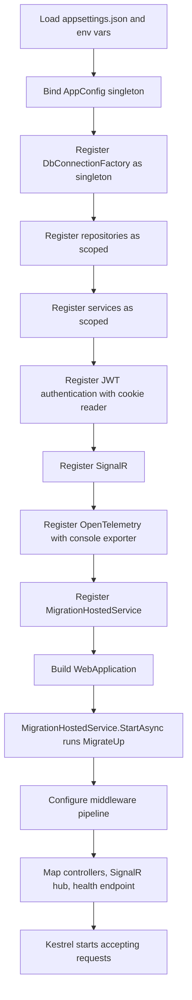

### 7.2 Dependency Wiring

All dependencies are registered in `Program.cs` using ASP.NET Core's built-in DI container. The composition order follows the dependency graph:

1. **Configuration** — `AppConfig` is constructed from `IConfiguration` and registered as a **singleton**. All services receive `AppConfig` by constructor injection; they do not read `IConfiguration` directly.

2. **Infrastructure** — `IDbConnectionFactory` is registered as a **singleton**. It holds only the connection string (no mutable state) and is safe to share.

3. **Repositories** — All three repository interfaces are registered as **scoped** (one instance per HTTP request). Each method opens and disposes its own `IDbConnection`.

4. **Services** — All service interfaces are registered as **scoped**. `JwtService` receives `AppConfig` to read the signing key and expiry.

5. **JWT Authentication** — `AddAuthentication().AddJwtBearer()` with a custom `OnMessageReceived` event handler that reads the token from the HTTP-only cookie named `"jwt"` rather than the `Authorization` header. This is the only place cookie-name coupling is hardcoded.

6. **SignalR** — `AddSignalR()` registers hub infrastructure. `TallyHub` is mapped to `/hubs/tally` in the middleware pipeline.

7. **OpenTelemetry** — `AddOpenTelemetry()` configured with `ConsoleExporter` for both traces and metrics. Named activity sources: `PollMe.VoteSubmission`, `PollMe.PollCreation`, `PollMe.ResultsRetrieval`.

8. **FluentMigrator** — `AddFluentMigratorCore()` with the SQLite connection string and an assembly scanner targeting `PollMe.Api`. `MigrationHostedService` is registered as `IHostedService`.

### 7.3 Configuration Parameters

| Parameter | Type | Default | Required | Source |
|-----------|------|---------|:---:|------|
| `Jwt__Secret` | string | — | **Yes** | Environment variable |
| `Jwt__Issuer` | string | `"pollme"` | No | `appsettings.json` |
| `Jwt__Audience` | string | `"pollme"` | No | `appsettings.json` |
| `Jwt__ExpiryMinutes` | int | `1440` | No | `appsettings.json` |
| `Database__Path` | string | `"pollme.db"` | No | `appsettings.json` |
| `Poll__MinOptions` | int | `2` | No | `appsettings.json` |
| `Poll__MaxOptions` | int | `10` | No | `appsettings.json` |
| `VoteToken__ExpiryDays` | int | `365` | No | `appsettings.json` |

`Jwt__Secret` must be supplied via environment variable in the Compose file or developer shell — it must never appear in a committed file. `AppConfig` fails fast with a clear error message at startup if `Jwt__Secret` is missing or empty.

---

## 8. Testing Strategy

### 8.1 Unit Tests — Per Class/Module

#### Backend Controllers

| Class | Test | Requirement | Description |
|-------|------|:-----------:|-------------|
| `AuthController` | `Register_ValidRequest_Returns201WithCookie` | FR-3.1.1 | Service returns creator → 201 with HTTP-only cookie set |
| `AuthController` | `Register_DuplicateUsername_Returns409` | FR-3.1.1 | Service throws `ConflictException` → 409 |
| `AuthController` | `Login_ValidCredentials_Returns200WithCookie` | FR-3.1.2 | Service returns creator → 200 with HTTP-only cookie |
| `AuthController` | `Login_InvalidCredentials_Returns401WithGenericMessage` | FR-3.1.2 | Service returns null → 401; response body does not identify which field failed |
| `AuthController` | `Logout_ExpiresCookie` | FR-3.1.3 | Response sets the JWT cookie with `Max-Age=0` |
| `PollsController` | `Create_ValidRequest_Returns201WithSlugAndVoteLink` | FR-3.2.1 | Service returns poll → 201 with `slug` and `voteLink` in body |
| `PollsController` | `Create_ValidationFailure_Returns400` | FR-3.2.1 | Service throws `ValidationException` → 400 |
| `PollsController` | `Create_Unauthenticated_Returns401` | FR-3.2.1 | No JWT cookie → 401 |
| `PollsController` | `GetMyPolls_ReturnsCreatorDashboardSummaries` | FR-3.2.2 | Returns `PollSummaryDto` list for authenticated creator |
| `PollsController` | `GetBySlug_KnownSlug_ReturnsPollVoteDto` | FR-3.2.3 | Returns poll question, options, and mode |
| `PollsController` | `GetBySlug_UnknownSlug_Returns404` | FR-3.2.3 | Service throws `NotFoundException` → 404 |
| `VoteController` | `Submit_PublicPoll_Returns200WithTallyDto` | FR-3.3.1, FR-3.3.2 | Vote recorded → 200 with `TallyDto` for a public poll |
| `VoteController` | `Submit_CreatorOnlyPoll_Returns200WithConfirmationOnly` | FR-3.3.2 | Vote recorded → 200 with confirmation message; no tally in body |
| `VoteController` | `Submit_BroadcastsTallyToSignalRGroup` | FR-3.4.1 | `IHubContext` mock receives `SendAsync("ReceiveTallyUpdate", ...)` on group `"poll-{id}"` |
| `ResultsController` | `GetResults_PublicPoll_UnauthenticatedReturns200` | FR-3.4.2 | No JWT → 200 with `TallyDto` for a public poll |
| `ResultsController` | `GetResults_CreatorOnlyPoll_UnauthenticatedReturns403` | FR-3.4.2 | No JWT → 403 |
| `ResultsController` | `GetResults_CreatorOnlyPoll_OwnerReturns200` | FR-3.4.2 | Authenticated as owning creator → 200 with `TallyDto` |
| `ResultsController` | `GetResults_CreatorOnlyPoll_NonOwnerReturns403` | FR-3.4.2 | Authenticated as a different creator → 403 |

#### Backend Services

| Class | Test | Requirement | Description |
|-------|------|:-----------:|-------------|
| `AuthService` | `Register_NewUsername_StoresPasswordAsBcryptHash` | FR-3.1.1, NFR-6.2 | The `passwordHash` passed to the repository is a valid bcrypt hash; the original plaintext is not present |
| `AuthService` | `Register_ExistingUsername_ThrowsConflict` | FR-3.1.1 | `FindByUsernameAsync` returns a creator → `ConflictException` thrown |
| `AuthService` | `Login_CorrectPassword_ReturnsCreator` | FR-3.1.2 | BCrypt hash matches plaintext → returns `Creator` |
| `AuthService` | `Login_WrongPassword_ReturnsNull` | FR-3.1.2 | Hash mismatch → returns `null` |
| `AuthService` | `Login_UnknownUsername_ReturnsNull` | FR-3.1.2 | Repository returns null → returns `null` |
| `PollService` | `Create_ValidInput_ReturnsCreatedPollWithSlug` | FR-3.2.1 | Poll has a non-empty, non-null slug matching 6-char alphanumeric pattern |
| `PollService` | `Create_BelowMinOptions_ThrowsValidation` | FR-3.2.1 | Option count below `Poll__MinOptions` → `ValidationException` |
| `PollService` | `Create_AboveMaxOptions_ThrowsValidation` | FR-3.2.1 | Option count above `Poll__MaxOptions` → `ValidationException` |
| `PollService` | `GetCreatorPolls_TieForLeading_ReturnsOptionWithLowestPosition` | FR-3.2.2 | Two options with equal vote count → the option with the lowest `Position` value is identified as leading |
| `PollService` | `GetCreatorPolls_NoVotes_ReturnsNullLeadingOptionAndZeroPercent` | FR-3.2.2 | Poll with no votes → `leadingOptionText` is `null` and `leadingPercentage` is `0` |
| `SlugService` | `Generate_CollisionOnFirstAttempt_ReturnsSecondCandidate` | FR-3.2.1 | First slug returned by `SlugExistsAsync` as taken; second candidate is returned |
| `VoteService` | `Submit_SingleSelectWithMultipleIds_ThrowsValidation` | FR-3.3.1 | Single-select poll + 2 selected option IDs → `ValidationException` |
| `VoteService` | `Submit_MultiSelectWithNoIds_ThrowsValidation` | FR-3.3.1 | Multi-select poll + empty array → `ValidationException` |
| `VoteService` | `Submit_ValidSingleSelect_CallsRepoAndReturnsTally` | FR-3.3.1 | Valid single-select vote → repository `InsertAsync` called once; `TallyDto` returned |
| `VoteService` | `Submit_ValidMultiSelect_PersistsAllSelections` | FR-3.3.2 | Valid multi-select vote with 3 options selected → 3 rows persisted in `vote_selections` |
| `VoteService` | `GetTallies_CorrectlyComputesRoundedPercentages` | FR-3.4.2 | `Percentage = round((votes / total) * 100)` for each option |
| `VoteService` | `GetTallies_NoVotesCast_AllOptionsReturnZeroPercent` | FR-3.4.2 | Repository returns all zero counts → all `Percentage` values are 0 |

#### Frontend Hooks and Components

| Module | Test | Requirement | Description |
|--------|------|:-----------:|-------------|
| `useVoteStatus` | `Returns_HasVotedFalse_WhenNoLocalStorageKey` | FR-3.3.3 | No `voted_{slug}` key in storage → `hasVoted` is `false` |
| `useVoteStatus` | `Returns_HasVotedTrue_WhenLocalStorageKeyPresent` | FR-3.3.3 | `voted_{slug}` key present → `hasVoted` is `true` |
| `useVoteStatus` | `MarkVoted_WritesKeyToLocalStorage` | FR-3.3.3 | Calling `markVoted(slug)` creates `voted_{slug}` in `localStorage` |
| `VoteForm` | `SingleSelect_RendersRadioButtonsForEachOption` | FR-3.3.1 | Poll with `mode=SingleSelect` → all option inputs are `type="radio"` |
| `VoteForm` | `MultiSelect_RendersCheckboxesForEachOption` | FR-3.3.1 | Poll with `mode=MultiSelect` → all option inputs are `type="checkbox"` |
| `VoteForm` | `SingleSelect_SubmitDisabledUntilSelectionMade` | FR-3.3.1 | Submit button is disabled with no selection; enabled after one radio is selected |
| `VoteForm` | `MultiSelect_SubmitEnabledWithAtLeastOneCheckbox` | FR-3.3.1 | Submit enabled once at least one checkbox is checked |
| `ResultsChart` | `Renders_AllOptionsWithBarWidthMatchingPercentage` | FR-3.4.2 | Each option's bar element has a width style equal to its `percentage` value |
| `ResultsChart` | `Renders_ZeroWidthBars_WhenAllPercentagesAreZero` | FR-3.4.2 | All bars at 0% when `TallyDto` options all carry `percentage: 0` |
| `ProtectedRoute` | `RedirectsToLogin_WhenAuthContextIsNull` | FR-3.1.2 | No auth context present → renders `<Navigate to="/login" />` |
| `VotePage` | `VotePage_NotVoted_RendersVoteForm` | FR-3.3.1 | `hasVoted(slug)` returns `false` → `VoteForm` component is rendered |
| `VotePage` | `VotePage_AlreadyVoted_PublicPoll_RendersResultsView` | FR-3.3.3 | `hasVoted(slug)` returns `true` and poll visibility is Public → results view is rendered instead of the form |
| `VotePage` | `VotePage_AlreadyVoted_CreatorOnlyPoll_RendersConfirmation` | FR-3.3.3 | `hasVoted(slug)` returns `true` and poll visibility is CreatorOnly → confirmation message is rendered |

### 8.2 Integration Tests

All backend integration tests use `WebApplicationFactory<Program>` with a per-test temporary SQLite file. Migrations run automatically via `MigrationHostedService` during factory startup. `IHubContext<TallyHub>` is replaced with an NSubstitute mock registered before `WebApplicationFactory` builds — SignalR broadcast behaviour is validated in controller unit tests instead.

Frontend integration tests (React Testing Library) mock the API layer with Jest module mocks or MSW — no live backend is needed.

| Test | Requirements Covered | Setup | Exercise | Assert |
|------|---------------------|-------|----------|--------|
| `Register_CreatesCreatorAndSetsCookie` | FR-3.1.1 | Empty DB | `POST /api/auth/register` with unique username | 201; HTTP-only `jwt` cookie set; row exists in `creators` table |
| `Register_RejectsDuplicateUsername` | FR-3.1.1 | Creator already in DB | `POST /api/auth/register` with same username | 409 Conflict; no new row created |
| `Login_SetsCookieForValidCredentials` | FR-3.1.2 | Creator seeded with bcrypt hash | `POST /api/auth/login` with correct password | 200; HTTP-only `jwt` cookie set |
| `Login_RejectsWrongPassword` | FR-3.1.2 | Creator in DB | `POST /api/auth/login` with wrong password | 401; no cookie in response |
| `Logout_ClearsCookie` | FR-3.1.3 | Authenticated session | `POST /api/auth/logout` | 200; `jwt` cookie expired |
| `GetMe_ValidCookie_ReturnsCreatorIdAndUsername` | FR-3.1.2 | Authenticated session | `GET /api/auth/me` with valid JWT cookie | 200; response body contains `id` and `username` matching the seeded creator |
| `GetMe_NoCookie_Returns401` | FR-3.1.2 | No session | `GET /api/auth/me` (no JWT cookie) | 401 Unauthorized |
| `CreatePoll_PersistsPollAndOptions` | FR-3.2.1 | Authenticated creator | `POST /api/polls` with valid 3-option payload | 201; poll and 3 option rows in DB; response contains `slug` and `voteLink` |
| `CreatePoll_RejectsTooFewOptions` | FR-3.2.1 | Authenticated creator | `POST /api/polls` with 1 option | 400 Bad Request |
| `CreatePoll_RejectsUnauthenticated` | FR-3.2.1 | No session | `POST /api/polls` | 401 Unauthorized |
| `GetMyPolls_ReturnsOnlyCallerPolls` | FR-3.2.2 | Two creators, each with polls | `GET /api/polls` as creator A | Response contains only creator A's polls; creator B's polls absent |
| `GetMyPolls_IncludesVoteCountAndLeadingOption` | FR-3.2.2 | Poll with 3 votes on option A, 1 on option B | `GET /api/polls` | Dashboard entry shows `totalVotes: 4`, `leadingOptionText: "Option A"`, `leadingPercentage: 75` |
| `GetPollBySlug_ReturnsPollForVoting` | FR-3.2.3 | Poll in DB | `GET /api/polls/{slug}` (unauthenticated) | 200 with `question`, `options`, and `mode` |
| `GetPollBySlug_Returns404ForUnknownSlug` | FR-3.2.3 | Empty DB | `GET /api/polls/unknown` | 404 Not Found |
| `SubmitVote_PersistsVoteAndSelections` | FR-3.3.1 | Poll with 3 options | `POST /api/polls/{slug}/votes` with 1 selected option ID | 200; 1 row in `votes`; 1 row in `vote_selections` |
| `SubmitVote_ReturnsTallyForPublicPoll` | FR-3.3.2 | Public poll | `POST /api/polls/{slug}/votes` | Response body is `TallyDto` with option counts and percentages |
| `SubmitVote_ReturnsConfirmationForCreatorOnlyPoll` | FR-3.3.2 | Creator-only poll | `POST /api/polls/{slug}/votes` | Response body contains confirmation message; no tally data |
| `SubmitVote_RejectsTwoSelectionsOnSingleSelectPoll` | FR-3.3.1 | Single-select poll | `POST /api/polls/{slug}/votes` with 2 option IDs | 400 Bad Request |
| `GetResults_ReturnsTallyForPublicPoll_Unauthenticated` | FR-3.4.2 | Public poll with votes | `GET /api/polls/{slug}/results` (no auth) | 200 with correct vote counts and rounded percentages |
| `GetResults_Returns403ForCreatorOnlyPoll_Unauthenticated` | FR-3.4.2 | Creator-only poll | `GET /api/polls/{slug}/results` (no auth) | 403 Forbidden |
| `GetResults_ReturnsResultsForOwnerOfCreatorOnlyPoll` | FR-3.4.2 | Creator-only poll; authenticated as owner | `GET /api/polls/{slug}/results` | 200 with `TallyDto` |
| `GetResults_Returns403ForNonOwnerOfCreatorOnlyPoll` | FR-3.4.2 | Creator-only poll; authenticated as different creator | `GET /api/polls/{slug}/results` | 403 Forbidden |

### 8.3 Requirements Traceability Matrix

| Requirement | Unit Tests | Integration Tests | Notes |
|-------------|-----------|------------------|-------|
| FR-3.1.1 Registration | `Register_StoresPasswordAsBcryptHash`, `Register_ExistingUsername_ThrowsConflict`, `Register_ValidRequest_Returns201`, `Register_DuplicateUsername_Returns409` | `Register_CreatesCreatorAndSetsCookie`, `Register_RejectsDuplicateUsername` | Bcrypt storage verified in unit test; never in integration test DB dump |
| FR-3.1.2 Login | `Login_CorrectPassword_ReturnsCreator`, `Login_WrongPassword_ReturnsNull`, `Login_UnknownUsername_ReturnsNull`, `Login_ValidCredentials_Returns200`, `Login_InvalidCredentials_Returns401WithGenericMessage` | `Login_SetsCookieForValidCredentials`, `Login_RejectsWrongPassword`, `GetMe_ValidCookie_ReturnsCreatorIdAndUsername`, `GetMe_NoCookie_Returns401` | Generic 401 message does not expose which field failed; `GET /api/auth/me` tests validate SPA auth-state initialization |
| FR-3.1.3 Logout | `Logout_ExpiresCookie` | `Logout_ClearsCookie` | |
| FR-3.2.1 Poll Creation | `Create_ValidInput_ReturnsCreatedPollWithSlug`, `Create_BelowMinOptions_ThrowsValidation`, `Create_AboveMaxOptions_ThrowsValidation`, `Generate_CollisionOnFirstAttempt_ReturnsSecondCandidate` | `CreatePoll_PersistsPollAndOptions`, `CreatePoll_RejectsTooFewOptions`, `CreatePoll_RejectsUnauthenticated` | Slug retry covered in `SlugService` unit test |
| FR-3.2.2 Dashboard | `GetMyPolls_ReturnsCreatorDashboardSummaries` | `GetMyPolls_ReturnsOnlyCallerPolls`, `GetMyPolls_IncludesVoteCountAndLeadingOption` | |
| FR-3.2.3 Poll Retrieval | `GetBySlug_KnownSlug_ReturnsPollVoteDto`, `GetBySlug_UnknownSlug_Returns404` | `GetPollBySlug_ReturnsPollForVoting`, `GetPollBySlug_Returns404ForUnknownSlug` | |
| FR-3.3.1 Vote Submission | `Submit_SingleSelectWithMultipleIds_ThrowsValidation`, `Submit_MultiSelectWithNoIds_ThrowsValidation`, `VoteForm` unit tests | `SubmitVote_PersistsVoteAndSelections`, `SubmitVote_RejectsTwoSelectionsOnSingleSelectPoll` | |
| FR-3.3.2 Post-Vote Experience | `Submit_PublicPoll_Returns200WithTallyDto`, `Submit_CreatorOnlyPoll_Returns200WithConfirmationOnly` | `SubmitVote_ReturnsTallyForPublicPoll`, `SubmitVote_ReturnsConfirmationForCreatorOnlyPoll` | |
| FR-3.3.3 Duplicate Prevention | `useVoteStatus` hook unit tests | — | Browser localStorage; no server-side enforcement to integration-test |
| FR-3.4.1 Real-Time Updates | `Submit_BroadcastsTallyToSignalRGroup` | — | SignalR broadcast verified against mocked `IHubContext` in controller unit test |
| FR-3.4.2 Results Display | `GetTallies_CorrectlyComputesRoundedPercentages`, `GetTallies_NoVotesCast_AllOptionsReturnZeroPercent`, `ResultsChart` unit tests | `GetResults_ReturnsTallyForPublicPoll_Unauthenticated`, `GetResults_Returns403ForCreatorOnlyPoll_Unauthenticated`, `GetResults_ReturnsResultsForOwner`, `GetResults_Returns403ForNonOwner` | Percentage formula and zero-vote edge case covered in service unit tests |
| FR-3.5.1 Tracing | — | — | OTel configuration verified by smoke-testing the running system; no automated assertions in v1 |
| FR-3.5.2 Metrics | — | — | Same as FR-3.5.1 |
| FR-3.6.1 CI Pipeline | — | — | GitHub Actions workflow file runs `dotnet test` and `npm test` on every push; pipeline config is itself the artifact |

### 8.4 Test Infrastructure

**Test Doubles:**

| Interface | Double Type | Purpose |
|-----------|-------------|---------|
| `IHubContext<TallyHub>` | NSubstitute mock | Verifies group broadcast calls without a live WebSocket connection |
| `ICreatorRepository` | NSubstitute mock | Isolates `AuthService` in unit tests |
| `IPollRepository` | NSubstitute mock | Isolates `PollService` and `SlugService` in unit tests |
| `IVoteRepository` | NSubstitute mock | Isolates `VoteService` in unit tests |

**Integration Test Dependencies:**

Backend integration tests use `WebApplicationFactory<Program>` with a per-test temporary SQLite file path (e.g., `Path.GetTempFileName()` + `.db`). FluentMigrator migrations run automatically via `MigrationHostedService` during factory startup. Each test disposes the file after completion. No Docker or external services are required to run backend tests.

Frontend integration tests (React Testing Library + Jest) mock API calls using Jest module factories applied to the `api/` layer. No live backend is needed.

**Shared Test Utilities:**

| Utility | Purpose |
|---------|---------|
| `PollBuilder` | Fluent builder for `CreatePollRequest` fixtures; defaults to a valid 2-option single-select public poll so each test only specifies what it overrides |
| `AuthHelper` | Sends `POST /api/auth/register` and `POST /api/auth/login`, extracts the JWT cookie, and attaches it to subsequent `HttpClient` requests |
| `DbSeedHelper` | Inserts `Creator`, `Poll`, `Option`, and `Vote` rows directly via Dapper for integration test setup; avoids going through the API to seed data |
| `TallyAssertions` | FluentAssertions extension methods that verify percentage arithmetic correctness on a `TallyDto` (`ShouldHaveCorrectPercentages`, `ShouldSumToApproximately100`) — `ShouldSumToApproximately100` asserts that the sum of all option percentages is within ±2 of 100, tolerating independent per-option rounding |

---

## 9. Open Questions

1. **Nginx WebSocket proxy headers (from HLD open question 1):** The nginx `default.conf` must include `proxy_http_version 1.1`, `proxy_set_header Upgrade $http_upgrade`, and `proxy_set_header Connection "upgrade"` for the `/hubs/tally` location block. This is a known nginx requirement for SignalR WebSocket connections and must be captured explicitly when the nginx config is written.

2. **JWT cookie reading (from HLD open question 2):** ASP.NET Core's `JwtBearerHandler` reads tokens from the `Authorization` header by default. A custom `OnMessageReceived` event handler must read the token from the HTTP-only cookie named `"jwt"`. This is the only place the cookie name is hardcoded — it should be a named constant shared between the cookie-set path in `AuthController` and the read path in the JWT auth configuration.

3. **`MigrationHostedService` execution order:** `IHostedService.StartAsync` is called before Kestrel begins accepting connections only if the service is registered before `WebApplication.Run`. Registration order in `Program.cs` must be verified to confirm this guarantee.

4. **Tally percentage sum-to-100:** When option percentages are independently rounded to the nearest whole number, they may not sum to exactly 100% (e.g., three options each at 33.3% round to 33/33/33 = 99%). For a portfolio demo, independent rounding is acceptable and documented as a known simplification. `TallyAssertions` should assert values are within ±1% of expected rather than requiring exact equality.

5. **`GET /api/auth/me` for SPA auth state initialization:** On every browser load, the React app needs to know if the user is authenticated without requiring another login. `GET /api/auth/me` must return the creator's `Id` and `Username` from the JWT claims so the SPA can initialize `useAuth` state. If the cookie is absent or expired, it returns 401 — the SPA treats this as unauthenticated and shows the login page.

---

*This low-level design is detailed enough for an implementer to create a task breakdown and begin coding without architectural ambiguity. All class designs and test plans trace back to the [requirements document](pollme-requirements.md) and are consistent with the [high-level design](pollme-high-level-design.md).*
