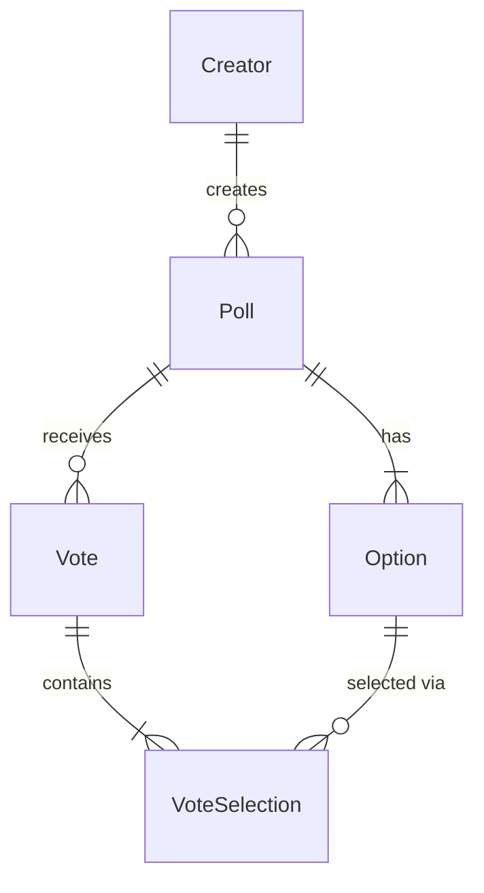
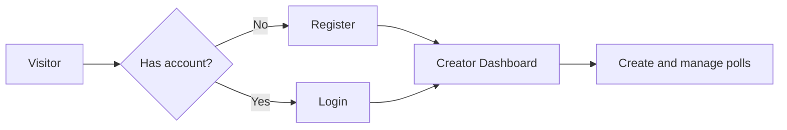
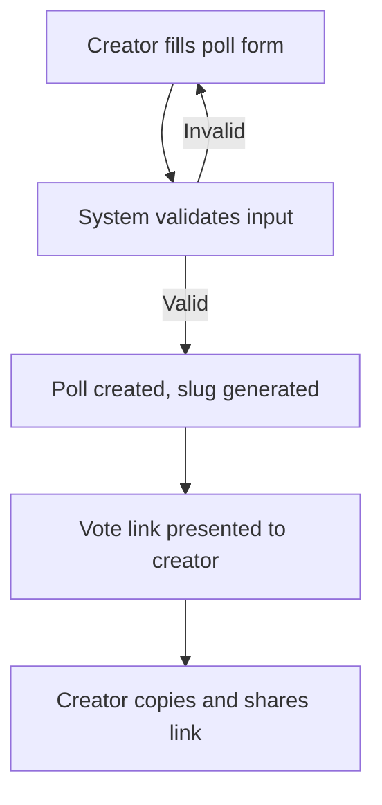
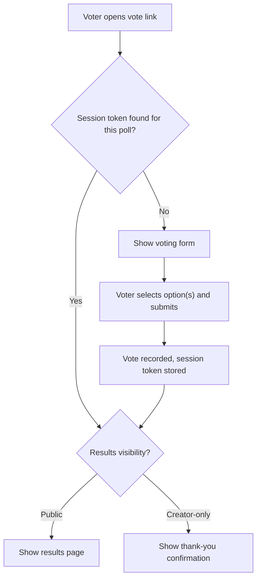
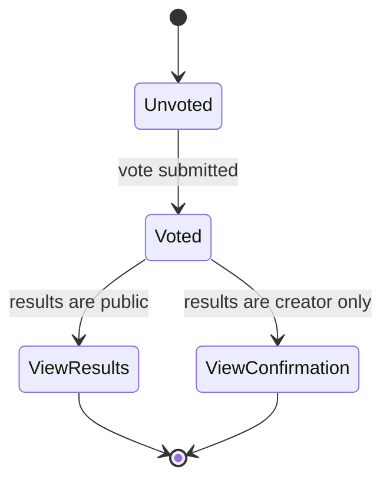
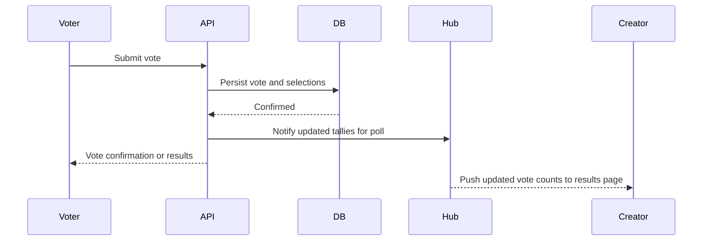
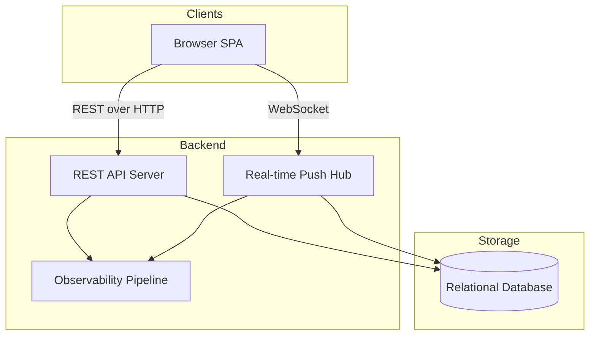

# PollMe 3.0 — Requirements

## 1. Overview

PollMe 3.0 is a full-stack polling web application that lets registered creators build polls (single-choice or multiple-choice), share them via a simple link, and track live results as anonymous voters participate. The project is designed as a portfolio artifact: every architectural layer should be readable, explainable, and walkable in a brief technical interview.

## 2. Core Concepts

### 2.1 Terminology

| Term | Definition |
|------|------------|
| **Poll Creator** | A registered user who creates polls, manages them, and views results via the dashboard. Authenticates with username and password. |
| **Voter** | An anonymous participant who receives a vote link and casts a vote — no account required. |
| **Vote Link** | A shareable URL containing an auto-generated slug that takes a voter directly to a specific poll's voting page. Shared via copy-to-clipboard. |
| **Slug** | A short, URL-friendly identifier auto-generated for each poll (e.g., `a3x9k2`). |
| **Single-select** | A poll mode where the voter may choose exactly one answer option. |
| **Multi-select** | A poll mode where the voter may choose one or more answer options. |
| **Creator Dashboard** | A page listing all polls created by the authenticated user, with at-a-glance result summaries. |
| **Results Visibility** | A per-poll setting (public or creator-only) controlling whether voters can see results after voting. |
| **Session Token** | A short-lived identifier stored in the voter's browser, used for best-effort duplicate-vote prevention. |
| **VoteSelection** | The association between a cast vote and the specific option(s) chosen by the voter. |

### 2.2 Entity Relationships

## 3. Functional Requirements

### 3.1 Authentication

#### FR-3.1.1 Registration
- The system SHALL allow a visitor to register as a Poll Creator by providing a unique username and a password.
- The system SHALL reject registration if the username is already taken and inform the user accordingly.
- The system SHALL store passwords in a hashed form; plaintext passwords SHALL NOT be persisted.
- The system SHALL NOT require email verification at registration.

#### FR-3.1.2 Login
- The system SHALL authenticate a Poll Creator by verifying their username and password.
- The system SHALL establish an authenticated session upon successful login.
- The system SHALL reject login with invalid credentials without revealing which field was incorrect.

#### FR-3.1.3 Logout
- The system SHALL allow an authenticated creator to log out, ending their session.

### 3.2 Poll Management

#### FR-3.2.1 Poll Creation
- The system SHALL allow an authenticated creator to create a poll.
- A poll SHALL be composed of:
  - A question (required, text-only)
  - Between 2 and 10 answer options (each text-only)
  - A poll mode: single-select or multi-select
  - A results visibility setting: public or creator-only
- The system SHALL auto-generate a unique slug for each poll upon creation.
- Upon successful creation, the system SHALL present the creator with their poll's vote link, which they can copy to their clipboard.

#### FR-3.2.2 Creator Dashboard
- The system SHALL provide an authenticated creator with a dashboard listing all polls they have created.
- Each dashboard entry SHALL display:
  - The poll question (truncated if necessary)
  - Total vote count
  - The leading option and its current percentage
  - The creation date
- The dashboard SHALL allow the creator to navigate to any individual poll's full results page.

#### FR-3.2.3 Poll Retrieval for Voting
- The system SHALL allow any user (authenticated or anonymous) to access a poll's voting page via its vote link.
- The voting page SHALL display the poll question and all answer options.

### 3.3 Voting

#### FR-3.3.1 Vote Submission
- The system SHALL allow any anonymous Voter to cast a vote on a poll by navigating to its vote link — no account is required.
- For single-select polls, the Voter SHALL be required to select exactly one option before submitting.
- For multi-select polls, the Voter SHALL be required to select at least one option before submitting.
- On submitting a vote, the system SHALL record the vote and persist a session token in the voter's browser.

#### FR-3.3.2 Post-Vote Experience
- If the poll's results visibility is **public**, the Voter SHALL be shown the current results immediately after voting.
- If the poll's results visibility is **creator-only**, the Voter SHALL be shown a simple confirmation message after voting and nothing more.

#### FR-3.3.3 Duplicate Vote Prevention
- The system SHALL perform best-effort duplicate-vote prevention using a browser-stored session token.
- If a session token indicating a prior vote on the same poll is present, the system SHALL skip the voting form and instead:
  - Show the results page (for public-visibility polls), or
  - Show the confirmation message (for creator-only polls).
- The system SHALL NOT guarantee strict duplicate enforcement. Clearing browser data allows a voter to vote again — this is an accepted limitation for a portfolio demo.

### 3.4 Live Results

#### FR-3.4.1 Real-Time Vote Updates
- The results page SHALL update vote counts and percentages in real time as new votes are submitted, without requiring a page refresh.
- Real-time delivery is scoped to a single server deployment; multi-instance synchronization is not a v1 requirement.

#### FR-3.4.2 Results Display
- The results page SHALL display each answer option alongside its vote count and its percentage of total votes, visualized as a horizontal bar.
- Percentage SHALL be computed as (option votes ÷ total votes) × 100, rounded to the nearest whole number.
- When no votes have been cast, all options SHALL display 0%.
- The results page SHALL be accessible to:
  - The poll creator at any time (authenticated).
  - Any voter after voting, if the poll's results visibility is set to public.

### 3.5 Observability

#### FR-3.5.1 Distributed Tracing
- The system SHALL emit distributed traces for key operations, including poll creation, vote submission, and results retrieval.
- Traces SHALL be emitted in a standard, interoperable format compatible with common observability tooling.

#### FR-3.5.2 Metrics
- The system SHALL emit operational metrics including HTTP request counts, request latency, and vote submission rate.
- Metrics SHALL be emitted in a standard, interoperable format compatible with common observability tooling.

### 3.6 CI Pipeline

#### FR-3.6.1 Automated Quality Gates
- A CI pipeline SHALL run automatically on every push to the repository.
- The pipeline SHALL execute build, test, and lint checks for both backend and frontend code.
- A failing check SHALL block merge.
- The pipeline configuration itself SHALL be a first-class portfolio artifact — readable and explainable.

## 4. API Requirements

The system exposes a REST API that serves the two primary actors — Poll Creators and Voters — alongside a persistent, real-time channel through which the server pushes live result updates to connected clients without them needing to poll or refresh.

### 4.1 Authentication

The API supports creator account registration, login, and logout. These operations exist to establish and manage the authenticated session that gates creator-only actions. Unauthenticated users cannot create or list polls; the session credential is the boundary between the public (voting) experience and the creator experience.

### 4.2 Poll Management

Authenticated creators need to create polls and retrieve a list of their own polls so they can monitor and share them. The API also provides an unauthenticated route for loading a specific poll's question and options — this is what powers the voter's experience when they follow a shared vote link. Without this public access, anonymous participation would not be possible.

### 4.3 Voting

Voters submit their selection(s) anonymously. No account or session credential is required. The API records the vote and immediately coordinates delivery of updated tallies to any clients connected to that poll's real-time channel.

### 4.4 Results

Results can be fetched on demand. Access is conditional on the poll's results-visibility setting: results are publicly accessible for public polls, and restricted to the authenticated creator for creator-only polls. This conditionality is what enforces the creator's stated preference at poll creation time.

### 4.5 Real-Time Channel

A persistent connection channel complements the REST API by allowing the server to push tally updates to connected clients the moment a vote is recorded. This eliminates the need for the results page to poll for changes and is what makes the live-results experience feel immediate and engaging.

### 4.6 Vote Submission and Real-Time Flow

## 5. Configuration Parameters

### 5.1 Poll Shape Constraints

The system enforces configurable limits on how a poll is structured — specifically, the permitted range for the number of answer options. These constraints exist to keep polls usable: too few options is not a meaningful choice, and too many degrades the voting experience. The exact bounds are a system-level concern rather than something each creator sets individually.

### 5.2 Per-Poll Behavioral Settings

Each poll carries two behavioral settings that the creator chooses at creation time and that govern the poll's entire lifetime:

- **Voting mode** — whether voters may select only one option (single-select) or one or more (multi-select). This is a content decision: some questions have one right answer; others invite multiple selections.
- **Results visibility** — whether voters may see results after voting, or whether results are reserved for the creator alone. This lets the creator control the social dynamics of their poll (e.g., avoiding bandwagon effects by hiding results until they are ready to share them).

Both settings are immutable after creation — the poll's behaviour should be predictable for everyone who interacts with it.

### 5.3 Session Token Lifetime

The voter's browser-stored session token, used for best-effort duplicate-vote detection, has a configurable expiry. The default is long enough that a typical voter will not accidentally vote twice during normal use, while still being finite so that tokens do not accumulate indefinitely.

## 6. Non-Functional Requirements

### 6.1 Readability and Explainability
- The system SHALL be implemented such that any layer — data access, API, real-time, frontend — can be walked through and explained within five minutes in a technical interview.
- All database interactions SHALL use explicit, visible queries; no hidden or auto-generated query logic is permitted.
- Schema evolution SHALL be managed through explicit, human-readable migration steps traceable in source control.

### 6.2 Security
- Creator passwords SHALL be stored using a strong, one-way hashing algorithm; plaintext passwords SHALL NOT appear in storage or logs.
- API endpoints that create or manage polls SHALL require a valid creator session.
- The system SHALL guard against common web vulnerabilities (e.g., XSS, CSRF where applicable).

### 6.3 Testability
- The backend SHALL have meaningful test coverage for business logic and API endpoints.
- The frontend SHALL have meaningful test coverage for key user-facing components and interactions.
- All tests SHALL be runnable locally and as part of the CI pipeline.

### 6.4 Real-Time Responsiveness
- Results pages SHALL reflect new votes within a few seconds of submission without a page reload.

### 6.5 Performance and Scale
- The system is designed for a small creator population and demo-scale traffic; no specific throughput SLA is required.
- Horizontal scaling and distributed real-time synchronization are not v1 concerns.

### 6.6 Frontend Aesthetics
- The UI SHALL be clean and readable without relying on heavy custom CSS.
- Visual style SHALL emerge from well-structured, semantic HTML markup.

## 7. Out of Scope (v1)

- Rich media (images, video) in poll questions or options — all content is text-only
- Poll scheduling, expiry, or manual closure — polls are open-ended once created
- Editing or deleting a poll after creation
- Analytics beyond per-option vote tallies (no demographics, time series, or trend data)
- Strict duplicate-vote enforcement (one-time vote links, IP-based blocking, etc.)
- Password reset or account recovery
- Email verification at registration
- Social or federated authentication (OAuth, SSO, passkeys)
- Horizontal / multi-server real-time scaling
- Poll result export (CSV, JSON, etc.)

## 8. System Architecture Overview

## 9. Glossary

| Term | Definition |
|------|------------|
| **Poll Creator** | A registered user who creates and manages polls. |
| **Voter** | An anonymous participant who casts a vote via a shared link. |
| **Vote Link** | A shareable URL containing a poll's slug, directing a voter to the voting page. |
| **Slug** | A short, auto-generated, URL-friendly identifier uniquely identifying a poll (e.g., `a3x9k2`). |
| **Single-select** | A poll mode in which a voter may choose exactly one option. |
| **Multi-select** | A poll mode in which a voter may choose one or more options. |
| **Creator Dashboard** | The authenticated view listing all polls created by a creator, with at-a-glance stats. |
| **Results Visibility** | A per-poll configuration controlling whether voters may view results after voting. |
| **Session Token** | A browser-stored identifier used for best-effort prevention of duplicate votes from the same browser. |
| **VoteSelection** | The join between a cast vote and the specific option(s) the voter chose. |

---

## Assumptions Made

- The creator population is small (primarily the author); the system is not designed for large-scale concurrent usage.
- A single server deployment is sufficient for v1; distributed real-time is deferred.
- Session-based deduplication is accepted as "good enough" for a portfolio demo; voters who clear browser data can vote again — this is a known, accepted limitation.
- Poll creators authenticate with username and password only; no external identity providers are needed in v1.
- All poll content is text-only; no media attachments are anticipated.
- Slugs are auto-generated by the system and are not user-configurable.
- Polls have no draft state; they are live and accepting votes immediately upon creation.
