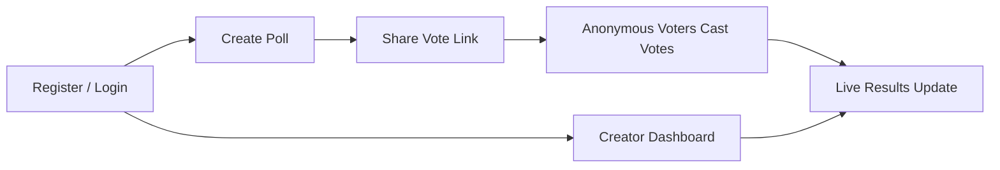

# PollMe 3.0 — Project Narrative

## Background

### Motivation

PollMe 3.0 is a portfolio project: a full-stack polling web application designed to be **readable, explainable, and interview-ready**. The primary audience is a hiring manager or technical interviewer; every architectural choice should be something the author can walk through confidently.

Previous iterations (1.x / 2.x) are being superseded. Version 3.0 starts from a clean slate with an emphasis on real-time features, observability, and patterns that tell a clear story at every layer of the stack.

### Current State

The project does not yet exist. No application code, project structure, or CI pipeline has been built.

### The Gap

PollMe 3.0 needs to be defined before it can be built — what it does, who uses it, how those users interact with it, and what a complete, satisfying experience looks like end to end. This narrative establishes that shared understanding so formal requirements can be derived next.

## Terminology

| Term | Definition |
|------|------------|
| **Poll Creator** | A registered user who creates polls, manages them, and views results via the dashboard. Authenticates with username/password. |
| **Voter** | An anonymous participant who receives a vote link and casts a vote — no account required. |
| **Vote Link** | A shareable URL containing an auto-generated slug that takes a voter directly to a specific poll's voting page. Shared via copy-to-clipboard. |
| **Slug** | A short, URL-friendly identifier auto-generated for each poll (e.g., `a3x9k2`). |
| **Single-select** | A poll mode where the voter may choose exactly one answer option. |
| **Multi-select** | A poll mode where the voter may choose one or more answer options. |
| **Creator Dashboard** | A page listing all polls created by the authenticated user, with at-a-glance result summaries. |
| **Results Visibility** | A per-poll setting (public or creator-only) controlling whether voters can see results after voting. |
| **Session Token** | A short-lived identifier stored in the voter's browser, used for best-effort duplicate-vote prevention. If cleared, the voter can vote again — an accepted limitation. |

## Goals

1. **Deliver a working, demo-able polling application.** A creator registers and creates polls (single- or multiple-choice), shares vote links, and tracks live results. Voters participate anonymously via shared links.

2. **Make every implementation choice explainable.** Code, architecture, and infrastructure should be transparent enough that the author can walk an interviewer through any layer in under five minutes.

3. **Keep data access patterns transparent and readable.** All database interactions should be visible and understandable in the codebase — no hidden query generation. The schema's evolution should be equally clear.

4. **Deliver live, updating results.** Poll results pages update as votes arrive — no manual refresh required. This is both a user-experience feature and a technical talking point.

5. **Instrument the application with observability from day one.** Traces and metrics are emitted for key operations to demonstrate production-readiness thinking.

6. **Maintain a clean, testable codebase.** Both backend and frontend layers have meaningful test coverage. Tests are part of the CI gate, not an afterthought.

7. **Automate quality gates on every push.** Build, test, and lint checks run automatically in a CI pipeline. The pipeline itself is a portfolio artifact.

8. **Keep the frontend minimal and polished.** The UI should feel clean without heavy CSS investment — style emerges from well-structured markup, not elaborate custom styling.

## Proposal

### The Experience in a Nutshell

PollMe is a lightweight polling app built around one core loop: **register → create a poll → share a link → collect anonymous votes → view live results.** Voters don't need accounts — anyone with the link can participate. Creators sign up with a simple username and password — bare-minimum auth (register, login) with no email verification or password reset in v1.

### Creating a Poll

A poll creator registers (or logs in) and fills out a simple form: a question, 2–10 answer options, a choice of single-select or multi-select, and a **results visibility** setting (public or creator-only). On submission the creator receives a **vote link** — a URL with a short, auto-generated slug (e.g., `/poll/a3x9k2`) — which they can copy to clipboard and share however they like.

### Voting

A voter opens the shared link, sees the question and options, makes their selection, and submits. No account or login is required — the experience is intentionally frictionless. To discourage casual duplicate voting, the app uses best-effort session-based deduplication (sufficient for a portfolio demo, not bulletproof). If the poll's results are configured as public, the voter can see current results after voting; if results are creator-only, the voter sees a simple "Thanks for voting!" confirmation and nothing more.

### Live Results

Results update in real time as votes arrive — no page refresh needed. The results page shows each option with its vote count and a horizontal percentage bar chart. This gives the creator (and, for public-results polls, curious voters) an engaging, interactive feel.

### Creator Dashboard

Creators log in with their username and password to access a dashboard listing all polls they've created. Each row shows the poll question (truncated), total vote count, the leading option with its percentage, and the creation date. From the dashboard creators can drill into any individual poll's full results page.

### What's Deliberately Out of Scope

- **Rich media in polls.** Questions and options are text-only for now.
- **Poll scheduling or expiry.** Polls are open-ended once created; no manual close.
- **Analytics beyond vote counts.** The results view shows tallies, not demographics or trends.
- **Strict duplicate-vote enforcement.** Best-effort session dedup only; determined users can bypass it.

## Open Questions

*All initial open questions were resolved during drafting. Decisions are captured below for traceability.*

1. **Creator identity** → Lightweight username/password authentication. Creators register and log in; polls are owned by their account.
2. **Duplicate vote prevention** → Best-effort deduplication via a browser-stored session token. If a voter clears their browser data, they can vote again — accepted as a known limitation for a portfolio demo.
3. **Results visibility** → Configurable per poll. The creator chooses public or creator-only at creation time.
4. **Poll closure / expiry** → Not needed for v1. Polls remain open-ended.
5. **Dashboard persistence** → Resolved by decision 1; creator auth provides server-side poll ownership.
6. **Real-time at scale** → Real-time result updates are scoped to a single deployment — horizontal scaling is not a v1 concern and can be revisited if the application outgrows its initial scope.

## Appendices

### A. Alternatives Considered

#### Creator Identity: Passwordless Link vs Username/Password vs No Auth

| | Passwordless (email link) | Username/Password | No Auth (client-side only) |
|---|---|---|---|
| **Pros** | No password to manage | Simple, well-understood pattern | Zero friction |
| **Cons** | Requires email infrastructure, adds complexity | Password storage responsibility | Dashboard can't survive device/browser change |
| **Decision** | — | **Chosen.** Simplest server-side ownership model for a portfolio project. | — |

#### Duplicate Vote Prevention: Strict Enforcement vs Session Dedup vs None

| | Strict enforcement (one-time links) | Session deduplication | None |
|---|---|---|---|
| **Pros** | Strong integrity | Good-enough for demo, simple | Simplest |
| **Cons** | Complex link management, poor UX for re-shares | Bypassable | No integrity at all |
| **Decision** | — | **Chosen.** Balances demo quality with implementation simplicity. | — |

### B. Key Assumptions

- The app targets a **portfolio / interview demo** audience, not production scale.
- The creator population is small (likely just the author); credentials must still be stored securely.
- The app runs on a **single server**; horizontal scaling is not a v1 concern.
