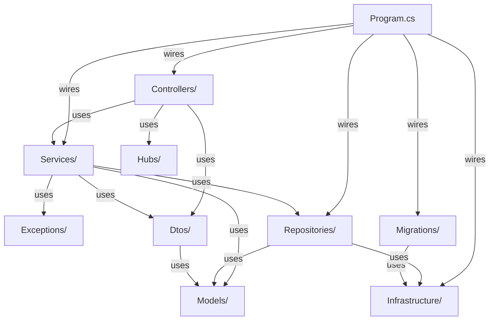
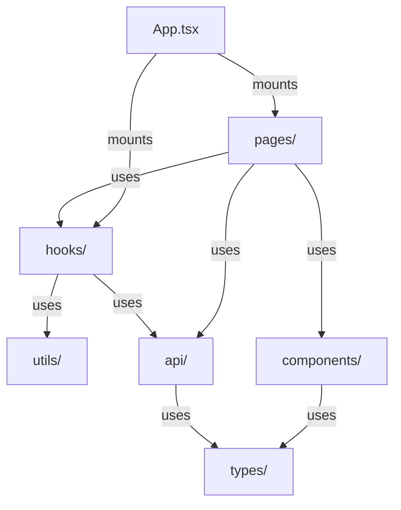

# PollMe 3.0 — Implementation Plan

This plan breaks the low-level design into implementable tasks organized into execution batches.
All tasks within a batch must complete before the next batch begins.

**Total Tasks:** 60 | **Batches:** 10 | **Critical Path:** 10 tasks | **Max Parallel Tracks:** 6 (Batch 6)

---

## Package Dependency Graph

### Backend (PollMe.Api)



### Frontend (pollme-frontend)



---

## Batch Execution Overview

```
Batch 1: Project Scaffolding
  Track A (serial): 1.1 → 1.2           [PollMe.sln + PollMe.Api.Tests]
  Track B (serial): 1.3 → 1.4           [Vite SPA + Jest/RTL]
  ─── Tracks A and B: PARALLEL ───
  >>> Commit: Both projects build; test runners execute with 0 tests

Batch 2: Core Shared Types
  Track A: 2.1                           [Models/]
  Track B: 2.2 → 2.3                    [Dtos/ then Exceptions/]
  Track C: 2.4                           [Infrastructure/]
  Track D: 2.5 and 2.6                  [src/types/, src/utils/]
  ─── Tracks A, C, D: PARALLEL ───
  ─── Track B depends on Track A (2.2 imports PollMode/ResultsVisibility) ───
  >>> Commit: All domain types and DTOs defined; both projects compile

Batch 3: Database Layer Foundations
  Track A: 3.1 and 3.2                  [Migrations/, MigrationHostedService]
  Track B: 3.3                           [Repository interfaces]
  ─── Tracks A and B: PARALLEL ───
  >>> Commit: Schema defined; repository contracts established

Batch 4: Repository Implementations
  Track A: 4.1                           [CreatorRepository]
  Track B: 4.2                           [PollRepository]
  Track C: 4.3                           [VoteRepository]
  ─── Tracks A, B, C: PARALLEL ───
  >>> Commit: Full data access layer implemented

Batch 5: Service Layer, Hub, and Frontend API
  5.1 runs first; then 5.2–5.7 PARALLEL; 5.8 PARALLEL with all
  >>> Commit: Business logic complete; frontend API layer wired

Batch 6: Controllers, Components, and Hooks
  Track A: 6.1, 6.2, 6.3, 6.4          [Controllers/]
  Track B: 6.5, 6.6, 6.7, 6.8          [src/components/]
  Track C: 6.9, 6.10, 6.11             [src/hooks/]
  ─── Tracks A, B, C: PARALLEL; within each track tasks are PARALLEL ───
  >>> Commit: Full API surface; all reusable frontend pieces

Batch 7: Application Shell, Pages, and Test Infrastructure
  Track A: 7.1                           [Program.cs + appsettings.json]
  Track B: 7.2, 7.3, 7.4, 7.5, 7.6, 7.7 [App.tsx + 5 pages — PARALLEL]
  Track C: 7.8                           [Test helpers]
  ─── Tracks A, B, C: PARALLEL ───
  >>> Commit: App runs end-to-end; pages renderable; test helpers ready

Batch 8: Unit Tests
  Track A: 8.1, 8.2, 8.3               [Service unit tests]
  Track B: 8.4, 8.5, 8.6               [Controller unit tests]
  Track C: 8.7, 8.8, 8.9, 8.10         [Frontend unit tests]
  ─── All tracks and all tasks within: PARALLEL ───
  >>> Commit: All unit tests green

Batch 9: Integration Tests
  9.1, 9.2, 9.3 PARALLEL (after 7.1 and 7.8 complete)
  >>> Commit: Full backend integration test coverage green

Batch 10: Deployment
  Track A: 10.1                          [Backend Dockerfile]
  Track B: 10.2                          [Frontend Dockerfile + nginx.conf]
  Track C: 10.3 → 10.4                  [docker-compose.yml then CI workflow]
  ─── Tracks A and B: PARALLEL; Track C depends on A and B ───
  >>> Commit: Docker Compose system runs; CI pipeline green
```

---

## Critical Path

The longest sequential chain through the batch graph (10 tasks):

```
1.1 → 2.1 → 3.3 → 4.2 → 5.1 → 5.5 → 6.2 → 7.1 → 7.8 → 9.2
```

No amount of parallelism can complete the project faster than this chain.

---

## Batch 1: Project Scaffolding

### Track A — Backend Solution (serial)

#### Task 1.1 — Create .NET Solution and PollMe.Api Project

**Prerequisites:** None
**Conflicts with:** Task 1.2 (both modify `PollMe.sln` — run serially)
**Parallel with:** Tasks 1.3, 1.4 (Track B — different directory)

**Objective:** Scaffold the ASP.NET Core Web API project with all required NuGet packages and folder structure.

**Instructions:**
1. From the repo root:
   ```
   dotnet new sln -n PollMe
   dotnet new webapi -n PollMe.Api --no-https -f net8.0
   dotnet sln add PollMe.Api/PollMe.Api.csproj
   ```
2. Delete template files: `PollMe.Api/Controllers/WeatherForecastController.cs`, `PollMe.Api/WeatherForecast.cs`
3. Create subdirectories inside `PollMe.Api/`: `Controllers/`, `Services/`, `Repositories/`, `Hubs/`, `Models/`, `Dtos/`, `Migrations/`, `Infrastructure/`, `Exceptions/`
4. Install NuGet packages:
   ```
   dotnet add PollMe.Api package Dapper
   dotnet add PollMe.Api package Microsoft.Data.Sqlite
   dotnet add PollMe.Api package FluentMigrator
   dotnet add PollMe.Api package FluentMigrator.Runner
   dotnet add PollMe.Api package FluentMigrator.Runner.SQLite
   dotnet add PollMe.Api package BCrypt.Net-Next
   dotnet add PollMe.Api package System.IdentityModel.Tokens.Jwt
   dotnet add PollMe.Api package Microsoft.AspNetCore.Authentication.JwtBearer
   dotnet add PollMe.Api package OpenTelemetry
   dotnet add PollMe.Api package OpenTelemetry.Exporter.Console
   dotnet add PollMe.Api package OpenTelemetry.Extensions.Hosting
   dotnet add PollMe.Api package OpenTelemetry.Instrumentation.AspNetCore
   dotnet add PollMe.Api package Microsoft.AspNetCore.SignalR
   ```
5. Replace `PollMe.Api/Program.cs` with a minimal stub: `var app = WebApplication.Create(); app.Run();`

**Verification:** `dotnet build PollMe.Api/PollMe.Api.csproj` — compiles with no errors
**Requirements covered:** —

---

#### Task 1.2 — Create PollMe.Api.Tests Project

**Prerequisites:** Task 1.1
**Conflicts with:** Task 1.1 (same `.sln` file)
**Parallel with:** Tasks 1.3, 1.4

**Objective:** Scaffold the xUnit test project with all required test dependencies and subfolder structure.

**Instructions:**
1. From the repo root:
   ```
   dotnet new xunit -n PollMe.Api.Tests -f net8.0
   dotnet sln add PollMe.Api.Tests/PollMe.Api.Tests.csproj
   dotnet add PollMe.Api.Tests reference PollMe.Api
   ```
2. Delete generated `PollMe.Api.Tests/UnitTest1.cs`
3. Create subdirectories: `PollMe.Api.Tests/Controllers/`, `PollMe.Api.Tests/Services/`, `PollMe.Api.Tests/Integration/`, `PollMe.Api.Tests/Helpers/`
4. Install NuGet packages:
   ```
   dotnet add PollMe.Api.Tests package FluentAssertions
   dotnet add PollMe.Api.Tests package NSubstitute
   dotnet add PollMe.Api.Tests package Microsoft.AspNetCore.Mvc.Testing
   dotnet add PollMe.Api.Tests package Microsoft.NET.Test.Sdk
   ```

**Verification:** `dotnet test PollMe.Api.Tests/PollMe.Api.Tests.csproj` — 0 tests, no errors
**Requirements covered:** —

---

### Track B — Frontend SPA (serial)

#### Task 1.3 — Scaffold React + TypeScript SPA

**Prerequisites:** None
**Conflicts with:** Task 1.4 (same `package.json`)
**Parallel with:** Tasks 1.1, 1.2

**Objective:** Initialize the Vite + React + TypeScript SPA with routing, CSS framework, and SignalR client.

**Instructions:**
1. From the repo root:
   ```
   npm create vite@latest pollme-frontend -- --template react-ts
   cd pollme-frontend && npm install
   npm install react-router-dom @picocss/pico @microsoft/signalr
   ```
2. Create subdirectories inside `pollme-frontend/src/`: `pages/`, `components/`, `hooks/`, `api/`, `types/`, `utils/`
3. Remove unused Vite template files: `src/App.css`, `src/index.css`, `src/assets/react.svg`, `public/vite.svg`
4. Replace `src/App.tsx` with a minimal stub returning `<div>PollMe</div>`
5. In `src/main.tsx`, add: `import '@picocss/pico'`

**Verification:** `cd pollme-frontend && npm run build` — Vite build succeeds with no TypeScript errors
**Requirements covered:** —

---

#### Task 1.4 — Configure Frontend Test Infrastructure

**Prerequisites:** Task 1.3
**Conflicts with:** Task 1.3 (same `package.json`)
**Parallel with:** Tasks 1.1, 1.2

**Objective:** Set up Jest + React Testing Library with jsdom, TypeScript support, and CSS module mocking.

**Instructions:**
1. From `pollme-frontend/`, install dev dependencies:
   ```
   npm install --save-dev jest @types/jest ts-jest jest-environment-jsdom @testing-library/react @testing-library/user-event @testing-library/jest-dom identity-obj-proxy
   ```
2. Create `pollme-frontend/jest.config.ts`:
   ```ts
   export default {
     preset: 'ts-jest',
     testEnvironment: 'jsdom',
     setupFilesAfterFramework: ['<rootDir>/jest.setup.ts'],
     moduleNameMapper: { '\\.(css|less|scss|sass)$': 'identity-obj-proxy' },
   };
   ```
3. Create `pollme-frontend/jest.setup.ts`: `import '@testing-library/jest-dom';`
4. Add `"test": "jest"` to `package.json` scripts

**Verification:** `cd pollme-frontend && npm test` — Jest starts with 0 test suites, no configuration errors
**Requirements covered:** —

---

### Batch 1 Commit Checkpoint
- [ ] `dotnet build PollMe.sln` — both projects compile
- [ ] `dotnet test PollMe.Api.Tests/PollMe.Api.Tests.csproj` — 0 tests, no errors
- [ ] `cd pollme-frontend && npm run build` — SPA builds cleanly
- [ ] `cd pollme-frontend && npm test` — 0 test suites, no configuration errors
- [ ] All `PollMe.Api/` and `pollme-frontend/src/` subdirectories exist

---

## Batch 2: Core Shared Types

*Tracks A, C, D are TRULY PARALLEL. Track B depends on Track A (2.2 imports enums from 2.1).*

### Track A — Domain Models

#### Task 2.1 — Create Domain Model Classes and Enumerations

**Prerequisites:** Task 1.1
**Conflicts with:** None
**Parallel with:** Tasks 2.3, 2.4, 2.5, 2.6

**Objective:** Create all eight entity classes and two enumerations that map to database rows.

**Instructions:**
1. `Models/PollMode.cs`: `public enum PollMode { SingleSelect, MultiSelect }` — namespace `PollMe.Api.Models`
2. `Models/ResultsVisibility.cs`: `public enum ResultsVisibility { Public, CreatorOnly }`
3. `Models/Creator.cs` — `Id: int`, `Username: string`, `PasswordHash: string`, `CreatedAt: DateTime` (all `init` setters)
4. `Models/Poll.cs` — `Id: int`, `CreatorId: int`, `Question: string`, `Slug: string`, `Mode: PollMode`, `Visibility: ResultsVisibility`, `CreatedAt: DateTime`
5. `Models/Option.cs` — `Id: int`, `PollId: int`, `Text: string`, `Position: int`
6. `Models/Vote.cs` — `Id: int`, `PollId: int`, `SessionToken: string`, `CreatedAt: DateTime`
7. `Models/VoteSelection.cs` — `VoteId: int`, `OptionId: int`
8. `Models/OptionTally.cs` — `OptionId: int`, `Text: string`, `Votes: int`
9. Use `init`-only setters on all properties; no constructors (Dapper uses property setters)

**Verification:** `dotnet build PollMe.Api/PollMe.Api.csproj` — compiles with no errors
**Requirements covered:** FR-3.1.1, FR-3.2.1, FR-3.3.1, FR-3.4.2

---

### Track B — DTOs and Exceptions (depends on 2.1)

#### Task 2.2 — Create Request and Response DTOs

**Prerequisites:** Task 2.1 (for `PollMode`/`ResultsVisibility` in `CreatePollRequest`)
**Conflicts with:** None
**Parallel with:** Tasks 2.3, 2.4, 2.5, 2.6

**Objective:** Create all ten request/response DTOs used for API binding and serialization.

**Instructions:**
1. `Dtos/RegisterRequest.cs` — `[Required] Username: string`, `[Required] Password: string`
2. `Dtos/LoginRequest.cs` — same as above
3. `Dtos/CreatePollRequest.cs` — `Question: string`, `Options: string[]`, `Mode: PollMode`, `Visibility: ResultsVisibility` (imports `PollMe.Api.Models`)
4. `Dtos/VoteRequest.cs` — `SelectedOptionIds: int[]` (default empty array)
5. `Dtos/CreatePollResponseDto.cs` — `Slug: string`, `VoteLink: string`
6. `Dtos/OptionDto.cs` — `Id: int`, `Text: string`, `Position: int`
7. `Dtos/PollVoteDto.cs` — `Id: int`, `Slug: string`, `Question: string`, `Options: OptionDto[]`, `Mode: PollMode`
8. `Dtos/PollSummaryDto.cs` — `Id: int`, `Slug: string`, `Question: string`, `TotalVotes: int`, `LeadingOptionText: string?`, `LeadingPercentage: int`, `CreatedAt: DateTime`
9. `Dtos/OptionTallyDto.cs` — `OptionId: int`, `Text: string`, `Votes: int`, `Percentage: int`
10. `Dtos/TallyDto.cs` — `PollId: int`, `Options: OptionTallyDto[]`

**Verification:** `dotnet build PollMe.Api/PollMe.Api.csproj` — compiles with no errors
**Requirements covered:** —

---

#### Task 2.3 — Create Custom Exception Classes

**Prerequisites:** Task 1.1
**Conflicts with:** None
**Parallel with:** Tasks 2.1, 2.2, 2.4, 2.5, 2.6

**Objective:** Create the three application exception types thrown by services and caught by global error middleware.

**Instructions:**
1. `Exceptions/ConflictException.cs`: `public class ConflictException(string message) : Exception(message);`
2. `Exceptions/NotFoundException.cs`: same pattern
3. `Exceptions/ValidationException.cs`: same pattern
4. All three in namespace `PollMe.Api.Exceptions`; inherit directly from `Exception`

**Verification:** `dotnet build PollMe.Api/PollMe.Api.csproj` — compiles with no errors
**Requirements covered:** —

---

### Track C — Infrastructure

#### Task 2.4 — Create Infrastructure Layer

**Prerequisites:** Task 1.1
**Conflicts with:** None
**Parallel with:** Tasks 2.1, 2.2, 2.3, 2.5, 2.6

**Objective:** Create `AppConfig` (configuration POCO) and the database connection factory interface + implementation.

**Instructions:**
1. `Infrastructure/AppConfig.cs` — nested configuration POCO:
   ```csharp
   public class AppConfig {
       public JwtConfig Jwt { get; init; } = new();
       public DatabaseConfig Database { get; init; } = new();
       public PollConfig Poll { get; init; } = new();
       public VoteTokenConfig VoteToken { get; init; } = new();
   }
   public class JwtConfig {
       public string Secret { get; init; } = "";
       public string Issuer { get; init; } = "pollme";
       public string Audience { get; init; } = "pollme";
       public int ExpiryMinutes { get; init; } = 1440;
   }
   public class DatabaseConfig { public string Path { get; init; } = "pollme.db"; }
   public class PollConfig { public int MinOptions { get; init; } = 2; public int MaxOptions { get; init; } = 10; }
   public class VoteTokenConfig { public int ExpiryDays { get; init; } = 365; }
   ```
2. `Infrastructure/IDbConnectionFactory.cs`: `public interface IDbConnectionFactory { IDbConnection CreateConnection(); }`
3. `Infrastructure/DbConnectionFactory.cs`: `public class DbConnectionFactory(string connectionString) : IDbConnectionFactory { public IDbConnection CreateConnection() => new SqliteConnection(connectionString); }`

**Verification:** `dotnet build PollMe.Api/PollMe.Api.csproj` — compiles with no errors
**Requirements covered:** —

---

### Track D — Frontend Types and Utilities

#### Task 2.5 — Create Frontend TypeScript Interfaces

**Prerequisites:** Task 1.3
**Conflicts with:** None
**Parallel with:** Tasks 2.1, 2.2, 2.3, 2.4, 2.6

**Objective:** Define all TypeScript interfaces mirroring backend DTOs and domain types.

**Instructions:**
1. Create `src/types/index.ts` with these exports:
   - `type PollMode = 'SingleSelect' | 'MultiSelect'`
   - `type ResultsVisibility = 'Public' | 'CreatorOnly'`
   - `interface Creator { id: number; username: string; }`
   - `interface OptionDto { id: number; text: string; position: number; }`
   - `interface PollVoteDto { id: number; slug: string; question: string; options: OptionDto[]; mode: PollMode; }`
   - `interface PollSummaryDto { id: number; slug: string; question: string; totalVotes: number; leadingOptionText: string | null; leadingPercentage: number; createdAt: string; }`
   - `interface OptionTallyDto { optionId: number; text: string; votes: number; percentage: number; }`
   - `interface TallyDto { pollId: number; options: OptionTallyDto[]; }`
   - `interface CreatePollResponseDto { slug: string; voteLink: string; }`
   - `interface RegisterRequest { username: string; password: string; }`
   - `interface LoginRequest { username: string; password: string; }`
   - `interface CreatePollRequest { question: string; options: string[]; mode: PollMode; visibility: ResultsVisibility; }`
   - `interface VoteRequest { selectedOptionIds: number[]; }`

**Verification:** `cd pollme-frontend && npm run build` — no TypeScript errors
**Requirements covered:** —

---

#### Task 2.6 — Create Frontend Utility Functions

**Prerequisites:** Task 1.3
**Conflicts with:** None
**Parallel with:** Tasks 2.1, 2.2, 2.3, 2.4, 2.5

**Objective:** Implement `voteStorage` (localStorage helpers for duplicate-vote detection) and `formatPercentage`.

**Instructions:**
1. Create `src/utils/voteStorage.ts`:
   - `const VOTE_TOKEN_EXPIRY_DAYS = 365`
   - `markVoted(slug: string): void` — writes `JSON.stringify({ ts: Date.now() })` to `localStorage` key `voted_${slug}`
   - `hasVoted(slug: string): boolean` — reads key; returns `false` if absent; parses JSON; returns `false` if `Date.now() - entry.ts >= VOTE_TOKEN_EXPIRY_DAYS * 86_400_000`; returns `true` otherwise; wraps entirely in `try/catch` returning `false` on any error
2. Create `src/utils/formatPercentage.ts`:
   - `export function formatPercentage(value: number): string { return \`${Math.round(value)}%\`; }`

**Verification:** `cd pollme-frontend && npm run build` — no TypeScript errors
**Requirements covered:** FR-3.3.3

---

### Batch 2 Commit Checkpoint
- [ ] `dotnet build PollMe.sln` — compiles with no errors
- [ ] `cd pollme-frontend && npm run build` — TypeScript compiles with no errors
- [ ] 8 model files, 10 DTO files, 3 exception files, 3 infrastructure files exist in backend
- [ ] `src/types/index.ts` and both `src/utils/` files exist in frontend

---

## Batch 3: Database Layer Foundations

*Depends on Batch 2. Tracks A and B are TRULY PARALLEL.*

### Track A — Migrations and Hosted Service

#### Task 3.1 — Create FluentMigrator Migration Classes

**Prerequisites:** Tasks 1.1, 2.4
**Conflicts with:** None
**Parallel with:** Tasks 3.2, 3.3

**Objective:** Implement the five migration classes defining the complete SQLite schema.

**Instructions:**
1. `Migrations/M001_CreateCreators.cs` — `[Migration(1)]`, `Up()` creates table `creators`: `id INTEGER PK AUTOINCREMENT`, `username TEXT UNIQUE NOT NULL`, `password_hash TEXT NOT NULL`, `created_at TEXT NOT NULL`; `Down()` drops table
2. `Migrations/M002_CreatePolls.cs` — `[Migration(2)]`, creates `polls`: `id INTEGER PK AUTOINCREMENT`, `creator_id INTEGER NOT NULL FK→creators(id)`, `question TEXT NOT NULL`, `slug TEXT UNIQUE NOT NULL`, `mode TEXT NOT NULL`, `visibility TEXT NOT NULL`, `created_at TEXT NOT NULL`
3. `Migrations/M003_CreateOptions.cs` — `[Migration(3)]`, creates `options`: `id INTEGER PK AUTOINCREMENT`, `poll_id INTEGER NOT NULL FK→polls(id)`, `text TEXT NOT NULL`, `position INTEGER NOT NULL`
4. `Migrations/M004_CreateVotes.cs` — `[Migration(4)]`, creates `votes`: `id INTEGER PK AUTOINCREMENT`, `poll_id INTEGER NOT NULL FK→polls(id)`, `session_token TEXT NOT NULL`, `created_at TEXT NOT NULL`
5. `Migrations/M005_CreateVoteSelections.cs` — `[Migration(5)]`, creates `vote_selections` with composite PK `(vote_id, option_id)`: `vote_id INTEGER NOT NULL FK→votes(id)`, `option_id INTEGER NOT NULL FK→options(id)`
6. All inherit `FluentMigrator.Migration`; namespace `PollMe.Api.Migrations`

**Verification:** `dotnet build PollMe.Api/PollMe.Api.csproj` — compiles with no errors
**Requirements covered:** —

---

#### Task 3.2 — Create MigrationHostedService

**Prerequisites:** Tasks 1.1, 2.4
**Conflicts with:** None
**Parallel with:** Tasks 3.1, 3.3

**Objective:** Implement the `IHostedService` that runs `MigrateUp()` at API startup before Kestrel accepts connections.

**Instructions:**
1. Create `Infrastructure/MigrationHostedService.cs`:
   ```csharp
   using FluentMigrator.Runner;
   namespace PollMe.Api.Infrastructure;
   public class MigrationHostedService(IMigrationRunner runner) : IHostedService {
       public Task StartAsync(CancellationToken ct) { runner.MigrateUp(); return Task.CompletedTask; }
       public Task StopAsync(CancellationToken ct) => Task.CompletedTask;
   }
   ```
2. This service is registered in `Program.cs` (Task 7.1) via `services.AddHostedService<MigrationHostedService>()` — the registration order ensures migration completes before Kestrel starts

**Verification:** `dotnet build PollMe.Api/PollMe.Api.csproj` — compiles with no errors
**Requirements covered:** —

---

### Track B — Repository Interfaces

#### Task 3.3 — Create Repository Interfaces

**Prerequisites:** Task 2.1
**Conflicts with:** None
**Parallel with:** Tasks 3.1, 3.2

**Objective:** Define the three repository interfaces that form the contract between services and data access.

**Instructions:**
1. `Repositories/ICreatorRepository.cs`:
   - `FindByUsernameAsync(username: string): Task<Creator?>` — null on miss, never throws
   - `CreateAsync(username: string, passwordHash: string): Task<Creator>` — returns new Creator with assigned Id
2. `Repositories/IPollRepository.cs`:
   - `CreateWithOptionsAsync(poll: Poll, options: IEnumerable<Option>): Task<Poll>` — atomic; returns Poll with Id
   - `GetBySlugAsync(slug: string): Task<Poll?>` — null if not found
   - `GetOptionsByPollIdAsync(pollId: int): Task<IEnumerable<Option>>` — empty list (never null)
   - `GetByCreatorIdAsync(creatorId: int): Task<IEnumerable<Poll>>` — empty list (never null)
   - `SlugExistsAsync(slug: string): Task<bool>`
3. `Repositories/IVoteRepository.cs`:
   - `CreateAsync(vote: Vote, selectedOptionIds: IEnumerable<int>): Task<Vote>` — atomic
   - `GetTalliesAsync(pollId: int): Task<IEnumerable<OptionTally>>` — includes zero-vote options; never null

**Verification:** `dotnet build PollMe.Api/PollMe.Api.csproj` — compiles with no errors
**Requirements covered:** —

---

### Batch 3 Commit Checkpoint
- [ ] `dotnet build PollMe.sln` — compiles with no errors
- [ ] 5 migration files in `Migrations/`; `MigrationHostedService.cs` in `Infrastructure/`
- [ ] 3 repository interface files in `Repositories/`

---

## Batch 4: Repository Implementations

*All three tasks depend on Tasks 2.1, 2.4, 3.3. They are TRULY PARALLEL — each is a single new file.*

#### Task 4.1 — Implement CreatorRepository

**Prerequisites:** Tasks 2.1, 2.4, 3.3
**Conflicts with:** None
**Parallel with:** Tasks 4.2, 4.3

**Objective:** Implement `ICreatorRepository` using Dapper with parameterized SQL; no string concatenation.

**Instructions:**
1. Create `Repositories/CreatorRepository.cs` implementing `ICreatorRepository`, injecting `IDbConnectionFactory`
2. Each method: `using var conn = _factory.CreateConnection();`
3. `FindByUsernameAsync`: `QuerySingleOrDefaultAsync<Creator>` with SQL:
   `SELECT id, username, password_hash AS PasswordHash, created_at AS CreatedAt FROM creators WHERE username = @Username`
4. `CreateAsync`: `ExecuteScalarAsync<int>` with:
   `INSERT INTO creators (username, password_hash, created_at) VALUES (@Username, @PasswordHash, @CreatedAt); SELECT last_insert_rowid();`
   Return `new Creator { Id = id, Username = username, PasswordHash = passwordHash, CreatedAt = DateTime.UtcNow }`

**Verification:** `dotnet build PollMe.Api/PollMe.Api.csproj` — compiles with no errors
**Requirements covered:** FR-3.1.1, FR-3.1.2

---

#### Task 4.2 — Implement PollRepository

**Prerequisites:** Tasks 2.1, 2.4, 3.3
**Conflicts with:** None
**Parallel with:** Tasks 4.1, 4.3

**Objective:** Implement all five `IPollRepository` methods; `CreateWithOptionsAsync` uses a transaction; enums stored as strings.

**Instructions:**
1. Create `Repositories/PollRepository.cs` implementing `IPollRepository`, injecting `IDbConnectionFactory`
2. `CreateWithOptionsAsync`: open connection → begin transaction → insert poll using `poll.Mode.ToString()` and `poll.Visibility.ToString()` → `last_insert_rowid()` → loop-insert each option with position index → commit → return `poll with { Id = pollId }`
3. `GetBySlugAsync`: `QuerySingleOrDefaultAsync<Poll>` with column aliases — Dapper maps string column values to enum by name when the property name matches: `SELECT id, creator_id AS CreatorId, question, slug, mode AS Mode, visibility AS Visibility, created_at AS CreatedAt FROM polls WHERE slug = @Slug`
4. `GetOptionsByPollIdAsync`: `QueryAsync<Option>` with `SELECT id, poll_id AS PollId, text, position FROM options WHERE poll_id = @PollId ORDER BY position`
5. `GetByCreatorIdAsync`: same pattern, `WHERE creator_id = @CreatorId ORDER BY created_at DESC`
6. `SlugExistsAsync`: `ExecuteScalarAsync<int>` `SELECT COUNT(1) FROM polls WHERE slug = @Slug` → `count > 0`

**Verification:** `dotnet build PollMe.Api/PollMe.Api.csproj` — compiles with no errors
**Requirements covered:** FR-3.2.1, FR-3.2.2, FR-3.2.3

---

#### Task 4.3 — Implement VoteRepository

**Prerequisites:** Tasks 2.1, 2.4, 3.3
**Conflicts with:** None
**Parallel with:** Tasks 4.1, 4.2

**Objective:** Implement `IVoteRepository` with transactional vote+selections insert and a LEFT JOIN tally query that includes zero-count options.

**Instructions:**
1. Create `Repositories/VoteRepository.cs` implementing `IVoteRepository`, injecting `IDbConnectionFactory`
2. `CreateAsync`: open connection → begin transaction → `INSERT INTO votes (poll_id, session_token, created_at) VALUES (...)` with `Guid.NewGuid().ToString()` as token → get rowid → loop-insert `(vote_id, option_id)` into `vote_selections` → commit → return `vote with { Id = voteId }`
3. `GetTalliesAsync`: execute this LEFT JOIN (required to show zero-vote options):
   ```sql
   SELECT o.id AS OptionId, o.text AS Text, COUNT(vs.vote_id) AS Votes
   FROM options o
   LEFT JOIN vote_selections vs ON vs.option_id = o.id
   LEFT JOIN votes v ON vs.vote_id = v.id AND v.poll_id = @PollId
   WHERE o.poll_id = @PollId
   GROUP BY o.id, o.text
   ORDER BY o.position
   ```

**Verification:** `dotnet build PollMe.Api/PollMe.Api.csproj` — compiles with no errors
**Requirements covered:** FR-3.3.1, FR-3.4.2

---

### Batch 4 Commit Checkpoint
- [ ] `dotnet build PollMe.sln` — compiles with no errors
- [ ] 3 repository implementation files in `Repositories/`

---

## Batch 5: Service Layer, Hub, and Frontend API

*Task 5.1 runs first. After it completes, Tasks 5.2–5.7 are TRULY PARALLEL (separate files). Task 5.8 is TRULY PARALLEL with all backend tasks (different codebase).*

#### Task 5.1 — Create Service Interfaces

**Prerequisites:** Tasks 2.1, 2.2, 3.3
**Conflicts with:** None
**Parallel with:** Task 5.8

**Objective:** Define all five service interfaces consumed by controllers.

**Instructions:**
1. `Services/IAuthService.cs`: `RegisterAsync(username, password): Task<Creator>`; `LoginAsync(username, password): Task<Creator?>`
2. `Services/IPollService.cs`: `CreatePollAsync(creatorId: int, request: CreatePollRequest): Task<Poll>`; `GetBySlugAsync(slug: string): Task<Poll>`; `GetPollWithOptionsAsync(slug: string): Task<PollVoteDto>`; `GetCreatorPollsAsync(creatorId: int): Task<IEnumerable<PollSummaryDto>>`
3. `Services/IVoteService.cs`: `SubmitVoteAsync(poll: Poll, selectedOptionIds: IEnumerable<int>): Task<TallyDto>`; `GetTalliesAsync(pollId: int): Task<TallyDto>`
4. `Services/ISlugService.cs`: `GenerateUniqueSlugAsync(): Task<string>`
5. `Services/IJwtService.cs`: `IssueToken(creator: Creator): string`

**Verification:** `dotnet build PollMe.Api/PollMe.Api.csproj` — compiles with no errors
**Requirements covered:** —

---

#### Task 5.2 — Implement AuthService

**Prerequisites:** Tasks 4.1, 5.1
**Conflicts with:** None
**Parallel with:** Tasks 5.3, 5.4, 5.5, 5.6, 5.7

**Objective:** Implement registration (BCrypt hash + conflict check) and login (BCrypt verify).

**Instructions:**
1. Create `Services/AuthService.cs` implementing `IAuthService`, injecting `ICreatorRepository`
2. `RegisterAsync`: call `FindByUsernameAsync`; if non-null throw `new ConflictException("Username already taken")`; call `BCrypt.Net.BCrypt.HashPassword(password)`; call `_repo.CreateAsync(username, hash)`; return creator
3. `LoginAsync`: call `FindByUsernameAsync`; return null if not found; call `BCrypt.Net.BCrypt.Verify(password, creator.PasswordHash)`; return creator if true, null if false
4. Never log or expose plaintext passwords anywhere

**Verification:** `dotnet build PollMe.Api/PollMe.Api.csproj` — compiles with no errors
**Requirements covered:** FR-3.1.1, FR-3.1.2, NFR-6.2

---

#### Task 5.3 — Implement JwtService

**Prerequisites:** Tasks 2.4, 5.1
**Conflicts with:** None
**Parallel with:** Tasks 5.2, 5.4, 5.5, 5.6, 5.7

**Objective:** Implement JWT generation with HS256; claims `sub` = creator ID, `unique_name` = username.

**Instructions:**
1. Create `Services/JwtService.cs` implementing `IJwtService`, injecting `AppConfig`
2. `IssueToken(creator)`:
   - Key: `new SymmetricSecurityKey(Encoding.UTF8.GetBytes(_config.Jwt.Secret))`
   - Creds: `new SigningCredentials(key, SecurityAlgorithms.HmacSha256)`
   - Claims: `new Claim(JwtRegisteredClaimNames.Sub, creator.Id.ToString())`, `new Claim(JwtRegisteredClaimNames.UniqueName, creator.Username)`
   - Token: `new JwtSecurityToken(issuer, audience, claims, expires: DateTime.UtcNow.AddMinutes(ExpiryMinutes), signingCredentials: creds)`
   - Return `new JwtSecurityTokenHandler().WriteToken(token)`

**Verification:** `dotnet build PollMe.Api/PollMe.Api.csproj` — compiles with no errors
**Requirements covered:** FR-3.1.2

---

#### Task 5.4 — Implement SlugService

**Prerequisites:** Tasks 3.3, 5.1
**Conflicts with:** None
**Parallel with:** Tasks 5.2, 5.3, 5.5, 5.6, 5.7

**Objective:** Generate random 6-character base-62 alphanumeric slugs with up to 5 collision-retry attempts.

**Instructions:**
1. Create `Services/SlugService.cs` implementing `ISlugService`, injecting `IPollRepository`
2. `GenerateUniqueSlugAsync()`:
   - Alphabet: `"abcdefghijklmnopqrstuvwxyzABCDEFGHIJKLMNOPQRSTUVWXYZ0123456789"`
   - Loop up to 5 times: generate 6-char string using `Random.Shared`; call `_pollRepo.SlugExistsAsync(candidate)`; return on first non-existing slug
   - If all 5 collide: throw `new Exception("Failed to generate a unique slug after 5 attempts")`

**Verification:** `dotnet build PollMe.Api/PollMe.Api.csproj` — compiles with no errors
**Requirements covered:** FR-3.2.1

---

#### Task 5.5 — Implement PollService

**Prerequisites:** Tasks 2.2, 2.4, 3.3, 5.1
**Conflicts with:** None
**Parallel with:** Tasks 5.2, 5.3, 5.4, 5.6, 5.7

**Objective:** Implement poll creation with validation, slug generation, and dashboard tally computation with tie-break logic.

**Instructions:**
1. Create `Services/PollService.cs` implementing `IPollService`, injecting `IPollRepository`, `IVoteRepository`, `ISlugService`, `AppConfig`
2. `CreatePollAsync(creatorId, request)`:
   - Validate `request.Options.Length` against `config.Poll.MinOptions`/`MaxOptions`; throw `ValidationException` if out of range
   - Call `_slugService.GenerateUniqueSlugAsync()`
   - Construct `Poll` (no Id yet) and `IEnumerable<Option>` with `Position` = 0-based index
   - Call `_pollRepo.CreateWithOptionsAsync(poll, options)`; return result
3. `GetBySlugAsync(slug)`: call `_pollRepo.GetBySlugAsync`; throw `NotFoundException("Poll not found")` if null
4. `GetPollWithOptionsAsync(slug)`: call `GetBySlugAsync` then `_pollRepo.GetOptionsByPollIdAsync`; map to `PollVoteDto`
5. `GetCreatorPollsAsync(creatorId)`:
   - Fetch polls via `_pollRepo.GetByCreatorIdAsync(creatorId)`
   - For each poll: call `_voteRepo.GetTalliesAsync(poll.Id)`; compute `TotalVotes = tallies.Sum(t => t.Votes)`
   - Leading option (when `TotalVotes > 0`): the option with max `Votes`; on tie, lowest `Position` wins
   - `LeadingPercentage = TotalVotes == 0 ? 0 : (int)Math.Round((double)leadingVotes / TotalVotes * 100)`
   - Map each poll to `PollSummaryDto`

**Verification:** `dotnet build PollMe.Api/PollMe.Api.csproj` — compiles with no errors
**Requirements covered:** FR-3.2.1, FR-3.2.2, FR-3.2.3

---

#### Task 5.6 — Implement VoteService

**Prerequisites:** Tasks 2.2, 3.3, 5.1
**Conflicts with:** None
**Parallel with:** Tasks 5.2, 5.3, 5.4, 5.5, 5.7

**Objective:** Implement vote submission (mode-based validation) and percentage-computing tally retrieval.

**Instructions:**
1. Create `Services/VoteService.cs` implementing `IVoteService`, injecting `IVoteRepository`
2. `SubmitVoteAsync(poll, selectedOptionIds)`:
   - `SingleSelect`: requires exactly 1 id; throw `ValidationException("Single-select polls require exactly one selection")` otherwise
   - `MultiSelect`: requires >= 1 id; throw `ValidationException("At least one option must be selected")` if empty
   - Call `_voteRepo.CreateAsync(new Vote { PollId = poll.Id, CreatedAt = DateTime.UtcNow }, selectedOptionIds)`
   - Return `GetTalliesAsync(poll.Id)`
3. `GetTalliesAsync(pollId)`:
   - Call `_voteRepo.GetTalliesAsync(pollId)`
   - `total = tallies.Sum(t => t.Votes)`
   - For each option: `Percentage = total == 0 ? 0 : (int)Math.Round((double)t.Votes / total * 100)`
   - Return `new TallyDto { PollId = pollId, Options = [OptionTallyDto...] }`

**Verification:** `dotnet build PollMe.Api/PollMe.Api.csproj` — compiles with no errors
**Requirements covered:** FR-3.3.1, FR-3.3.2, FR-3.4.2

---

#### Task 5.7 — Implement TallyHub

**Prerequisites:** Task 1.1
**Conflicts with:** None
**Parallel with:** Tasks 5.1–5.6, 5.8

**Objective:** Implement the SignalR Hub with `JoinPoll`/`LeavePoll` group management keyed on `"poll-{pollId}"`.

**Instructions:**
1. Create `Hubs/TallyHub.cs`:
   ```csharp
   using Microsoft.AspNetCore.SignalR;
   namespace PollMe.Api.Hubs;
   public class TallyHub : Hub {
       public Task JoinPoll(int pollId) =>
           Groups.AddToGroupAsync(Context.ConnectionId, $"poll-{pollId}");
       public Task LeavePoll(int pollId) =>
           Groups.RemoveFromGroupAsync(Context.ConnectionId, $"poll-{pollId}");
   }
   ```
2. The group key format `"poll-{pollId}"` must be used identically in `VoteController` (Task 6.3)

**Verification:** `dotnet build PollMe.Api/PollMe.Api.csproj` — compiles with no errors
**Requirements covered:** FR-3.4.1

---

#### Task 5.8 — Create Frontend API Modules

**Prerequisites:** Tasks 1.3, 2.5
**Conflicts with:** None
**Parallel with:** Tasks 5.1–5.7

**Objective:** Implement typed `fetch` wrappers for all four backend resource groups; all include `credentials: 'include'` for cookie forwarding.

**Instructions:**
1. `src/api/authApi.ts`:
   - `register(username, password): Promise<Creator>` — `POST /api/auth/register`
   - `login(username, password): Promise<Creator>` — `POST /api/auth/login`
   - `logout(): Promise<void>` — `POST /api/auth/logout`
   - `me(): Promise<Creator>` — `GET /api/auth/me`
   - Throw `new Error(await res.text())` on non-ok responses
2. `src/api/pollsApi.ts`:
   - `getPolls(): Promise<PollSummaryDto[]>` — `GET /api/polls`
   - `createPoll(req: CreatePollRequest): Promise<CreatePollResponseDto>` — `POST /api/polls`
   - `getPollBySlug(slug: string): Promise<PollVoteDto>` — `GET /api/polls/${slug}`
3. `src/api/voteApi.ts`:
   - `submitVote(slug: string, selectedOptionIds: number[]): Promise<TallyDto | { message: string }>` — `POST /api/polls/${slug}/votes`
4. `src/api/resultsApi.ts`:
   - `getResults(slug: string): Promise<TallyDto>` — `GET /api/polls/${slug}/results`
5. All `POST` calls include `Content-Type: application/json` header and `JSON.stringify` body; all calls include `credentials: 'include'`

**Verification:** `cd pollme-frontend && npm run build` — no TypeScript errors
**Requirements covered:** —

---

### Batch 5 Commit Checkpoint
- [ ] `dotnet build PollMe.sln` — compiles with no errors
- [ ] 5 service interface files + 5 service implementation files in `Services/`
- [ ] `Hubs/TallyHub.cs` exists
- [ ] `cd pollme-frontend && npm run build` — 4 API module files exist; no errors

---

## Batch 6: Controllers, Frontend Components, and Hooks

*Tracks A (controllers), B (components), C (hooks) are TRULY PARALLEL — different codebases and directories. Within each track, tasks create separate files and are also PARALLEL.*

### Track A — Backend Controllers

#### Task 6.1 — Implement AuthController

**Prerequisites:** Tasks 2.2, 2.3, 2.4, 5.1, 5.2, 5.3
**Conflicts with:** None
**Parallel with:** Tasks 6.2, 6.3, 6.4, 6.5–6.11

**Objective:** Implement `/api/auth` endpoints — register, login, logout, me — with HTTP-only JWT cookie.

**Instructions:**
1. Create `Controllers/AuthController.cs` with `[ApiController, Route("api/auth")]`, injecting `IAuthService`, `IJwtService`, `AppConfig`
2. `private const string CookieName = "jwt"` — **must match** the cookie name used in JWT auth config in `Program.cs` (Task 7.1)
3. `POST register`: call `_auth.RegisterAsync`; call `_jwt.IssueToken`; call `SetJwtCookie(token)`; return `CreatedAtAction` or `StatusCode(201, new { id, username })`
4. `POST login`: call `_auth.LoginAsync`; if null return `Unauthorized(new { error = "Invalid credentials" })`; otherwise set cookie and return `Ok(new { id, username })`
5. `POST logout`: `Response.Cookies.Append(CookieName, "", new CookieOptions { MaxAge = TimeSpan.Zero })`; return `Ok()`
6. `GET me [Authorize]`: parse `sub` and `unique_name` from `User.Claims`; return `Ok(new { id = int.Parse(sub), username })`
7. `private void SetJwtCookie(string token)`: `Response.Cookies.Append(CookieName, token, new CookieOptions { HttpOnly = true, SameSite = SameSiteMode.Strict, Expires = DateTimeOffset.UtcNow.AddMinutes(_config.Jwt.ExpiryMinutes) })`

**Verification:** `dotnet build PollMe.Api/PollMe.Api.csproj` — compiles with no errors
**Requirements covered:** FR-3.1.1, FR-3.1.2, FR-3.1.3

---

#### Task 6.2 — Implement PollsController

**Prerequisites:** Tasks 2.2, 5.1
**Conflicts with:** None
**Parallel with:** Tasks 6.1, 6.3, 6.4, 6.5–6.11

**Objective:** Implement poll creation, dashboard list, and slug-based poll retrieval.

**Instructions:**
1. Create `Controllers/PollsController.cs` with `[ApiController, Route("api/polls")]`, injecting `IPollService`
2. `POST "" [Authorize]`: parse `creatorId = int.Parse(User.FindFirstValue(JwtRegisteredClaimNames.Sub)!)`; call `_polls.CreatePollAsync(creatorId, request)`; return `StatusCode(201, new CreatePollResponseDto { Slug = poll.Slug, VoteLink = $"/vote/{poll.Slug}" })`
3. `GET "" [Authorize]`: parse `creatorId`; call `_polls.GetCreatorPollsAsync(creatorId)`; return `Ok(summaries)`
4. `GET "{slug}"`: call `_polls.GetPollWithOptionsAsync(slug)`; return `Ok(dto)`

**Verification:** `dotnet build PollMe.Api/PollMe.Api.csproj` — compiles with no errors
**Requirements covered:** FR-3.2.1, FR-3.2.2, FR-3.2.3

---

#### Task 6.3 — Implement VoteController

**Prerequisites:** Tasks 2.2, 5.1, 5.7
**Conflicts with:** None
**Parallel with:** Tasks 6.1, 6.2, 6.4, 6.5–6.11

**Objective:** Implement `POST /api/polls/{slug}/votes` — validate option IDs, persist, broadcast via SignalR, return visibility-based response.

**Instructions:**
1. Create `Controllers/VoteController.cs` with `[ApiController, Route("api/polls")]`, injecting `IPollService`, `IVoteService`, `IHubContext<TallyHub>`
2. `POST "{slug}/votes"`:
   - Call `_polls.GetPollWithOptionsAsync(slug)` to get `PollVoteDto` (404 via middleware if missing)
   - Validate all `request.SelectedOptionIds` exist in `pollDto.Options`; return `BadRequest` if any unknown
   - Call `_polls.GetBySlugAsync(slug)` to get domain `Poll`
   - Call `_votes.SubmitVoteAsync(poll, request.SelectedOptionIds)` to get tally (400 via middleware if validation fails)
   - Broadcast: `await _hub.Clients.Group($"poll-{poll.Id}").SendAsync("ReceiveTallyUpdate", tally)`
   - If `poll.Visibility == ResultsVisibility.Public`: return `Ok(tally)`
   - Else: return `Ok(new { message = "Thank you for voting!" })`

**Verification:** `dotnet build PollMe.Api/PollMe.Api.csproj` — compiles with no errors
**Requirements covered:** FR-3.3.1, FR-3.3.2, FR-3.4.1

---

#### Task 6.4 — Implement ResultsController

**Prerequisites:** Tasks 2.2, 5.1
**Conflicts with:** None
**Parallel with:** Tasks 6.1, 6.2, 6.3, 6.5–6.11

**Objective:** Implement `GET /api/polls/{slug}/results` — enforce visibility access control and return tallies.

**Instructions:**
1. Create `Controllers/ResultsController.cs` with `[ApiController, Route("api/polls")]`, injecting `IPollService`, `IVoteService`
2. `GET "{slug}/results"`:
   - Call `_polls.GetBySlugAsync(slug)` (404 via middleware if missing)
   - If `poll.Visibility == ResultsVisibility.CreatorOnly`:
     - If `User.Identity?.IsAuthenticated != true`: return `Forbid()`
     - Parse `callerId = int.Parse(User.FindFirstValue(JwtRegisteredClaimNames.Sub)!)`
     - If `callerId != poll.CreatorId`: return `Forbid()`
   - Call `_votes.GetTalliesAsync(poll.Id)`; return `Ok(tally)`
3. `Forbid()` returns 403 without an auth challenge — do NOT use `Unauthorized()` here

**Verification:** `dotnet build PollMe.Api/PollMe.Api.csproj` — compiles with no errors
**Requirements covered:** FR-3.4.2

---

### Track B — Frontend Components

#### Task 6.5 — Implement NavBar and ProtectedRoute

**Prerequisites:** Tasks 1.3, 2.5
**Conflicts with:** None
**Parallel with:** Tasks 6.1–6.4, 6.6–6.11

**Objective:** Implement `NavBar` (header with auth-conditional links) and `ProtectedRoute` (redirects unauthenticated users).

**Instructions:**
1. `src/components/ProtectedRoute.tsx`:
   ```tsx
   import { Navigate } from 'react-router-dom';
   import { useAuth } from '../hooks/useAuth';
   export function ProtectedRoute({ children }: { children: React.ReactNode }) {
       const { creator } = useAuth();
       if (!creator) return <Navigate to="/login" replace />;
       return <>{children}</>;
   }
   ```
2. `src/components/NavBar.tsx`: renders a `<nav>` with app name and `<Link>` elements; shows Dashboard + Create Poll + Logout when authenticated; shows Login + Register when not; uses `useAuth().logout()` for the logout action

**Verification:** `cd pollme-frontend && npm run build` — no TypeScript errors
**Requirements covered:** FR-3.1.2

---

#### Task 6.6 — Implement VoteForm Component

**Prerequisites:** Tasks 1.3, 2.5
**Conflicts with:** None
**Parallel with:** Tasks 6.1–6.5, 6.7–6.11

**Objective:** Render radio buttons (single-select) or checkboxes (multi-select); disable submit until at least one option is selected.

**Instructions:**
1. Create `src/components/VoteForm.tsx`
2. Props: `poll: PollVoteDto`, `onSubmit: (selectedIds: number[]) => void`, `isSubmitting?: boolean`
3. State: `selectedIds: number[]` (empty initially)
4. `SingleSelect`: each option as `<input type="radio" name="vote" value={opt.id}>` — `onChange` replaces selectedIds with `[opt.id]`
5. `MultiSelect`: each option as `<input type="checkbox" value={opt.id}>` — `onChange` toggles the id in selectedIds
6. Submit `<button>` is `disabled` when `selectedIds.length === 0 || isSubmitting`
7. `onSubmit` form handler calls `props.onSubmit(selectedIds)` and `e.preventDefault()`

**Verification:** `cd pollme-frontend && npm run build` — no TypeScript errors
**Requirements covered:** FR-3.3.1

---

#### Task 6.7 — Implement ResultsChart Component

**Prerequisites:** Tasks 1.3, 2.5
**Conflicts with:** None
**Parallel with:** Tasks 6.1–6.6, 6.8–6.11

**Objective:** Display each option with a horizontal progress bar whose width equals its percentage.

**Instructions:**
1. Create `src/components/ResultsChart.tsx`
2. Props: `tally: TallyDto`
3. For each option:
   ```tsx
   <div key={option.optionId}>
       <span>{option.text}</span>
       <progress value={option.percentage} max={100} />
       <span>{option.votes} votes ({option.percentage}%)</span>
   </div>
   ```
4. When all percentages are 0, bars render with 0 width — no special case needed

**Verification:** `cd pollme-frontend && npm run build` — no TypeScript errors
**Requirements covered:** FR-3.4.2

---

#### Task 6.8 — Implement PollCard Component

**Prerequisites:** Tasks 1.3, 2.5
**Conflicts with:** None
**Parallel with:** Tasks 6.1–6.7, 6.9–6.11

**Objective:** Render a dashboard card for a single poll with leading option summary and copy-to-clipboard vote link.

**Instructions:**
1. Create `src/components/PollCard.tsx`
2. Props: `poll: PollSummaryDto`
3. Render: question text, total votes, leading option text (or "No votes yet" if null), leading percentage, creation date (formatted with `toLocaleDateString`)
4. `<Link to={/results/${poll.slug}}>View Results</Link>`
5. Copy-to-clipboard button: `onClick={() => navigator.clipboard.writeText(window.location.origin + '/vote/' + poll.slug)}`

**Verification:** `cd pollme-frontend && npm run build` — no TypeScript errors
**Requirements covered:** FR-3.2.2

---

### Track C — Frontend Hooks

#### Task 6.9 — Implement useAuth Hook

**Prerequisites:** Tasks 1.3, 2.5, 5.8
**Conflicts with:** None
**Parallel with:** Tasks 6.1–6.8, 6.10, 6.11

**Objective:** Provide `AuthContext` with `creator`, `login`, `register`, `logout`; restore session from `GET /api/auth/me` on load.

**Instructions:**
1. Create `src/hooks/useAuth.tsx` — exports `AuthProvider` component and `useAuth` hook
2. `AuthContext` shape: `{ creator: Creator | null, login, register, logout }`
3. `AuthProvider` `useEffect` on mount: call `authApi.me()` → set creator on success; catch 401 → leave null
4. `login(u, p)`: call `authApi.login(u, p)`; set creator
5. `register(u, p)`: call `authApi.register(u, p)`; set creator
6. `logout()`: call `authApi.logout()`; set creator to null
7. `useAuth()` calls `useContext(AuthContext)` and throws if used outside provider

**Verification:** `cd pollme-frontend && npm run build` — no TypeScript errors
**Requirements covered:** FR-3.1.1, FR-3.1.2, FR-3.1.3

---

#### Task 6.10 — Implement useSignalR Hook

**Prerequisites:** Tasks 1.3, 2.5
**Conflicts with:** None
**Parallel with:** Tasks 6.1–6.9, 6.11

**Objective:** Manage a SignalR connection to `/hubs/tally`, join/leave the poll group, and invoke a callback on `ReceiveTallyUpdate`.

**Instructions:**
1. Create `src/hooks/useSignalR.ts`
2. Signature: `useSignalR(pollId: number | null, onTallyUpdate: (tally: TallyDto) => void): void`
3. `useEffect` (deps: `[pollId, onTallyUpdate]`):
   - If `pollId == null` do nothing
   - Build connection: `new HubConnectionBuilder().withUrl('/hubs/tally').build()`
   - `connection.start()` → `connection.invoke('JoinPoll', pollId)` → `connection.on('ReceiveTallyUpdate', onTallyUpdate)`
   - Return cleanup: `connection.invoke('LeavePoll', pollId)` → `connection.stop()`
4. Wrap `onTallyUpdate` in `useCallback` in the consuming component to stabilize the reference

**Verification:** `cd pollme-frontend && npm run build` — no TypeScript errors
**Requirements covered:** FR-3.4.1

---

#### Task 6.11 — Implement useVoteStatus Hook

**Prerequisites:** Tasks 1.3, 2.6
**Conflicts with:** None
**Parallel with:** Tasks 6.1–6.10

**Objective:** Thin wrapper around `voteStorage` utilities providing `hasVoted()` and `markVoted()` for a slug.

**Instructions:**
1. Create `src/hooks/useVoteStatus.ts`:
   ```ts
   import { hasVoted, markVoted } from '../utils/voteStorage';
   export function useVoteStatus(slug: string) {
       return {
           hasVoted: () => hasVoted(slug),
           markVoted: () => markVoted(slug),
       };
   }
   ```

**Verification:** `cd pollme-frontend && npm run build` — no TypeScript errors
**Requirements covered:** FR-3.3.3

---

### Batch 6 Commit Checkpoint
- [ ] `dotnet build PollMe.sln` — 4 controller files exist; compiles with no errors
- [ ] `cd pollme-frontend && npm run build` — 4 components + 3 hooks exist; no errors

---

## Batch 7: Application Shell, Pages, and Test Infrastructure

*Tracks A, B, C are TRULY PARALLEL. Within Track B, all page tasks are TRULY PARALLEL (separate files).*

#### Task 7.1 — Wire Up Program.cs and Configuration

**Prerequisites:** Tasks 2.1–2.4, 3.1–3.3, 4.1–4.3, 5.1–5.7, 6.1–6.4
**Conflicts with:** None
**Parallel with:** Tasks 7.2–7.8

**Objective:** Implement the full DI composition root, JWT cookie auth, SignalR, OpenTelemetry, FluentMigrator, global exception handler, and `appsettings.json` defaults.

**Instructions:**
1. Replace `PollMe.Api/Program.cs` stub with full wiring in this order:
   - Bind and validate `AppConfig` — fail fast: `if (string.IsNullOrEmpty(config.Jwt.Secret)) throw new InvalidOperationException("Jwt__Secret is required")`
   - `services.AddSingleton<IDbConnectionFactory>(_ => new DbConnectionFactory($"Data Source={config.Database.Path}"))`
   - Register all three repositories as scoped
   - Register all five services as scoped
   - JWT Bearer auth with cookie reader:
     ```csharp
     services.AddAuthentication(JwtBearerDefaults.AuthenticationScheme)
         .AddJwtBearer(options => {
             options.Events = new JwtBearerEvents {
                 OnMessageReceived = ctx => {
                     ctx.Token = ctx.Request.Cookies["jwt"];
                     return Task.CompletedTask;
                 }
             };
             options.TokenValidationParameters = new TokenValidationParameters {
                 ValidIssuer = config.Jwt.Issuer,
                 ValidAudience = config.Jwt.Audience,
                 IssuerSigningKey = new SymmetricSecurityKey(Encoding.UTF8.GetBytes(config.Jwt.Secret))
             };
         });
     ```
   - `services.AddSignalR()`
   - OpenTelemetry: `.AddOpenTelemetry().WithTracing(b => b.AddSource("PollMe").AddAspNetCoreInstrumentation().AddConsoleExporter())`
   - FluentMigrator: `.AddFluentMigratorCore().ConfigureRunner(r => r.AddSQLite().WithGlobalConnectionString(...).ScanIn(Assembly.GetExecutingAssembly()).For.Migrations())`
   - `services.AddHostedService<MigrationHostedService>()`
   - `services.AddControllers()`
   - `services.AddAuthorization()`
2. Middleware pipeline:
   - Global exception handler (inline `Use` or extracted middleware): catch `ConflictException` → 409, `NotFoundException` → 404, `ValidationException` → 400, else → 500; all write `{ "error": message }` JSON
   - `app.UseAuthentication(); app.UseAuthorization();`
   - `app.MapControllers(); app.MapHub<TallyHub>("/hubs/tally");`
3. Create `PollMe.Api/appsettings.json`:
   ```json
   {
     "Jwt": { "Issuer": "pollme", "Audience": "pollme", "ExpiryMinutes": 1440 },
     "Database": { "Path": "pollme.db" },
     "Poll": { "MinOptions": 2, "MaxOptions": 10 },
     "VoteToken": { "ExpiryDays": 365 }
   }
   ```
   Note: `Jwt__Secret` must NOT appear in this file — set via environment variable only.

**Verification:**
- `$env:Jwt__Secret="testsecret"; dotnet run --project PollMe.Api` — server starts without errors
- `curl http://localhost:5000/api/auth/me` — returns 401 (not 500)
**Requirements covered:** FR-3.5.1, FR-3.5.2

---

#### Task 7.2 — Create App.tsx and React Router Setup

**Prerequisites:** Tasks 1.3, 6.5, 6.9
**Conflicts with:** None
**Parallel with:** Tasks 7.1, 7.3–7.8

**Objective:** Wire up `AuthProvider`, `BrowserRouter`, and all six routes with `ProtectedRoute` guards on authenticated routes.

**Instructions:**
1. Replace `src/App.tsx`:
   ```tsx
   import { BrowserRouter, Routes, Route, Navigate } from 'react-router-dom';
   import { AuthProvider } from './hooks/useAuth';
   import { NavBar } from './components/NavBar';
   import { ProtectedRoute } from './components/ProtectedRoute';
   // import all pages (stubs acceptable until pages are implemented)
   export default function App() {
       return (
           <AuthProvider>
               <BrowserRouter>
                   <NavBar />
                   <Routes>
                       <Route path="/login" element={<LoginPage />} />
                       <Route path="/register" element={<RegisterPage />} />
                       <Route path="/dashboard" element={<ProtectedRoute><DashboardPage /></ProtectedRoute>} />
                       <Route path="/polls/new" element={<ProtectedRoute><CreatePollPage /></ProtectedRoute>} />
                       <Route path="/vote/:slug" element={<VotePage />} />
                       <Route path="/results/:slug" element={<ResultsPage />} />
                       <Route path="*" element={<Navigate to="/login" replace />} />
                   </Routes>
               </BrowserRouter>
           </AuthProvider>
       );
   }
   ```

**Verification:** `cd pollme-frontend && npm run build` — no TypeScript errors
**Requirements covered:** —

---

#### Task 7.3 — Implement LoginPage and RegisterPage

**Prerequisites:** Tasks 1.3, 6.9
**Conflicts with:** None
**Parallel with:** Tasks 7.1, 7.2, 7.4–7.8

**Objective:** Implement controlled-form authentication pages with error display and cross-links.

**Instructions:**
1. `src/pages/LoginPage.tsx`: state `username`, `password`, `error`; on submit call `useAuth().login(username, password)` then navigate to `/dashboard`; on error display error message; link to `/register`
2. `src/pages/RegisterPage.tsx`: same structure; on submit call `useAuth().register(...)`; link to `/login`
3. Use Pico CSS semantic HTML — `<main>`, `<article>`, `<form>` — no custom CSS classes needed

**Verification:** `cd pollme-frontend && npm run build` — no TypeScript errors
**Requirements covered:** FR-3.1.1, FR-3.1.2

---

#### Task 7.4 — Implement DashboardPage

**Prerequisites:** Tasks 1.3, 5.8, 6.8, 6.9
**Conflicts with:** None
**Parallel with:** Tasks 7.1–7.3, 7.5–7.8

**Objective:** Fetch and display all creator polls using `PollCard`; show empty state when list is empty.

**Instructions:**
1. Create `src/pages/DashboardPage.tsx`
2. State: `polls: PollSummaryDto[]`, `loading: boolean`
3. On mount: call `pollsApi.getPolls()` → set polls; handle loading state
4. Render: `<h1>My Polls</h1>`, `<Link to="/polls/new">Create New Poll</Link>`, map over polls with `<PollCard>`, "No polls yet" if empty

**Verification:** `cd pollme-frontend && npm run build` — no TypeScript errors
**Requirements covered:** FR-3.2.2

---

#### Task 7.5 — Implement CreatePollPage

**Prerequisites:** Tasks 1.3, 5.8
**Conflicts with:** None
**Parallel with:** Tasks 7.1–7.4, 7.6–7.8

**Objective:** Poll creation form with dynamic option list (2–10), mode/visibility selects; show vote link on success.

**Instructions:**
1. Create `src/pages/CreatePollPage.tsx`
2. State: `question`, `options: string[]` (start with 2 empty), `mode: PollMode`, `visibility: ResultsVisibility`, `voteLink: string | null`
3. Add option button (disabled when `options.length >= 10`); remove option button per row (disabled when `options.length <= 2`)
4. On submit: call `pollsApi.createPoll(...)` → set `voteLink`; display it with a copy button
5. `mode` and `visibility` as `<select>` elements with `onChange` handlers

**Verification:** `cd pollme-frontend && npm run build` — no TypeScript errors
**Requirements covered:** FR-3.2.1

---

#### Task 7.6 — Implement VotePage

**Prerequisites:** Tasks 1.3, 5.8, 6.6, 6.11
**Conflicts with:** None
**Parallel with:** Tasks 7.1–7.5, 7.7, 7.8

**Objective:** Check localStorage for prior vote; if already voted show thank-you; otherwise show `VoteForm` and on submit persist, mark voted, and navigate.

**Instructions:**
1. Create `src/pages/VotePage.tsx`
2. `slug` from `useParams()`; `{ hasVoted, markVoted }` from `useVoteStatus(slug)`
3. State: `poll: PollVoteDto | null`, `submitted: boolean`
4. On mount: call `pollsApi.getPollBySlug(slug)` → set poll
5. If `hasVoted()`: render thank-you message with `<Link to={/results/${slug}}>View Results</Link>`
6. Otherwise render `<VoteForm poll={poll} onSubmit={handleSubmit}>`
7. `handleSubmit(selectedIds)`:
   - Call `voteApi.submitVote(slug, selectedIds)`
   - Call `markVoted()`
   - If response has an `options` field (TallyDto): navigate to `/results/${slug}`
   - Otherwise: set `submitted = true` (show thank-you message inline)

**Verification:** `cd pollme-frontend && npm run build` — no TypeScript errors
**Requirements covered:** FR-3.3.1, FR-3.3.2, FR-3.3.3

---

#### Task 7.7 — Implement ResultsPage

**Prerequisites:** Tasks 1.3, 5.8, 6.7, 6.10
**Conflicts with:** None
**Parallel with:** Tasks 7.1–7.6, 7.8

**Objective:** Fetch initial tallies, subscribe to SignalR for live updates, display `ResultsChart`.

**Instructions:**
1. Create `src/pages/ResultsPage.tsx`
2. `slug` from `useParams()`; state: `tally: TallyDto | null`, `pollId: number | null`, `error: string | null`
3. On mount: call `resultsApi.getResults(slug)` → set `tally` and `pollId = tally.pollId`; on 403 set error "Results are not public for this poll"
4. `const handleTallyUpdate = useCallback((t: TallyDto) => setTally(t), [])` — stable callback for hook
5. `useSignalR(pollId, handleTallyUpdate)`
6. Render: `<ResultsChart tally={tally} />` when available; error paragraph if error

**Verification:** `cd pollme-frontend && npm run build` — no TypeScript errors
**Requirements covered:** FR-3.4.1, FR-3.4.2

---

#### Task 7.8 — Create Backend Test Utilities

**Prerequisites:** Tasks 2.1, 2.2
**Conflicts with:** None
**Parallel with:** Tasks 7.1–7.7

**Objective:** Implement `PollBuilder`, `AuthHelper`, `DbSeedHelper`, and `TallyAssertions` shared by all test suites.

**Instructions:**
1. `Helpers/PollBuilder.cs` — fluent builder for `CreatePollRequest`:
   ```csharp
   public class PollBuilder {
       private string _question = "Test Question?";
       private string[] _options = ["Option A", "Option B"];
       private PollMode _mode = PollMode.SingleSelect;
       private ResultsVisibility _visibility = ResultsVisibility.Public;
       public PollBuilder WithMode(PollMode m) { _mode = m; return this; }
       public PollBuilder WithVisibility(ResultsVisibility v) { _visibility = v; return this; }
       public PollBuilder WithOptions(params string[] opts) { _options = opts; return this; }
       public CreatePollRequest Build() => new() { Question = _question, Options = _options, Mode = _mode, Visibility = _visibility };
   }
   ```
2. `Helpers/AuthHelper.cs` — registers a creator and returns cookie-attached `HttpClient`:
   - `AuthenticateAsync(HttpClient client, string username = "testuser", string password = "Password1!")` — POST to `/api/auth/register`; cookie is set automatically if `HttpClientHandler.UseCookies = true`; return client
3. `Helpers/DbSeedHelper.cs` — Dapper inserts via `IDbConnection`:
   - `InsertCreatorAsync(conn, username, passwordHash): Task<int>` — returns new Id
   - `InsertPollAsync(conn, creatorId, slug, question, mode, visibility): Task<int>`
   - `InsertOptionAsync(conn, pollId, text, position): Task<int>`
   - `InsertVoteAsync(conn, pollId, params int[] selectedOptionIds): Task<int>`
4. `Helpers/TallyAssertions.cs` — FluentAssertions extensions on `TallyDto`:
   - `ShouldHaveCorrectPercentages()` — each `Percentage == (int)Math.Round((double)opt.Votes / total * 100)`
   - `ShouldSumToApproximately100()` — `options.Sum(o => o.Percentage)` is within ±2 of 100 when `TotalVotes > 0`

**Verification:** `dotnet build PollMe.Api.Tests/PollMe.Api.Tests.csproj` — compiles with no errors
**Requirements covered:** —

---

### Batch 7 Commit Checkpoint
- [ ] `$env:Jwt__Secret="testsecret"; dotnet run --project PollMe.Api` — API starts; `GET /api/auth/me` returns 401
- [ ] `dotnet build PollMe.sln` — full solution compiles with no errors
- [ ] `cd pollme-frontend && npm run build` — SPA builds; 6 page files exist
- [ ] `dotnet build PollMe.Api.Tests/PollMe.Api.Tests.csproj` — test helpers compile

---

## Batch 8: Unit Tests

*All 10 tasks are TRULY PARALLEL — each creates a single new test file with no shared dependencies.*

#### Task 8.1 — AuthService and JwtService Unit Tests

**Prerequisites:** Tasks 5.2, 5.3, 7.8
**Conflicts with:** None
**Parallel with:** Tasks 8.2–8.10

**Instructions:**
1. `Services/AuthServiceTests.cs` (5 tests, NSubstitute mock for `ICreatorRepository`):
   - `Register_NewUsername_StoresPasswordAsBcryptHash` — verify `BCrypt.Verify(plaintext, capturedHash)` is true
   - `Register_ExistingUsername_ThrowsConflict` — repo returns a creator → `ConflictException` thrown
   - `Login_CorrectPassword_ReturnsCreator`
   - `Login_WrongPassword_ReturnsNull`
   - `Login_UnknownUsername_ReturnsNull` — repo returns null → method returns null
2. `Services/JwtServiceTests.cs` (1 test):
   - `IssueToken_ValidCreator_ReturnsSignedJwtWithSubAndUsernameClaims` — parse token; assert `sub` = creator.Id.ToString(), `unique_name` = creator.Username, `exp` is in the future

**Verification:** `dotnet test PollMe.Api.Tests/ --filter Category=Unit` — 6 tests pass
**Requirements covered:** FR-3.1.1, FR-3.1.2, NFR-6.2

---

#### Task 8.2 — PollService and SlugService Unit Tests

**Prerequisites:** Tasks 5.4, 5.5, 7.8
**Conflicts with:** None
**Parallel with:** Tasks 8.1, 8.3–8.10

**Instructions:**
1. `Services/PollServiceTests.cs` (5 tests, mocks for `IPollRepository`, `IVoteRepository`, `ISlugService`):
   - `Create_ValidInput_ReturnsCreatedPollWithSlug`
   - `Create_BelowMinOptions_ThrowsValidation`
   - `Create_AboveMaxOptions_ThrowsValidation`
   - `GetCreatorPolls_TieForLeading_ReturnsOptionWithLowestPosition` — set up two options tied in votes; assert leading option has lower Position value
   - `GetCreatorPolls_NoVotes_ReturnsNullLeadingOptionAndZeroPercent`
2. `Services/SlugServiceTests.cs` (1 test):
   - `Generate_CollisionOnFirstAttempt_ReturnsSecondCandidate` — `SlugExistsAsync` returns true for first call, false for second; verify result differs from first candidate and `SlugExistsAsync` was called twice

**Verification:** 6 tests pass
**Requirements covered:** FR-3.2.1, FR-3.2.2

---

#### Task 8.3 — VoteService Unit Tests

**Prerequisites:** Tasks 5.6, 7.8
**Conflicts with:** None
**Parallel with:** Tasks 8.1, 8.2, 8.4–8.10

**Instructions:**
1. `Services/VoteServiceTests.cs` (6 tests, mock for `IVoteRepository`):
   - `Submit_SingleSelectWithMultipleIds_ThrowsValidation`
   - `Submit_MultiSelectWithNoIds_ThrowsValidation`
   - `Submit_ValidSingleSelect_CallsRepoAndReturnsTally`
   - `Submit_ValidMultiSelect_PersistsAllSelections` — verify `CreateAsync` called with all 3 option ids
   - `GetTallies_CorrectlyComputesRoundedPercentages` — 1 vote out of 3 total → Percentage = 33
   - `GetTallies_NoVotesCast_AllOptionsReturnZeroPercent`

**Verification:** 6 tests pass
**Requirements covered:** FR-3.3.1, FR-3.3.2, FR-3.4.2

---

#### Task 8.4 — AuthController Unit Tests

**Prerequisites:** Tasks 6.1, 7.8
**Conflicts with:** None
**Parallel with:** Tasks 8.1–8.3, 8.5–8.10

**Instructions:**
1. `Controllers/AuthControllerTests.cs` (5 tests, mocks for `IAuthService`, `IJwtService`, stub `AppConfig`):
   - `Register_ValidRequest_Returns201WithHttpOnlyCookie` — assert 201 status; assert `Set-Cookie` header contains `jwt` with `HttpOnly`
   - `Register_DuplicateUsername_Returns409` — service throws `ConflictException` → test global error handler → 409
   - `Login_ValidCredentials_Returns200WithCookie`
   - `Login_InvalidCredentials_Returns401`
   - `Logout_ClearsCookieWithZeroMaxAge`

**Verification:** 5 tests pass
**Requirements covered:** FR-3.1.1, FR-3.1.2, FR-3.1.3

---

#### Task 8.5 — PollsController Unit Tests

**Prerequisites:** Tasks 6.2, 7.8
**Conflicts with:** None
**Parallel with:** Tasks 8.1–8.4, 8.6–8.10

**Instructions:**
1. `Controllers/PollsControllerTests.cs` (6 tests, mock for `IPollService`):
   - `Create_Authenticated_Returns201WithSlug`
   - `Create_ServiceThrowsValidation_Returns400`
   - `GetMyPolls_Authenticated_ReturnsList`
   - `GetMyPolls_Unauthenticated_Returns401`
   - `GetBySlug_Exists_Returns200WithPollVoteDto`
   - `GetBySlug_ServiceThrowsNotFound_Returns404`

**Verification:** 6 tests pass
**Requirements covered:** FR-3.2.1, FR-3.2.2, FR-3.2.3

---

#### Task 8.6 — VoteController and ResultsController Unit Tests

**Prerequisites:** Tasks 6.3, 6.4, 7.8
**Conflicts with:** None
**Parallel with:** Tasks 8.1–8.5, 8.7–8.10

**Instructions:**
1. `Controllers/VoteControllerTests.cs` (5 tests, mocks for `IPollService`, `IVoteService`, `IHubContext<TallyHub>`):
   - `Submit_PublicPoll_Returns200WithTally`
   - `Submit_CreatorOnlyPoll_Returns200WithThankYouMessage`
   - `Submit_UnknownOptionId_Returns400`
   - `Submit_ServiceThrowsValidation_Returns400`
   - `Submit_ValidVote_BroadcastsTallyToSignalRGroup` — verify `_hub.Clients.Group("poll-{id}").SendAsync("ReceiveTallyUpdate", ...)` was called
2. `Controllers/ResultsControllerTests.cs` (4 tests):
   - `GetResults_PublicPoll_Returns200` (unauthenticated)
   - `GetResults_CreatorOnlyUnauthenticated_Returns403`
   - `GetResults_CreatorOnlyByOwner_Returns200`
   - `GetResults_CreatorOnlyByNonOwner_Returns403`

**Verification:** 9 tests pass
**Requirements covered:** FR-3.3.1, FR-3.4.1, FR-3.4.2

---

#### Task 8.7 — useVoteStatus and voteStorage Unit Tests

**Prerequisites:** Tasks 2.6, 6.11
**Conflicts with:** None
**Parallel with:** Tasks 8.1–8.6, 8.8–8.10

**Instructions:**
1. `src/__tests__/voteStorage.test.ts` (3 tests, `localStorage` mocked via `jest-localstorage-mock` or `beforeEach(() => localStorage.clear())`):
   - `markVoted_and_hasVoted_returnsTrueImmediately`
   - `hasVoted_expiredToken_returnsFalse` — write entry with `ts = Date.now() - 366 * 86_400_000`; assert `hasVoted` returns false
   - `hasVoted_noEntry_returnsFalse`

**Verification:** 3 tests pass
**Requirements covered:** FR-3.3.3

---

#### Task 8.8 — VoteForm Component Tests

**Prerequisites:** Tasks 6.6, 7.8
**Conflicts with:** None
**Parallel with:** Tasks 8.1–8.7, 8.9, 8.10

**Instructions:**
1. `src/__tests__/VoteForm.test.tsx` (4 tests using RTL + `@testing-library/user-event`):
   - `SingleSelect_submitDisabledInitially`
   - `SingleSelect_selectingOption_enablesSubmit`
   - `MultiSelect_selectingMultipleOptions_callsOnSubmitWithAllIds`
   - `SingleSelect_selectingOneOption_callsOnSubmitWithSingleId`

**Verification:** 4 tests pass
**Requirements covered:** FR-3.3.1

---

#### Task 8.9 — ResultsChart and ProtectedRoute Tests

**Prerequisites:** Tasks 6.5, 6.7
**Conflicts with:** None
**Parallel with:** Tasks 8.1–8.8, 8.10

**Instructions:**
1. `src/__tests__/ResultsChart.test.tsx` (2 tests):
   - `renders_progressBarsForEachOption` — assert one `<progress>` element per option
   - `renders_zeroPercentageBarsCorrectly` — all votes = 0; assert all `value` attributes are "0"
2. `src/__tests__/ProtectedRoute.test.tsx` (1 test):
   - `unauthenticatedUser_redirectsToLogin` — render `ProtectedRoute` with null auth context; assert `Navigate to="/login"` renders

**Verification:** 3 tests pass
**Requirements covered:** FR-3.1.2, FR-3.4.2

---

#### Task 8.10 — VotePage Unit Tests

**Prerequisites:** Tasks 7.6
**Conflicts with:** None
**Parallel with:** Tasks 8.1–8.9

**Instructions:**
1. `src/__tests__/VotePage.test.tsx` (3 tests, mock `pollsApi`, `voteApi`, `voteStorage`):
   - `alreadyVoted_showsThankYouWithResultsLink` — mock `hasVoted` = true; assert "Thank you" text and results link rendered
   - `notVoted_showsVoteForm` — mock `hasVoted` = false; assert `VoteForm` rendered
   - `afterVoting_publicPoll_navigatesToResults` — mock submit to return `TallyDto`; assert navigation to `/results/${slug}`

**Verification:** 3 tests pass
**Requirements covered:** FR-3.3.1, FR-3.3.3

---

### Batch 8 Commit Checkpoint
- [ ] `dotnet test PollMe.Api.Tests/PollMe.Api.Tests.csproj` — all 37 backend unit tests pass
- [ ] `cd pollme-frontend && npm test` — all 19 frontend unit tests pass

---

## Batch 9: Integration Tests

*All three tasks are TRULY PARALLEL. Each creates a single new file in `Integration/`.*
*Depends on Tasks 7.1, 7.8, and `WebApplicationFactory<Program>` setup.*

### Integration Test Setup (applies to all three tasks)

Each integration test class:
- Inherits from `IClassFixture<WebApplicationFactory<Program>>`
- Uses a per-test temporary SQLite file: `var dbPath = Path.GetTempFileName() + ".db"`
- Overrides `ASPNETCORE_ENVIRONMENT` and `Database__Path` via `WithWebHostBuilder`
- Replaces `IHubContext<TallyHub>` with `NSubstitute.Substitute.For<IHubContext<TallyHub>>()` via `ConfigureTestServices`
- Uses `HttpClient` created with `factory.CreateClient(new WebApplicationFactoryClientOptions { HandleCookies = true })`

---

#### Task 9.1 — Auth Integration Tests

**Prerequisites:** Tasks 7.1, 7.8
**Conflicts with:** None
**Parallel with:** Tasks 9.2, 9.3

**Instructions:**
1. `Integration/AuthIntegrationTests.cs` (7 tests):
   - `Register_ValidRequest_Returns201AndSetsCookie` (FR-3.1.1)
   - `Register_DuplicateUsername_Returns409` (FR-3.1.1)
   - `Login_ValidCredentials_Returns200AndSetsCookie` (FR-3.1.2)
   - `Login_WrongPassword_Returns401` (FR-3.1.2)
   - `Logout_Returns200AndClearsCookie` (FR-3.1.3)
   - `GetMe_WithValidCookie_Returns200WithCreatorInfo` (FR-3.1.3)
   - `GetMe_WithNoCookie_Returns401` (FR-3.1.3)

**Verification:** 7 tests pass
**Requirements covered:** FR-3.1.1, FR-3.1.2, FR-3.1.3

---

#### Task 9.2 — Poll Management Integration Tests

**Prerequisites:** Tasks 7.1, 7.8
**Conflicts with:** None
**Parallel with:** Tasks 9.1, 9.3

**Instructions:**
1. `Integration/PollIntegrationTests.cs` (7 tests; use `AuthHelper.AuthenticateAsync` and `PollBuilder`):
   - `CreatePoll_AuthenticatedValidRequest_PersistsPollAndOptions` (FR-3.2.1)
   - `CreatePoll_BelowMinOptions_Returns400` (FR-3.2.1)
   - `CreatePoll_Unauthenticated_Returns401` (FR-3.2.1)
   - `GetMyPolls_Returns_OnlyCallerPolls` (FR-3.2.2) — two creators; each sees only their own
   - `GetMyPolls_IncludesVoteCountPerPoll` (FR-3.2.2) — seed a vote; assert `totalVotes = 1`
   - `GetPollBySlug_Exists_Returns200WithOptions` (FR-3.2.3)
   - `GetPollBySlug_NonExistent_Returns404` (FR-3.2.3)

**Verification:** 7 tests pass
**Requirements covered:** FR-3.2.1, FR-3.2.2, FR-3.2.3

---

#### Task 9.3 — Vote and Results Integration Tests

**Prerequisites:** Tasks 7.1, 7.8
**Conflicts with:** None
**Parallel with:** Tasks 9.1, 9.2

**Instructions:**
1. `Integration/VoteResultsIntegrationTests.cs` (8 tests; use `DbSeedHelper` and `TallyAssertions`):
   - `SubmitVote_ValidSingleSelect_Returns200WithTally` (FR-3.3.1) — verify tally; call `tally.ShouldHaveCorrectPercentages()`
   - `SubmitVote_CreatorOnlyPoll_Returns200WithThankYouMessage` (FR-3.3.2)
   - `SubmitVote_TwoSelectionsForSingleSelect_Returns400` (FR-3.3.1)
   - `SubmitVote_ValidMultiSelect_PersistsAllSelections` (FR-3.3.2)
   - `GetResults_PublicPoll_Returns200Unauthenticated` (FR-3.4.2)
   - `GetResults_CreatorOnlyUnauthenticated_Returns403` (FR-3.4.2)
   - `GetResults_CreatorOnlyByOwner_Returns200` (FR-3.4.2)
   - `GetResults_CreatorOnlyByNonOwner_Returns403` (FR-3.4.2)

**Verification:** 8 tests pass; `tally.ShouldSumToApproximately100()` passes
**Requirements covered:** FR-3.3.1, FR-3.3.2, FR-3.4.1, FR-3.4.2

---

### Batch 9 Commit Checkpoint
- [ ] `dotnet test PollMe.Api.Tests/PollMe.Api.Tests.csproj` — all 22 integration tests pass
- [ ] `dotnet test PollMe.Api.Tests/PollMe.Api.Tests.csproj` — full suite (59 tests) green

---

## Batch 10: Deployment

*Tracks A and B are TRULY PARALLEL. Track C depends on both.*

#### Task 10.1 — Backend Dockerfile

**Prerequisites:** Task 7.1
**Conflicts with:** None
**Parallel with:** Task 10.2

**Instructions:**
1. Create `PollMe.Api/Dockerfile` (multi-stage):
   ```dockerfile
   FROM mcr.microsoft.com/dotnet/sdk:8.0 AS build
   WORKDIR /src
   COPY PollMe.Api/PollMe.Api.csproj .
   RUN dotnet restore
   COPY PollMe.Api/ .
   RUN dotnet publish -c Release -o /app

   FROM mcr.microsoft.com/dotnet/aspnet:8.0
   WORKDIR /app
   COPY --from=build /app .
   EXPOSE 8080
   ENTRYPOINT ["dotnet", "PollMe.Api.dll"]
   ```

**Verification:** `docker build -f PollMe.Api/Dockerfile .` — image builds successfully
**Requirements covered:** NFR-6.1

---

#### Task 10.2 — Frontend Dockerfile and Nginx Config

**Prerequisites:** Tasks 1.3, 7.2–7.7
**Conflicts with:** None
**Parallel with:** Task 10.1

**Instructions:**
1. Create `pollme-frontend/Dockerfile` (multi-stage):
   ```dockerfile
   FROM node:20-alpine AS build
   WORKDIR /app
   COPY package*.json ./
   RUN npm ci
   COPY . .
   RUN npm run build

   FROM nginx:alpine
   COPY --from=build /app/dist /usr/share/nginx/html
   COPY nginx/default.conf /etc/nginx/conf.d/default.conf
   EXPOSE 80
   ```
2. Create `pollme-frontend/nginx/default.conf`:
   ```nginx
   server {
       listen 80;
       root /usr/share/nginx/html;
       index index.html;

       location / {
           try_files $uri /index.html;
       }

       location /api {
           proxy_pass http://api:8080;
           proxy_set_header Host $host;
       }

       location /hubs {
           proxy_pass http://api:8080;
           proxy_http_version 1.1;
           proxy_set_header Upgrade $http_upgrade;
           proxy_set_header Connection "upgrade";
           proxy_set_header Host $host;
       }
   }
   ```
   The `/hubs` block must include the WebSocket upgrade headers for SignalR to function.

**Verification:** `docker build -f pollme-frontend/Dockerfile pollme-frontend/` — image builds successfully
**Requirements covered:** NFR-6.1, FR-3.4.1

---

#### Task 10.3 — Docker Compose File

**Prerequisites:** Tasks 10.1, 10.2
**Conflicts with:** Task 10.4 (both create new top-level files — run serially)

**Instructions:**
1. Create `docker-compose.yml` at repo root:
   ```yaml
   version: '3.9'
   services:
     api:
       build:
         context: .
         dockerfile: PollMe.Api/Dockerfile
       environment:
         - Jwt__Secret=${JWT_SECRET}
         - Database__Path=/data/pollme.db
       volumes:
         - pollme-data:/data
       expose:
         - "8080"
     frontend:
       build:
         context: pollme-frontend
         dockerfile: Dockerfile
       ports:
         - "80:80"
       depends_on:
         - api
   volumes:
     pollme-data:
   ```
2. Create `.env.example` at repo root: `JWT_SECRET=change-me-in-production`
3. Add `.env` to `.gitignore` (if not already)
4. Note: `Jwt__Secret` must be set via `JWT_SECRET` environment variable — never hardcoded

**Verification:** `docker compose up --build` — both containers start; `curl http://localhost/api/auth/me` returns 401
**Requirements covered:** NFR-6.1, FR-3.5.1

---

#### Task 10.4 — GitHub Actions CI Workflow

**Prerequisites:** Tasks 10.1, 10.2
**Conflicts with:** Task 10.3 (same area of repo)

**Instructions:**
1. Create `.github/workflows/ci.yml`:
   ```yaml
   name: CI
   on: [push, pull_request]
   jobs:
     backend:
       runs-on: ubuntu-latest
       steps:
         - uses: actions/checkout@v4
         - uses: actions/setup-dotnet@v4
           with: { dotnet-version: '8.0.x' }
         - run: dotnet build PollMe.sln
         - run: dotnet test PollMe.Api.Tests/PollMe.Api.Tests.csproj --no-build
           env:
             Jwt__Secret: ci-test-secret
     frontend:
       runs-on: ubuntu-latest
       steps:
         - uses: actions/checkout@v4
         - uses: actions/setup-node@v4
           with: { node-version: '20' }
         - run: cd pollme-frontend && npm ci
         - run: cd pollme-frontend && npm run build
         - run: cd pollme-frontend && npm test -- --ci
   ```

**Verification:** Push to GitHub — both `backend` and `frontend` jobs pass
**Requirements covered:** —

---

### Batch 10 Commit Checkpoint
- [ ] `docker compose up --build` — system starts; `/api/auth/me` returns 401; frontend serves SPA at `/`
- [ ] SignalR WebSocket upgrade succeeds: `ws://localhost/hubs/tally` connects without 404/400
- [ ] CI workflow file passes lint (`actionlint` or GitHub Actions check on push)

---

## Task Status Tracker

| Task | Title | Status | Prerequisites | Conflicts |
|------|-------|--------|---------------|-----------|
| 1.1 | Create .NET Solution and PollMe.Api | [ ] | — | 1.2 |
| 1.2 | Create PollMe.Api.Tests Project | [ ] | 1.1 | 1.1 |
| 1.3 | Scaffold React + TypeScript SPA | [ ] | — | 1.4 |
| 1.4 | Configure Frontend Test Infrastructure | [ ] | 1.3 | 1.3 |
| 2.1 | Create Domain Model Classes | [ ] | 1.1 | — |
| 2.2 | Create Request and Response DTOs | [ ] | 2.1 | — |
| 2.3 | Create Custom Exception Classes | [ ] | 1.1 | — |
| 2.4 | Create Infrastructure Layer | [ ] | 1.1 | — |
| 2.5 | Create Frontend TypeScript Interfaces | [ ] | 1.3 | — |
| 2.6 | Create Frontend Utility Functions | [ ] | 1.3 | — |
| 3.1 | Create FluentMigrator Migration Classes | [ ] | 1.1, 2.4 | — |
| 3.2 | Create MigrationHostedService | [ ] | 1.1, 2.4 | — |
| 3.3 | Create Repository Interfaces | [ ] | 2.1 | — |
| 4.1 | Implement CreatorRepository | [ ] | 2.1, 2.4, 3.3 | — |
| 4.2 | Implement PollRepository | [ ] | 2.1, 2.4, 3.3 | — |
| 4.3 | Implement VoteRepository | [ ] | 2.1, 2.4, 3.3 | — |
| 5.1 | Create Service Interfaces | [ ] | 2.1, 2.2, 3.3 | — |
| 5.2 | Implement AuthService | [ ] | 4.1, 5.1 | — |
| 5.3 | Implement JwtService | [ ] | 2.4, 5.1 | — |
| 5.4 | Implement SlugService | [ ] | 3.3, 5.1 | — |
| 5.5 | Implement PollService | [ ] | 2.2, 2.4, 3.3, 5.1 | — |
| 5.6 | Implement VoteService | [ ] | 2.2, 3.3, 5.1 | — |
| 5.7 | Implement TallyHub | [ ] | 1.1 | — |
| 5.8 | Create Frontend API Modules | [ ] | 1.3, 2.5 | — |
| 6.1 | Implement AuthController | [ ] | 2.2, 2.3, 2.4, 5.1, 5.2, 5.3 | — |
| 6.2 | Implement PollsController | [ ] | 2.2, 5.1 | — |
| 6.3 | Implement VoteController | [ ] | 2.2, 5.1, 5.7 | — |
| 6.4 | Implement ResultsController | [ ] | 2.2, 5.1 | — |
| 6.5 | Implement NavBar and ProtectedRoute | [ ] | 1.3, 2.5 | — |
| 6.6 | Implement VoteForm Component | [ ] | 1.3, 2.5 | — |
| 6.7 | Implement ResultsChart Component | [ ] | 1.3, 2.5 | — |
| 6.8 | Implement PollCard Component | [ ] | 1.3, 2.5 | — |
| 6.9 | Implement useAuth Hook | [ ] | 1.3, 2.5, 5.8 | — |
| 6.10 | Implement useSignalR Hook | [ ] | 1.3, 2.5 | — |
| 6.11 | Implement useVoteStatus Hook | [ ] | 1.3, 2.6 | — |
| 7.1 | Wire Up Program.cs and Configuration | [ ] | 2.1–2.4, 3.1–3.3, 4.1–4.3, 5.1–5.7, 6.1–6.4 | — |
| 7.2 | Create App.tsx and React Router Setup | [ ] | 1.3, 6.5, 6.9 | — |
| 7.3 | Implement LoginPage and RegisterPage | [ ] | 1.3, 6.9 | — |
| 7.4 | Implement DashboardPage | [ ] | 1.3, 5.8, 6.8, 6.9 | — |
| 7.5 | Implement CreatePollPage | [ ] | 1.3, 5.8 | — |
| 7.6 | Implement VotePage | [ ] | 1.3, 5.8, 6.6, 6.11 | — |
| 7.7 | Implement ResultsPage | [ ] | 1.3, 5.8, 6.7, 6.10 | — |
| 7.8 | Create Backend Test Utilities | [ ] | 2.1, 2.2 | — |
| 8.1 | AuthService and JwtService Unit Tests | [ ] | 5.2, 5.3, 7.8 | — |
| 8.2 | PollService and SlugService Unit Tests | [ ] | 5.4, 5.5, 7.8 | — |
| 8.3 | VoteService Unit Tests | [ ] | 5.6, 7.8 | — |
| 8.4 | AuthController Unit Tests | [ ] | 6.1, 7.8 | — |
| 8.5 | PollsController Unit Tests | [ ] | 6.2, 7.8 | — |
| 8.6 | VoteController and ResultsController Unit Tests | [ ] | 6.3, 6.4, 7.8 | — |
| 8.7 | useVoteStatus and voteStorage Tests | [ ] | 2.6, 6.11 | — |
| 8.8 | VoteForm Component Tests | [ ] | 6.6 | — |
| 8.9 | ResultsChart and ProtectedRoute Tests | [ ] | 6.5, 6.7 | — |
| 8.10 | VotePage Tests | [ ] | 7.6 | — |
| 9.1 | Auth Integration Tests | [ ] | 7.1, 7.8 | — |
| 9.2 | Poll Management Integration Tests | [ ] | 7.1, 7.8 | — |
| 9.3 | Vote and Results Integration Tests | [ ] | 7.1, 7.8 | — |
| 10.1 | Backend Dockerfile | [ ] | 7.1 | — |
| 10.2 | Frontend Dockerfile and Nginx Config | [ ] | 1.3, 7.2–7.7 | — |
| 10.3 | Docker Compose File | [ ] | 10.1, 10.2 | 10.4 |
| 10.4 | GitHub Actions CI Workflow | [ ] | 10.1, 10.2 | 10.3 |

Status legend: `[ ]` not started · `[~]` in progress · `[x]` completed

---

## Parallelization Summary

| Batch | Parallel Tracks | Max Simultaneous Tasks | Commit Coordination |
|-------|----------------|----------------------|---------------------|
| 1 | A (backend), B (frontend) | 2 | Both tracks must finish before commit |
| 2 | A (models), B (DTOs — sequential after A), C (infra), D (frontend) | 4 | B waits on A; C and D free |
| 3 | A (migrations), B (repo interfaces) | 2 | Both tracks must finish |
| 4 | A (Creator), B (Poll), C (Vote) repo | 3 | All three must finish |
| 5 | 5.1 first; then A–E (5.2–5.7) + F (5.8) | 7 | 5.1 gate; then all parallel |
| 6 | A (controllers), B (components), C (hooks) — all tasks within each track also parallel | 11 | All 11 must finish |
| 7 | A (Program.cs), B (6 pages), C (test helpers) | 8 | All three tracks must finish |
| 8 | All 10 test tasks truly parallel | 10 | All 10 must finish |
| 9 | Three integration test suites | 3 | All three must finish |
| 10 | A (backend Docker), B (frontend Docker), then C (compose + CI) | 2+2 | A,B parallel; C sequential after both |

---

## Requirements Traceability

| Requirement | Description | Implemented by | Tested by |
|-------------|-------------|----------------|-----------|
| FR-3.1.1 | Creator registration | 4.1, 5.2, 6.1 | 8.1, 8.4, 9.1 |
| FR-3.1.2 | Creator login + JWT cookie | 5.3, 6.1 | 8.1, 8.4, 9.1 |
| FR-3.1.3 | Logout + GET /me | 6.1 | 8.4, 9.1 |
| FR-3.2.1 | Poll creation with validation | 5.5, 6.2 | 8.2, 8.5, 9.2 |
| FR-3.2.2 | Dashboard with vote count + leading option | 5.5, 6.2, 6.8, 7.4 | 8.2, 8.5, 9.2 |
| FR-3.2.3 | Poll retrieval by slug | 5.5, 6.2 | 8.5, 9.2 |
| FR-3.3.1 | Vote submission (single/multi-select modes) | 5.6, 6.3 | 8.3, 8.6, 9.3 |
| FR-3.3.2 | Multi-select vote persistence | 5.6, 6.3 | 8.3, 8.6, 9.3 |
| FR-3.3.3 | Duplicate vote prevention via localStorage | 2.6, 6.11, 7.6 | 8.7, 8.10 |
| FR-3.4.1 | Real-time tally updates via SignalR | 5.7, 6.3, 6.10, 7.7 | 8.6 |
| FR-3.4.2 | Results visibility enforcement | 6.4, 5.6 | 8.3, 8.6, 9.3 |
| FR-3.5.1 | Configuration via environment variables | 7.1 | 9.x (Jwt__Secret env var in test setup) |
| FR-3.5.2 | Fail-fast on missing Jwt__Secret | 7.1 | manual |
| NFR-6.1 | Docker Compose deployment | 10.1, 10.2, 10.3 | manual |
| NFR-6.2 | Password hashing with BCrypt | 5.2 | 8.1 |
