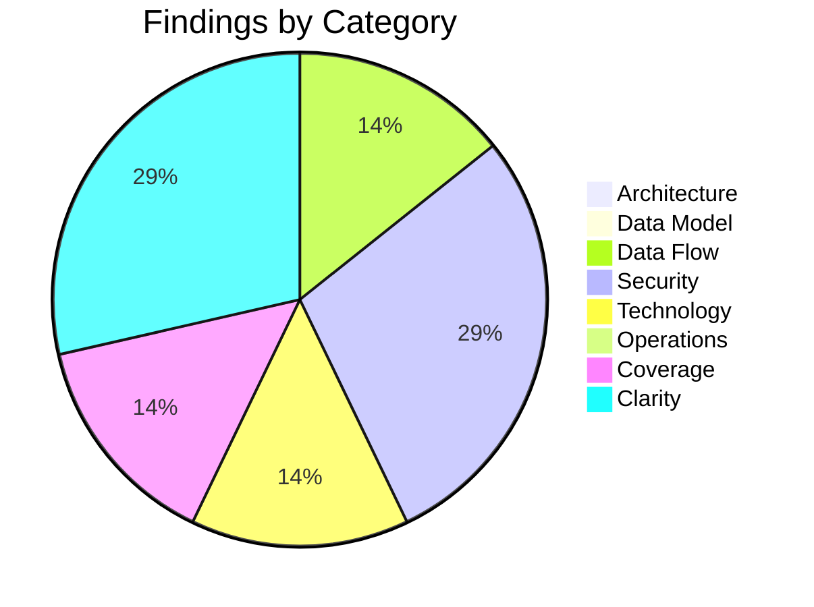

# High-Level Design Review: PollMe 3.0

**Document Reviewed:** `design\pollme-high-level-design.md`
**Requirements Reference:** `design\pollme-requirements.md`
**Review Date:** 2026-04-25
**Reviewer:** Copilot (Automated Review)

---

## Executive Summary

The PollMe 3.0 high-level design is well-structured, well-justified, and appropriate for its stated purpose as a portfolio artifact. Technology choices are coherent, every major flow is documented, and the data model cleanly matches the requirements. The primary gap is that the voter session token design is under-specified in two related ways: the storage mechanism (cookie vs. localStorage) is left open in the security section, and the HLD does not state whether the vote endpoint performs server-side duplicate checking in addition to the client-side check shown in data flow 5.4. This ambiguity spans security architecture, behavioral design, and data model intent, and should be resolved before the LLD author designs the vote endpoint and frontend state management.

**Overall Verdict:** Needs targeted fixes before proceeding

---

## Section Verdicts

| Review Area | Verdict | Findings |
|-------------|---------|----------|
| Architecture & Component Design | Sufficient | 0 |
| Data Model Soundness | Sufficient | 0 |
| Data Flow Integrity | Partially Addressed | 1 |
| Security Architecture | Partially Addressed | 2 |
| Technology Choices | Partially Addressed | 1 |
| Deployment & Operational Readiness | Sufficient | 0 |
| Requirements Coverage | Partially Addressed | 1 |
| Specification Clarity | Partially Addressed | 2 |

---

## 1. Architecture & Component Design

### Current State

The design defines two containers (nginx frontend, ASP.NET Core backend) with a SQLite named volume. Component responsibilities are enumerated in tables for both containers, communication patterns are explicitly described (REST, WebSocket via SignalR, nginx reverse proxy), and the single-process backend is clearly identified as the sole data authority. The architecture is deliberately single-server, which is appropriate for a portfolio demo, and the trade-off is acknowledged.

### Strengths

- Component boundaries are unambiguous and ownership is clearly stated — the backend owns all data, the frontend owns all rendering.
- The single-origin pattern via nginx proxy is a pragmatic design that eliminates CORS configuration and is cleanly explained.
- All major alternatives were considered with explicit rationale for each decision.
- Open questions are pre-identified and correctly scoped to the LLD (nginx WebSocket headers, migration invocation timing).

### Gaps and Recommendations

No meaningful gaps identified at the architecture level.

### Verdict: **Sufficient**

---

## 2. Data Model Soundness

### Current State

The entity-relationship diagram in section 4.1 captures all five entities (Creator, Poll, Option, Vote, VoteSelection) with correct cardinalities. The key attributes table (4.2) describes the purpose and relationships of each entity. The data lifecycle section (4.3) explicitly states immutability constraints and defers deletion and account recovery. The model matches the requirement entities defined in section 2.2 of the requirements document exactly.

### Strengths

- ER diagram cardinalities are fully labeled and match the requirements ER diagram.
- Data lifecycle decisions (no draft state, immutable options, immutable poll settings, votes never deleted in v1) are explicitly documented as design decisions.
- The design correctly reflects that no PII is stored in vote data.

### Gaps and Recommendations

No meaningful gaps identified in the data model.

### Verdict: **Sufficient**

---

## 3. Data Flow Integrity

### Current State

Five data flows are documented: creator login (5.1), poll creation (5.2), vote submission and real-time update (5.3), voter access with duplicate detection (5.4), and a failure paths summary (5.5). The real-time push flow (5.3) correctly shows the full chain from vote submission through tally computation to SignalR broadcast. Failure handling is addressed, and best-effort real-time delivery is explicitly acknowledged.

### Gaps and Recommendations

| ID | Gap | Flow | Priority | Recommendation |
|----|-----|------|----------|----------------|
| FLOW-1 | No data flow diagram for the registration path (FR-3.1.1). Login has a sequence diagram; registration has a meaningful conflict path (username already taken) that is distinct from any other documented flow. | Registration | Consider | Add a sequence diagram for registration parallel to the login diagram in section 5.1, showing the happy path (creator created, cookie issued) and the conflict branch (409 or 400 returned). |

### Verdict: **Partially Addressed**

---

## 4. Security Architecture

### Current State

| Aspect | Status | Notes |
|--------|--------|-------|
| Authentication | Defined | JWT in HTTP-only, SameSite=Strict cookie; well-justified in section 6.3 |
| Authorization | Defined | Identity-scoped; creator-only poll results protected; ownership enforced at results endpoint |
| Trust Boundaries | Defined | Diagram in section 7.2 clearly separates browser from Docker network |
| Encryption in Transit | Defined | Local-only; HTTPS deferred to a future public deployment; trade-off acknowledged |
| Encryption at Rest | Defined | SQLite plaintext; acceptable for local demo; no PII in votes |
| Secrets Management | Partial | JWT secret acknowledged in Open Question 11.2, but the specific mechanism (inline vs. .env file) is unstated |
| Input Validation | Partial | Validation mentioned in data flow 5.2 and failure path 5.5, but not addressed as a security concern |

### Gaps and Recommendations

| ID | Gap | Priority | Recommendation |
|----|-----|----------|----------------|
| SEC-1 | The voter session token storage mechanism is listed as "cookie or localStorage" in the data protection table (section 7.3) without resolving which is used. This is a security decision: a cookie can be scoped with an expiry and HttpOnly flag; localStorage is readable by JavaScript and therefore more XSS-exposed. The choice should be stated definitively. | Should Address | Decide and document the storage mechanism. If a cookie is used, specify whether it carries the HttpOnly flag and its scope. If localStorage is used, acknowledge the XSS exposure and explain why it is acceptable for a local-only deployment. |
| SEC-2 | The security architecture section addresses XSS (HTTP-only cookie) and CSRF (SameSite=Strict) but does not mention SQL injection. Dapper supports parameterized queries but does not enforce them — a developer can still concatenate strings into a query. For a portfolio artifact where the explicit SQL is a feature, this omission is a gap in the stated security posture. | Should Address | Add a line to section 7 stating that all Dapper queries SHALL use parameterized inputs; raw string interpolation in SQL is prohibited. This is a one-sentence architectural constraint that directly addresses NFR-6.2's requirement to guard against common web vulnerabilities. |

### Verdict: **Partially Addressed**

---

## 5. Technology Choices

### Assessment

| Technology | Choice | Rationale Provided? | Alternatives Considered? | Concerns |
|------------|--------|---------------------|--------------------------|----------|
| Backend language | C# / .NET | Yes | N/A — portfolio constraint | None |
| Backend framework | ASP.NET Core Web API | Yes | N/A — first-party .NET | None |
| Data access | Dapper | Yes | Yes (EF Core, ADO.NET) | None |
| Schema migrations | FluentMigrator | Yes | N/A | See Open Question 11.3 |
| Primary database | SQLite | Yes | Yes (PostgreSQL, MySQL) | None |
| Real-time push | SignalR | Yes | Yes (SSE, polling, Redis) | None |
| Creator auth | JWT in HTTP-only cookie | Yes | Yes (session, localStorage) | None |
| Observability | OTel + console exporter | Yes | N/A — external backend explicitly deferred | None |
| Frontend framework | React + TypeScript | Yes | N/A — portfolio constraint | None |
| Frontend bundler | Vite | Yes | N/A | None |
| Frontend tests | Jest + React Testing Library | Yes | N/A | None |
| Backend tests | xUnit + NSubstitute + FluentAssertions | Yes | N/A | None |
| CSS framework | Pico CSS | Yes | N/A | None |
| Container runtime | Docker Compose | Yes | Yes (no-Docker local dev) | None |
| CI | GitHub Actions | Yes | N/A | None |
| **Client-side routing** | **Not listed** | **N/A** | **N/A** | **See TECH-1** |

### Gaps and Recommendations

| ID | Gap | Priority | Recommendation |
|----|-----|----------|----------------|
| TECH-1 | The technology table does not list a client-side routing library. The SPA has at least five distinct views (login/register, dashboard, poll creation, voting, results), so a routing solution is a required technology choice. Since the table includes specific choices at the level of Pico CSS and React Testing Library, the omission of a routing library is a gap in completeness. | Consider | Add the chosen routing library (e.g., React Router) to the technology table with brief rationale. |

### Verdict: **Partially Addressed**

---

## 6. Deployment & Operational Readiness

### Current State

The deployment section is thorough for a portfolio artifact. The Docker Compose topology is fully described with a diagram (section 8.1), local development without Docker is explicitly covered (section 8.2) with concrete `dotnet run` and `npm run dev` commands, and the infrastructure requirements table (section 8.3) lists all resources with sizing. Observability output via OTel console exporter is appropriate for a local-only deployment and is correctly acknowledged as an explicit trade-off.

### Strengths

- Local development story (section 8.2) is first-class — developers can run the full stack without Docker using the same Vite proxy pattern.
- The deployment section correctly defers HTTPS to a future public deployment and acknowledges it.
- The decision to not expose the backend container's port directly to the host (only nginx publishes a host port) is a sound architectural practice and is documented.

### Gaps and Recommendations

No meaningful gaps identified at the operational level for the stated scope.

### Verdict: **Sufficient**

---

## 7. Requirements Coverage

### Coverage Matrix

| Requirement | Addressed In Design? | Section | Notes |
|-------------|---------------------|---------|-------|
| FR-3.1.1 Registration | Partial | 3.2, 4.3 | Mentioned in components; no data flow diagram; see FLOW-1 |
| FR-3.1.2 Login | Yes | 5.1, 6.3, 7.1 | Sequence diagram present |
| FR-3.1.3 Logout | Yes | 3.2, 7.1 | Cookie revocation stated |
| FR-3.2.1 Poll Creation | Yes | 5.2, 4.3 | Sequence diagram present; immutability constraints documented |
| FR-3.2.2 Creator Dashboard | Yes | 3.1, 3.2 | Data model supports all required dashboard fields |
| FR-3.2.3 Poll Retrieval for Voting | Yes | 3.2 | Listed as Poll Endpoints responsibility |
| FR-3.3.1 Vote Submission | Yes | 5.3 | Sequence diagram present |
| FR-3.3.2 Post-Vote Experience | Yes | 5.4 | Flowchart covers both visibility branches |
| FR-3.3.3 Duplicate Vote Prevention | Partial | 5.4, 4.2 | Client-side check documented; server-side behavior ambiguous; see UNCLEAR-1 |
| FR-3.4.1 Real-Time Vote Updates | Yes | 5.3, 6.4 | Full push chain documented; single-server scope acknowledged |
| FR-3.4.2 Results Display | Yes | 3.1, 3.2 | Visibility enforcement stated in section 7.1 |
| FR-3.5.1 Distributed Tracing | Yes | 3.2, 9 | OTel Pipeline component listed; console exporter chosen |
| FR-3.5.2 Metrics | Yes | 3.2, 9 | Covered by OTel Pipeline |
| FR-3.6.1 CI Pipeline | Yes | 9 | GitHub Actions listed with rationale |
| Config-5.1 Poll shape constraints | Yes | 3.1, 5.2 | 2–10 options enforced at creation |
| Config-5.3 Session token lifetime | No | — | See COV-1 |

### Gaps

| ID | Requirement | Status | Recommendation |
|----|-------------|--------|----------------|
| COV-1 | Config-5.3 (Session Token Lifetime) | Missing | Requirements section 5.3 states the session token lifetime is configurable with a meaningful default. The HLD does not address where this configuration lives (application settings, environment variable) or what the default value is. Add a brief note to section 4.3 or section 8 stating the default lifetime and its configuration mechanism. |

### Verdict: **Partially Addressed**

---

## 8. Specification Clarity

### Items Requiring Clarification

| ID | Item | Section | Issue | Question |
|----|------|---------|-------|----------|
| UNCLEAR-1 | Voter session token storage | 7.3 | Ambiguous | Section 7.3 lists voter session token storage as "Browser cookie or localStorage" without deciding between them. These have meaningfully different security properties and different implementation paths. Which is it? |
| UNCLEAR-2 | Server-side duplicate vote check | 5.4, 4.2 | Undefined | Data flow 5.4 shows the duplicate-vote check as a client-side browser check (session token present in browser storage). The Vote entity in 4.2 also stores a session_token field. Does the vote endpoint validate the submitted session token against existing Vote records on the server side, or is deduplication purely client-side? The LLD author needs this clarified to design the vote endpoint correctly. |

### Verdict: **Partially Addressed**

---

## Summary of Recommendations

### Must Address (Blocking — resolve before low-level design)

*None.*

### Should Address (High Priority)

1. **SEC-1:** Decide and document the voter session token storage mechanism — cookie (with flags) or localStorage (with acknowledged XSS exposure). This resolves UNCLEAR-1.
2. **SEC-2:** Add an explicit constraint to section 7 that all Dapper queries SHALL use parameterized inputs; raw SQL string interpolation is prohibited.
3. **UNCLEAR-2:** Clarify whether the vote endpoint performs server-side duplicate checking against Vote.session_token, or whether deduplication is exclusively client-side. State the decision in section 5.4 or section 7.1.

### Consider (Medium Priority)

1. **FLOW-1:** Add a sequence diagram for the registration flow (parallel to the login diagram), showing the happy path and the username-conflict branch.
2. **TECH-1:** Add the client-side routing library to the technology table in section 9.
3. **COV-1:** Document the session token lifetime default and its configuration mechanism (Requirements 5.3).

---

## Findings Summary

| Area | Verdict | Must | Should | Consider |
|------|---------|------|--------|----------|
| Architecture & Components | Sufficient | 0 | 0 | 0 |
| Data Model | Sufficient | 0 | 0 | 0 |
| Data Flows | Partially Addressed | 0 | 0 | 1 |
| Security | Partially Addressed | 0 | 2 | 0 |
| Technology Choices | Partially Addressed | 0 | 0 | 1 |
| Deployment & Ops | Sufficient | 0 | 0 | 0 |
| Requirements Coverage | Partially Addressed | 0 | 0 | 1 |
| Specification Clarity | Partially Addressed | 0 | 1 | 1 |
| **Total** | | **0** | **3** | **3** |
