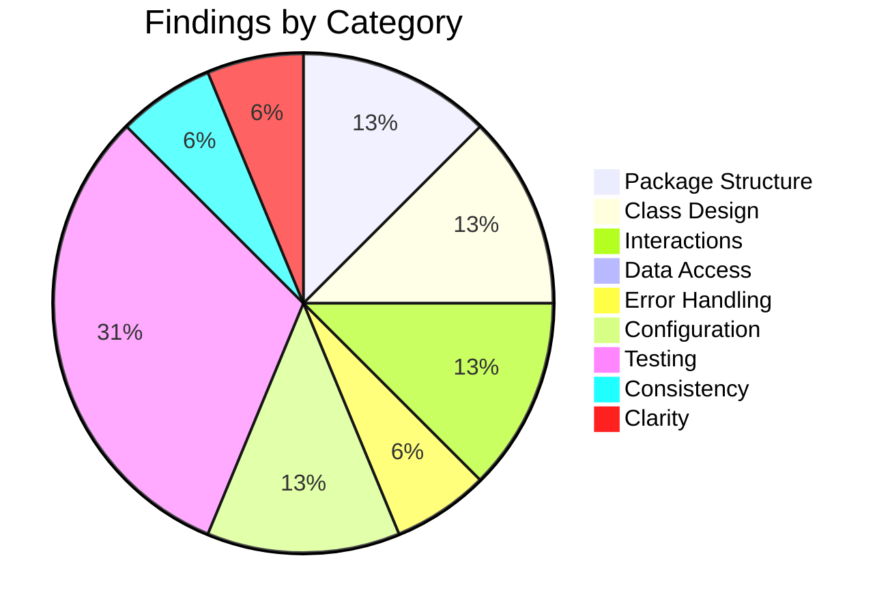

# Low-Level Design Review: PollMe 3.0

**Document Reviewed:** `design\pollme-low-level-design.md`
**Requirements Reference:** `design\pollme-requirements.md`
**High-Level Design Reference:** `design\pollme-high-level-design.md`
**Review Date:** 2026-04-25
**Reviewer:** Copilot (Automated Review)

---

## Executive Summary

This review covers the PollMe 3.0 low-level design against the requirements and high-level design. The document is impressively detailed — the DAL, error handling strategy, configuration wiring, and test infrastructure are all well-specified. Three blocking issues were found: a type mismatch in the vote submission workflow that leaves an implementer with contradictory signals, a nullable-return-type inconsistency in `IAuthService` that would cause a runtime null-reference error, and a frontend route guard on `/results/:slug` that would silently break the public-poll post-vote experience. These must be resolved before implementation begins.

**Overall Verdict:** Needs targeted fixes before proceeding

---

## Section Verdicts

| Review Area | Verdict | Findings |
|-------------|---------|----------|
| Package/Module Structure | Partially Addressed | 2 |
| Class/Type Design | Partially Addressed | 2 |
| Class Interactions & Workflows | Partially Addressed | 2 |
| Data Access Layer | Sufficient | 0 |
| Error Handling | Partially Addressed | 1 |
| Configuration & Wiring | Partially Addressed | 2 |
| Testing Completeness | Partially Addressed | 4 |
| Consistency with High-Level Design | Partially Addressed | 1 |
| Specification Clarity | Partially Addressed | 1 |

---

## 1. Package/Module Structure

### Current State

Single `PollMe.Api` project with eight logical subfolders. Dependency direction is clean: Controllers → Services → Repositories → Infrastructure/Models. The frontend has six subfolders with a similarly clean one-directional graph.

### Strengths

- Flat single-project backend avoids multi-project complexity while still enforcing clear folder-level boundaries.
- Frontend dependency graph is acyclic and correctly shows pages as the top-level consumers.

### Gaps and Recommendations

| ID | Gap | Package(s) | Priority | Recommendation |
|----|-----|------------|----------|----------------|
| PKG-1 | `CTRL --> HUB` dependency is missing from the backend folder graph. `VoteController` takes `IHubContext<TallyHub>` by constructor injection, which requires a compile-time reference to `Hubs/TallyHub`. | `Controllers/`, `Hubs/` | Consider | Add `CTRL --> HUB` edge to the dependency graph in §2.1.1 so the diagram is accurate. |
| PKG-2 | `HUB --> REPO` dependency appears in the folder graph, but `TallyHub` (§3.5) has no repository field or method parameter in its class diagram. `JoinPoll`/`LeavePoll` only call `Groups.AddToGroupAsync`/`RemoveFromGroupAsync` — no DB access needed. | `Hubs/`, `Repositories/` | Consider | If TallyHub truly has no repository dependency, remove the `HUB --> REPO` edge. If poll-existence validation at join time is intended, add the repository field to the TallyHub class diagram. |

### Verdict: **Partially Addressed**

---

## 2. Class/Type Design

### Current State

Service and repository interfaces are well-defined with clear single responsibilities. Domain models are plain data classes. DTOs are appropriately separated from domain models.

### Strengths

- `OptionTally` → `OptionTallyDto` mapping keeps percentage computation cleanly in the service layer.
- `PollMode` and `ResultsVisibility` as typed enumerations with explicit SQLite storage strings prevents magic-string bugs.

### Gaps and Recommendations

| ID | Gap | Class/Type | Priority | Recommendation |
|----|-----|------------|----------|----------------|
| CLASS-1 | **`IAuthService.LoginAsync` return type is non-nullable `Task<Creator>`** but §6.2 states "AuthService.LoginAsync returns null → 401 Unauthorized." An implementer who follows the interface signature as written will introduce a NullReferenceException at the controller's null-check site. | `IAuthService`, `AuthService` | **Must Address** | Change the interface and implementation return type to `Task<Creator?>`. The controller's null-check pattern (`if (creator is null) return Unauthorized(...)`) then compiles correctly with nullable reference types enabled. |
| CLASS-2 | `PollService` depends on `IVoteService` to build `PollSummaryDto` for the dashboard. At runtime this results in N+1 tally queries (one `GetTalliesAsync` call per poll). For a demo-scale system this is fine, but it is not acknowledged anywhere in the design, and the `IVoteRepository` already has `GetTalliesAsync` which could be called directly by the repository if a JOIN-based summary query were added. | `PollService`, `IPollRepository` | Consider | Add a note in §5.2 acknowledging the N+1 pattern and stating it is acceptable at demo scale. If the portfolio readability goal is better served by a single explicit SQL JOIN, a `GetPollSummariesByCreatorIdAsync` method on `IPollRepository` that returns `IEnumerable<PollSummaryDto>` directly is worth listing as an alternative. |

### Verdict: **Partially Addressed**

---

## 3. Class Interactions & Workflows

### Current State

Four sequence diagrams cover registration, poll creation, vote submission, and results retrieval. An error propagation flowchart covers the failure path taxonomy.

### Gaps and Recommendations

| ID | Gap | Workflow | Priority | Recommendation |
|----|-----|----------|----------|----------------|
| INTERACT-1 | **Vote submission workflow (§4.3) contains a type mismatch that makes it unimplementable as written.** The diagram shows `VC->>PS: GetPollWithOptionsAsync(slug)` returning `PollVoteDto`, then immediately `VC->>VS: SubmitVoteAsync(poll, selectedOptionIds)` where `poll: Poll` is the domain model. `PollVoteDto` is not a `Poll`. Additionally, the controller decides whether to return a `TallyDto` or a confirmation message based on the poll's visibility, but `PollVoteDto` does not include a `Visibility` field — so the controller has no way to make that decision with only the DTO in hand. | Vote Submission | **Must Address** | Choose one of: **(a)** Replace `GetPollWithOptionsAsync` with `GetBySlugAsync` in the vote submission flow — the vote endpoint does not need the options list, only `Poll.Id`, `Poll.Mode`, and `Poll.Visibility`; **(b)** Add `Visibility: ResultsVisibility` to `PollVoteDto`; or **(c)** Have the controller make two service calls (one returning the DTO for validation context, one returning the domain model with visibility). Whichever approach is chosen, the sequence diagram and `PollVoteDto` definition must be updated to be consistent. |
| INTERACT-2 | Login (FR-3.1.2), Logout (FR-3.1.3), Dashboard list (FR-3.2.2), and Poll retrieval for voting (FR-3.2.3) have no sequence diagrams. These are simpler flows, but their absence creates ambiguity for logout (how is the cookie cleared — `Max-Age=0`? explicit expiry?) and for the dashboard (how does `PollService` orchestrate the N+1 tally calls?). | Login, Logout, Dashboard, Voting Page | Consider | Add minimal sequence diagrams for login and logout (they appear in the HLD but not the LLD). For the dashboard, a short prose description of the orchestration pattern (fetch polls, then fetch tallies per poll) would close the ambiguity. |

### Missing Workflow Coverage

| Requirement | Workflow Documented? | Notes |
|-------------|---------------------|-------|
| FR-3.1.1 Registration | Yes | §4.1 |
| FR-3.1.2 Login | No | HLD has a diagram; LLD does not reproduce it |
| FR-3.1.3 Logout | No | No diagram or prose description of cookie-clearing mechanism |
| FR-3.2.1 Poll Creation | Yes | §4.2 |
| FR-3.2.2 Dashboard | No | No sequence diagram; interaction is implied by class diagram |
| FR-3.2.3 Poll Retrieval for Voting | No | Simple flow but absence means no guidance on null-checking |
| FR-3.3.1 / FR-3.3.2 Vote Submission | Yes (with bug — see INTERACT-1) | §4.3 |
| FR-3.4.2 Results Page Load | Yes | §4.4 |

### Verdict: **Partially Addressed**

---

## 4. Data Access Layer

### Current State

Repository contracts are fully specified with per-method guarantees (null behavior, transaction scope, empty-collection-vs-null return). Query patterns are documented, transaction boundaries are clear, and connection lifecycle management is explicitly described (per-method `using` blocks). Migration naming convention and execution mechanism are well-defined.

### Strengths

- `LEFT JOIN` tally query correctly returns zero-count rows for options with no votes.
- Composite PK on `vote_selections(vote_id, option_id)` prevents duplicate option selections within a single vote without a separate unique constraint.
- Repository interface contracts explicitly distinguish "returns null on miss" from "returns empty list on miss" — a common source of NullReferenceExceptions when left unspecified.

### Verdict: **Sufficient**

---

## 5. Error Handling

### Current State

Three typed exceptions cover conflict, not-found, and validation scenarios. A global middleware maps them to HTTP status codes. Error responses are consistent JSON objects. Log levels are specified per error type.

### Strengths

- The design explicitly explains why `ForbiddenException` is not a custom type (visibility check is a controller-level authorization decision, not a service throw) — this prevents a common design mistake.
- Login 401 always returns a generic message regardless of which field was wrong, satisfying FR-3.1.2's credential-harvesting protection.

### Gaps and Recommendations

| ID | Gap | Priority | Recommendation |
|----|-----|----------|----------------|
| ERR-1 | `SlugService` retries up to 5 times, but the design does not specify what exception is thrown when all 5 attempts are exhausted — an extremely unlikely but possible scenario. An implementer who omits this case will throw an unintended `NullReferenceException` or return a null slug. | Consider | Document the exhaustion behavior: throw a new `SlugExhaustedException : Exception` (which the global middleware maps to 500) or use an existing `InvalidOperationException` with a clear message. Add it to the exception table in §6.1. |

### Verdict: **Partially Addressed**

---

## 6. Configuration & Wiring

### Current State

Startup sequence is diagrammed step-by-step. DI registration order follows the dependency graph. All configuration parameters are typed with defaults and required/optional flags. `Jwt__Secret` fail-fast validation is specified.

### Strengths

- Configuration parameters are cleanly separated by concern (`Jwt__`, `Database__`, `Poll__`, `VoteToken__`).
- `AppConfig` singleton means services never call `IConfiguration` directly — a common maintainability win.

### Gaps and Recommendations

| ID | Gap | Priority | Recommendation |
|----|-----|----------|----------------|
| CONF-1 | `VoteToken__ExpiryDays` (default 365) is defined as a configuration parameter (§7.3) and the requirements call for a configurable token lifetime (§5.3), but nowhere in the design is the enforcement mechanism described. `localStorage` keys do not expire on their own. The `voteStorage` utility in `utils/` is listed but not specified. | Should Address | Specify that `voteStorage.markVoted(slug)` stores `{ votedAt: ISO-timestamp }` and that `voteStorage.hasVoted(slug)` reads it back and compares `votedAt + VoteToken__ExpiryDays` against the current date. Without this spec, the configuration parameter has no effect at runtime. |
| CONF-2 | Open Question 3 (§9) about `MigrationHostedService` execution order remains unresolved. The startup diagram shows migrations completing before Kestrel accepts connections, but this guarantee depends on `StartAsync` being awaited synchronously. In .NET's generic host, all `IHostedService.StartAsync` calls complete before the server starts listening — this guarantee holds *only if* `StartAsync` does not return before `MigrateUp()` finishes (i.e., no `_ = Task.Run(...)` pattern is used). | Consider | Close the open question with a one-line note: "MigrationHostedService.StartAsync SHALL await MigrateUp() directly (not fire-and-forget) to rely on the .NET host's startup ordering guarantee. An integration test that seeds data before any request will implicitly verify this." |

### Verdict: **Partially Addressed**

---

## 7. Testing Completeness

This is the most critical section of the low-level design review.

### 7.1 Unit Test Assessment

| ID | Gap | Class | Requirement | Priority | Recommendation |
|----|-----|-------|-------------|----------|----------------|
| TEST-1 | `PollService.GetCreatorPollsAsync` has no unit test. This is the most complex service method — it fetches polls and then orchestrates per-poll tally lookups to build `PollSummaryDto` including `LeadingOptionText` and `LeadingPercentage`. The leading-option selection logic (what happens on a tie? what happens at zero votes?) is unspecified and untested. | `PollService` | FR-3.2.2 | Should Address | Add: `GetCreatorPolls_TieForLeading_ReturnsEitherOption` (or documents the tie-breaking rule), `GetCreatorPolls_NoVotes_ReturnsNullLeadingOptionAndZeroPercent`. |
| TEST-2 | `VoteService.SubmitVoteAsync` has only validation-error tests. There is no happy-path test verifying that the repository is called with the correct vote and selection IDs, and that the resulting tally is returned. | `VoteService` | FR-3.3.1 | Should Address | Add: `Submit_ValidSingleSelect_CallsRepoAndReturnsTally` and `Submit_ValidMultiSelect_PersistsAllSelections`. |
| TEST-3 | Frontend page-level components (`VotePage`, `ResultsPage`, `DashboardPage`, `CreatePollPage`, `LoginPage`, `RegisterPage`) have no unit tests at all. Notably, `VotePage` has conditional rendering based on `useVoteStatus` (show form vs. show confirmation vs. redirect to results) that is not tested at the page level. | `VotePage`, `ResultsPage` | FR-3.3.3, FR-3.3.2, FR-3.4.2 | Consider | Add at minimum: `VotePage_AlreadyVoted_PublicPoll_RendersResultsView`, `VotePage_AlreadyVoted_CreatorOnlyPoll_RendersConfirmation`, `VotePage_NotVoted_RendersVoteForm`. |
| TEST-4 | No unit test for `JwtService.IssueToken`. Since the issued token drives all creator authorization, verifying it carries the correct `sub` and `name` claims matters for downstream behavior. | `JwtService` | FR-3.1.1, FR-3.1.2 | Consider | Add: `IssueToken_ContainsCreatorIdAsSubjectClaim`, `IssueToken_ContainsUsernameAsClaim`. |

### 7.2 Integration Test Assessment

| ID | Gap | Requirement | Priority | Recommendation |
|----|-----|-------------|----------|----------------|
| TEST-5 | No integration test for `GET /api/auth/me`. This endpoint is described in Open Question 5 as critical for SPA auth-state initialization on every page load, but has no test. | FR-3.1.2 (session continuity) | Should Address | Add: `GetMe_ValidCookie_ReturnsCreatorIdAndUsername`, `GetMe_NoCookie_Returns401`. |
| TEST-6 | Multi-select voting has no integration test. `SubmitVote_PersistsVoteAndSelections` only tests one selected option on an unspecified poll type. | FR-3.3.1 | Consider | Add: `SubmitVote_MultiSelect_PersistsAllSelections`. |

### 7.3 Requirements Traceability Gaps

| Requirement | Unit Tests? | Integration Tests? | Gap |
|-------------|-------------|-------------------|-----|
| FR-3.2.2 Dashboard | Partial (controller only) | Yes | `PollService.GetCreatorPollsAsync` has no unit test; leading-option tie-breaking unspecified |
| FR-3.3.1 Vote Submission | Partial (validation only) | Partial (single option only) | No happy-path service unit test; no multi-select integration test |
| FR-3.5.1 Tracing | None | None | Documented as smoke-test only; acceptable for v1 |
| FR-3.5.2 Metrics | None | None | Documented as smoke-test only; acceptable for v1 |
| GET /api/auth/me | None | None | Not in the FR matrix; functionally critical for session continuity |

### 7.4 Test Infrastructure Assessment

| ID | Gap | Priority | Recommendation |
|----|-----|----------|----------------|
| TEST-7 | `TallyAssertions.ShouldSumToOneHundred` is named ambiguously given Open Question 4 documents that independent rounding may produce 99% or 101%. If the assertion requires exact 100%, it will produce false test failures. | Consider | Name it `ShouldSumToApproximately100` and implement with a tolerance of ±2 (to handle up to 10 options each rounding ±0.5). |

### Verdict: **Partially Addressed**

---

## 8. Consistency with High-Level Design

### Alignment Check

| High-Level Element | Low-Level Correspondence | Status | Notes |
|-------------------|-------------------------|--------|-------|
| Auth Endpoints (HLD §3.2) | `AuthController` + `IAuthService` | Aligned | |
| Poll Endpoints (HLD §3.2) | `PollsController` + `IPollService` | Aligned | |
| Vote Endpoint (HLD §3.2) | `VoteController` + `IVoteService` | Aligned | |
| Results Endpoint (HLD §3.2) | `ResultsController` + `IVoteService` | Aligned | |
| SignalR Hub (HLD §3.2) | `TallyHub` | Aligned | |
| OTel Pipeline (HLD §3.2) | `AddOpenTelemetry()` in Program.cs | Aligned | |
| Entity data model (HLD §4.2) | Migrations M001–M005 | Aligned | |
| Vote submission + real-time flow (HLD §4.6) | §4.3 interaction diagram | Aligned (pending INTERACT-1 fix) | |
| Technology: xUnit + NSubstitute + FluentAssertions (HLD §9) | Test strategy in §8 | Aligned | |
| `/results/:slug` access rule: conditional on visibility (HLD §4.4, §7.1) | Frontend route table: `Auth Guard: Yes (owner)` | **Misaligned** | See CONSIST-1 |

### Gaps and Recommendations

| ID | Gap | Priority | Recommendation |
|----|-----|----------|----------------|
| CONSIST-1 | **The frontend route table (§2.2) marks `/results/:slug` with `Auth Guard: Yes (owner)`.** The requirements (FR-3.3.2, FR-3.4.2) and HLD (§4.4, §7.1) are explicit that anonymous voters on **public** polls must see results after voting. A `ProtectedRoute` on this page redirects unauthenticated users to `/login`, meaning a voter who just submitted a vote on a public poll is sent to the login screen instead of the results — a broken core experience. The backend already enforces visibility access control at the API level. | **Must Address** | Change `/results/:slug` to `Auth Guard: No`. Remove `ProtectedRoute` from this route. The `ResultsPage` component should render normally for unauthenticated users and rely on the backend's 403 response for creator-only polls to redirect or display an appropriate message. |

### Verdict: **Partially Addressed**

---

## 9. Specification Clarity

### Items Requiring Clarification

| ID | Item | Section | Issue | Question |
|----|------|---------|-------|----------|
| UNCLEAR-1 | `IAuthService.LoginAsync` return type | §3.2 (Services class diagram) | Contradictory: class diagram says `Task<Creator>` (non-nullable); §6.2 says it "returns null → 401". One of these must change. | Should the interface declare `Task<Creator?>`, or should the service throw `UnauthorizedException` instead of returning null? (The rest of the error-mapping table uses exceptions for service-layer errors, so a null return here is the odd one out — but it is an explicit design choice stated in §6.2.) |

### Verdict: **Partially Addressed**

---

## Summary of Recommendations

### Must Address (Blocking — resolve before implementation)

1. **INTERACT-1:** `VoteController` vote submission diagram calls `GetPollWithOptionsAsync` (returns `PollVoteDto`) then passes `poll: Poll` to `VoteService`. The types are incompatible and `PollVoteDto` has no `Visibility` field. The workflow cannot be implemented as drawn.
2. **CLASS-1:** `IAuthService.LoginAsync` is declared `Task<Creator>` (non-nullable) but described as returning null on login failure. An implementation following the interface literally will cause a NullReferenceException.
3. **CONSIST-1:** `/results/:slug` has `ProtectedRoute` in the frontend route table, preventing anonymous voters from ever seeing public poll results after voting — directly violating FR-3.3.2 and FR-3.4.2.

### Should Address (High Priority)

1. **TEST-1:** `PollService.GetCreatorPollsAsync` has no unit tests; the leading-option selection logic (ties, zero votes) is unspecified and untested.
2. **TEST-2:** `VoteService.SubmitVoteAsync` has no happy-path unit test verifying correct repository calls and tally return.
3. **TEST-5:** `GET /api/auth/me` has no integration test despite being critical for SPA session continuity on every page load.
4. **CONF-1:** `VoteToken__ExpiryDays` configuration has no corresponding implementation spec in `voteStorage`. The parameter has no effect at runtime without a timestamp-based expiry check.

### Consider (Medium Priority)

1. **PKG-1:** Missing `CTRL --> HUB` edge in the backend folder dependency graph (VoteController → TallyHub via IHubContext).
2. **PKG-2:** Spurious `HUB --> REPO` edge — TallyHub has no repository in its class diagram.
3. **CLASS-2:** N+1 query pattern in dashboard (`PollService` calls `GetTalliesAsync` per poll) is not acknowledged; a direct SQL JOIN alternative should be noted.
4. **INTERACT-2:** No sequence diagrams for Login, Logout, Dashboard, or Poll retrieval for voting.
5. **ERR-1:** SlugService exhaustion behavior (all 5 retry attempts fail) is not documented.
6. **CONF-2:** Open Question 3 on migration ordering should be closed with a note that `StartAsync` must directly await `MigrateUp()` to rely on the .NET host guarantee.
7. **TEST-3:** Page-level frontend components have no unit tests; `VotePage` conditional rendering (voted vs. not voted) is a key user-facing flow that is currently untested at the page level.
8. **TEST-4:** `JwtService.IssueToken` has no unit test for claim content.
9. **TEST-7:** `TallyAssertions.ShouldSumToOneHundred` will produce false failures given documented rounding behavior; rename and add tolerance.

---

## Findings Summary

| Area | Verdict | Must | Should | Consider |
|------|---------|------|--------|----------|
| Package/Module Structure | Partially Addressed | 0 | 0 | 2 |
| Class/Type Design | Partially Addressed | 1 | 0 | 1 |
| Interactions & Workflows | Partially Addressed | 1 | 0 | 1 |
| Data Access Layer | Sufficient | 0 | 0 | 0 |
| Error Handling | Partially Addressed | 0 | 0 | 1 |
| Configuration & Wiring | Partially Addressed | 0 | 1 | 1 |
| Testing Completeness | Partially Addressed | 0 | 3 | 2 |
| HLD Consistency | Partially Addressed | 1 | 0 | 0 |
| Specification Clarity | Partially Addressed | 0 | 0 | 1 |
| **Total** | | **3** | **4** | **9** |

---

## Untested Requirements

| Requirement | Description | Why It Matters |
|-------------|-------------|----------------|
| FR-3.2.2 Dashboard (leading option) | Computation of `LeadingOptionText` and `LeadingPercentage` in `PollService.GetCreatorPollsAsync` | Tie-breaking and zero-vote edge cases are undefined — different implementers will make different choices, producing inconsistent dashboard behavior |
| FR-3.3.1 Vote Submission (happy path) | `VoteService.SubmitVoteAsync` correctly persisting vote and selections | Without a unit test, a repo call with the wrong IDs would go undetected until integration or manual testing |
